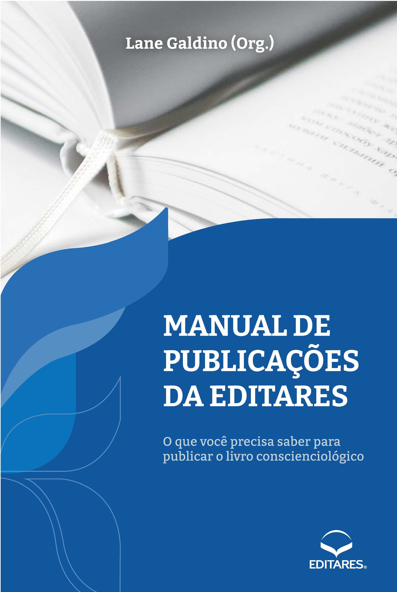
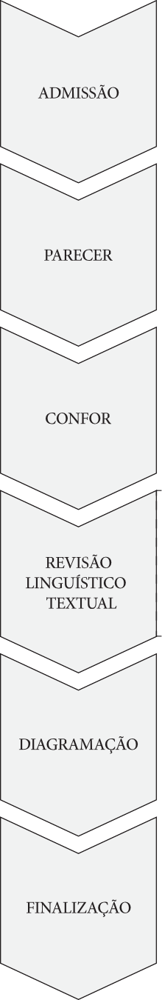
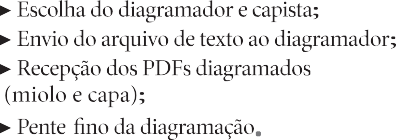
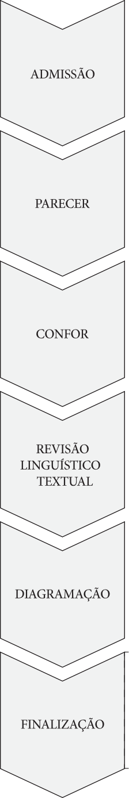
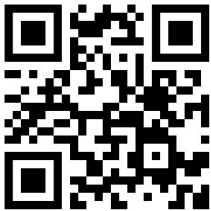
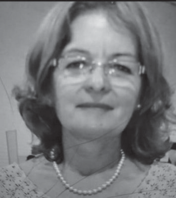
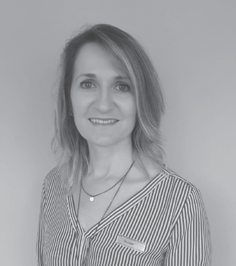
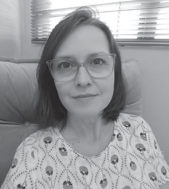

{width="6.535389326334208in" height="9.59523622047244in"}

> MANUAL DE

***1//111***

PUBLICAÇOES

> DA EDITARES
>
> O que você precisa saber para publicar o livro conscienciológico
>
> **Coordenação Geral:**
>
> Ana Claudia Prado Magda Stapf

+-------------------------------------------------------------------------------------------------------------------------------------------------------------------------------------------------------------------------------------+
| > **Conselho Editorial:**                                                                                                                                                                                                           |
+:=====================================================================================================================================:+:===========================================================================================:+
| > Ana Claudia Prado Carolina Ellwanger Cecilia Roma Cristina Bornia Cristina Ellwanger José Ricardo Gomes Joseane Vezaro Lane Galdino | > Liege Trentin Magda Stapf Maria Koltum Meracilde Daroit Nora Derrosso Patricia Pialarissi |
|                                                                                                                                       | >                                                                                           |
|                                                                                                                                       | > Roberta Bouchardet                                                                        |
+---------------------------------------------------------------------------------------------------------------------------------------+---------------------------------------------------------------------------------------------+

+--------------------------------------------------------------------------------------------------------------------------------+
| > **Equipe Técnica**:                                                                                                          |
+:=====================================================================:+:======================================================:+
| > Afrânia Perreira Correia Alex Ferreira                              | > Liliana Roriz Ferreira Liliane Sakakima Luciano Melo |
| >                                                                     | >                                                      |
| > Alex Sarmento                                                       | > Luís Ignácio Lopez Lurdes Sousa Marcia Perrusi       |
|                                                                       | >                                                      |
| André Becker do Nascimento Angélica Guidini                           | > Marcos de Paiva Vieira Mayla Minaré                  |
|                                                                       | >                                                      |
| > Beatriz Helena Cestari Blandina Monteiro                            | > Niciano Correia Vilas Bôas Rubia Henning             |
| >                                                                     | >                                                      |
| > Bruno Fabiano de Camargo Carlos Moreno Daniel Ronque Fabiane Cattai | > Rui Fernando Sousa Sónia Luginger                    |
| >                                                                     |                                                        |
| > Henrique Manoel de Abreu Leonardo Ribeiro                           |                                                        |
+-----------------------------------------------------------------------+--------------------------------------------------------+

> Todos os direitos desta edição estão reservados à Associação Internacional EDITARES.
>
> É terminantemente proibida a reprodução total ou parcial desta obra, por qual-quer meio ou processo, sem a expressa autorização do(s) autor(es)
>
> e da Associação Internacional EDITARES.
>
> A violação dos direitos autorais caracteriza crime descrito na legislação em vigor, sem prejuízo das sanções civis cabíveis.
>
> MANUAL DE,.,,,
>
> PUBLICAÇOES
>
> DA EDITARES
>
> O que você precisa saber para publicar o livro conscienciológico
>
> Foz do Iguaçu, PR 2024
>
> *Copyright* © 2021 -- Associação Internacional EDITARES 1ª Edição - 2021 - *Print on Demand* (PoD)
>
> 2ª Edição - 2024 - *Print on Demand* (PoD)
>
> Os direitos autorais desta edição foram cedidos pelos autores à *Associação Internacional EDITARES*.

+-----------------+---------------------------------------------------------------------------------------------------------------------------------------------+
| **Edição**      | > Magda Stapf.                                                                                                                              |
+=================+=============================================================================================================================================+
| **Revisão**     | > Carlos Moreno, Daniel Ronque, Eliana Manfroi, Ercília Monção, Ila Rezende, Liege Trentin, Oswaldo Vernet, Rosane Amadori e Sônia Ribeiro. |
+-----------------+---------------------------------------------------------------------------------------------------------------------------------------------+
| **Diagramação** | > Liliana Roriz Ferreira.                                                                                                                   |
+-----------------+---------------------------------------------------------------------------------------------------------------------------------------------+
| **Capa**        | > Francieli Padilha.                                                                                                                        |
|                 | >                                                                                                                                           |
|                 | > Imagens: Freepik e Rawpixel.com                                                                                                           |
|                 | >                                                                                                                                           |
|                 | > -- Freepik.com.                                                                                                                           |
+-----------------+---------------------------------------------------------------------------------------------------------------------------------------------+
| **Ilustrações** | > Jadher Curvelo.                                                                                                                           |
+-----------------+---------------------------------------------------------------------------------------------------------------------------------------------+
| **Impressão**   | > Meta Brasil.                                                                                                                              |
+-----------------+---------------------------------------------------------------------------------------------------------------------------------------------+

> **Dados Internacionais de Catalogação na Publicação (CIP)**

+--------+-----------------------------------------------------------------------------------------------------------------------------------------------------------------------------------+
| > M294 | > Manual de publicações da Editares: o que você precisa saber para publicar o livro conscienciológico / Organizado por Lane Galdino. - 2.ed. - Foz do Iguaçu, PR: Editares, 2024. |
|        | >                                                                                                                                                                                 |
|        | > 144 p. : il.                                                                                                                                                                    |
|        | >                                                                                                                                                                                 |
|        | > Livro disponível para publicação no sistema PoD (Print on Demand)                                                                                                               |
|        | >                                                                                                                                                                                 |
|        | > Inclui bibliografia Inclui índice remissivo                                                                                                                                     |
|        | >                                                                                                                                                                                 |
|        | > ISBN 978-85-8477-182-0                                                                                                                                                          |
|        | >                                                                                                                                                                                 |
|        | > 1\. Conscienciografia 2. Grafopensene 3. Editoração                                                                                                                             |
|        | >                                                                                                                                                                                 |
|        | > 4\. Redação técnica 5. Manuais I. Editares                                                                                                                                      |
|        |                                                                                                                                                                                   |
|        | CDU 808(035)                                                                                                                                                                      |
+========+===================================================================================================================================================================================+

> **Beatriz Helena P. de S. Cestari -- CRB-10/1708**
>
> ASSOCIAÇÃO INTERNACIONAL EDITARES
>
> Av. Felipe Wandscheer, nº 6.200, sala 110, Cognópolis Foz do Iguaçu, PR -- Brasil -- CEP: 85856-850
>
> *Website:* [www.editares.org](http://www.editares.org/) *Email:* <editares@editares.org>
>
> **[Ded]{.underline}icatória**
>
> Aos autores Aos leitores
>
> Aos voluntários pioneiros fundadores da EDITARES Aos voluntários ex-coordenadores da EDITARES Aos amparadores extrafísicos

####  [Sum]{.underline}ário

Prefácio da 1ª edição -- Neopatamar Editorial 9

[Introdução 11](#introdução)

[Associação Internacional EDITARES 15](#associação-internacional-editares)

1.  [Histórico e Organização 17](#histórico-e-organização)

2.  [Política Editorial 21](#política-editorial)

3.  Conselho Editorial 23

[Fluxo Editorial 25](#fluxo-editorial)

4.  Visão Geral 27

5.  [Admissão da Obra 29](#admissão-da-obra)

6.  [Parecer 33](#parecer)

7.  [Revisão de Confor 39](#revisão-de-confor)

8.  [Revisão Linguístico-Textual 45](#revisão-linguístico-textual)

9.  [Diagramação 49](#diagramação)

10. [Finalização 55](#finalização)

    1.  Orçamento da Obra 55

    2.  [Revisão de Provas 56](#revisão-de-provas)

    3.  [Autorização para a Impressão da Obra 56](#autorização-para-a-impressão-da-obra)

    4.  [Disponibilização para a Venda 56](#disponibilização-para-a-venda)

    5.  [Parcerias com Lojas Físicas 57](#parcerias-com-lojas-físicas)

    6.  [Modalidades de Disponibilização das Obras 57](#modalidades-de-disponibilização-das-obras)

[Lançamento da Obra 59](#lançamento-da-obra)

11. Celebração Multidimensional 61

12. [Aspectos Operacionais 63](#aspectos-operacionais)

[Obras com Tratamento Específico 67](#obras-com-tratamento-específico)

13. Obras em Língua Estrangeira 69

14. Periódicos 71

[Procedimentos Jurídicos 73](#procedimentos-jurídicos)

15. [Aspectos Legais 75](#aspectos-legais)

[Estrutura da Obra 81](#estrutura-da-obra)

16. Quadro Sinótico 83

17. [Elementos Pré-Textuais 85](#elementos-pré-textuais)

18. [Elementos Textuais 91](#elementos-textuais)

19. [Elementos Pós-Textuais 99](#elementos-pós-textuais)

[Considerações Finais 109](#considerações-finais)

[Apêndice: Modelo de Livro 111](#apêndice-modelo-de-livro)

[Referências Bibliográficas 123](#referências-bibliográficas-1)

[Índice Remissivo 129](#índice-remissivo)

Lista de Instituições Conscienciocêntricas (ICs) 135

[Lista de Publicações da Editares 137](#lista-de-publicações-da-editares)

Levantamento Estatístico da Obra 139

Minibiografias dos Autores 140

**Prefácio da 1ª Edição**

**[Neo]{.underline}patamar Editorial**

> **Edição.** Editar é organizar, selecionar, normatizar e, por vezes, redese-nhar engenhosamente palavras e frases ao modo de um artesão atento aos detalhes da própria obra. Exige atenção, criatividade, associação de ideias, em um verdadeiro e prazeroso exercício mentalsomático.
>
> **Histórico**. A arte da edição é antiga. Há vestígios de tal prática desde o Século III. Um dos centros editorais da História foi a célebre Biblioteca de Alexandria, onde se copiavam manualmente textos antigos, às vezes acrescidos de comentários.
>
> **Seriexologia.** Pode-se suspeitar, por hipótese, terem sido muitos editores e autores da atualidade ex-copistas ou escribas em retrovidas já envolvidos no universo da *escrita-edição-publicação*.
>
> **Prensa.** A edição ganhou importância a partir da prensa de Gutenberg, em uma época na qual as palavras grafadas começaram a viajar de um lugar para outro difundindo o conhecimento com velocidade jamais conhecida. A disseminação de ideias com aquele sistema de impressão derrubou al-guns paradigmas e contribuiu para solidificar outros.
>
> **Evolução.** O processo editorial implica organização, responsabilida-de e coesão entre os diversos especialistas, incluindo editores, pareceristas, diagramadores, revisores e capistas. Uma boa edição é resultado de um trabalho afinado em equipe.
>
> **Obra.** Esta obra, *Manual de Publicações da Editares,* mostra justa-mente a sinergia de voluntários-editores e da equipe técnica colegiada da *Associação Internacional Editares*. Antes mesmo de completar duas déca-das de existência, a jovem editora evidencia amadurecimento e especia-lização na tarefa mentalsomática de publicar verdades relativas de ponta oriundas de autores-pesquisadores da Neociência Conscienciologia.
>
> **Assistência.** A proposição deste Manual vem contribuir sobremanei-ra para a qualificação das obras conscienciológicas, esclarecendo autores e neoautores quanto a procedimentos relacionados ao processo editorial, seja em livros e periódicos escritos no idioma português ou em línguas estrangeiras. Também dirime costumeiras dúvidas daqueles autores es-treantes no mundo das publicações.
>
> **Profissionalismo.** Ao expor detalhes do fluxo editorial, incluindo desde a entrada da obra na Editora, até o lançamento e distribuição dos livros, os voluntários da Editares demonstram profissionalismo e deixam aos futuros integrantes da editora referência grafada para manter a quali-dade editorial alçada na atualidade.
>
> **Confor.** Os detalhes de conteúdo e forma, próprios dos livros cons-cienciológicos expostos nesta obra, indicam o quanto a Editares está sin-tonizada com a concepção da edição conscienciológica, a qual propõe ino-vações e exaustividade. A inserção do levantamento estatístico da obra, nas páginas finais, é um dos exemplos.
>
> **Desafio.** Editar é tarefa complexa. Editar obras conscienciológicas é desafio maior em razão da pressão inerente às ideias inovadoras do pa-radigma consciencial. A Editares mostra, com a publicação deste Manual, ter alcançado patamar editorial de excelência pautado na interassistencia-lidade.
>
> **Agradecimento.** Esta obra é fruto do trabalho persistente e contínuo de voluntários e ex-voluntários ao longo da última década e do esforço desmedido da atual coordenação a fim de organizar procedimentos téc-nico-administrativos da Editares. É preciso agradecer a cada voluntário e aos amparadores técnicos da Editoriologia e Publicaciologia por esta importante conquista no contexto da maxiproéxis grupal.
>
> Denise Paro. Foz do Iguaçu, 6 de junho de 2021.

###  [Int]{.underline}rodução

> **Autorrevezamento.** Se os componentes da *Comu-nidade Conscienciológica Cosmoética Internacional* (CCCI) entenderem mais o significado profundo do autorrevezamento multiexistencial, vão fazer mais do que têm feito até agora quanto à redação e publi-cação dos **livros** sobre a Conscienciologia. (Vieira, 2014b, p. 247)

##### Motivação

> **Tares.** A consecução da tarefa do esclarecimento por parte da cons-cin intermissivista presume, em algum nível, o compartilhamento das autopesquisas pautado no paradigma consciencial, seja de maneira oral ou escrita.
>
> **Livro.** O registro grafado do conteúdo autexperimental ainda cons-titui a forma mais perene de legar aos compassageiros a teática evolutiva particularíssima de cada autor, capaz de despertar reflexões, inspirar neo-condutas e motivar reciclagens em outros microuniversos conscienciais.
>
> **Urgência.** Muito se tem produzido em mais de 3 décadas de Cons-cienciologia e, paradoxalmente, não cessa a premência de novas publica-ções, com neoabordagens singulares, face à aceleração histórica do atual momento evolutivo planetário.
>
> **Cotejo.** Ultrapassando o artigo técnico e o verbete neoenciclopédico, o livro, pela extensão e profundidade pressupostas, requer do autor trata-mento bem mais cuidadoso no tocante à estruturação do conteúdo, sem perder de vista as características de legibilidade.
>
> ***Gap*.** Entre o esboço preliminar grafado pelo autor e o livro publi-cável, insere-se inevitável cadeia de apreciações, revisões, contribuições enriquecedoras e devolutivas, visando adequar a obra aos requisitos de cientificidade inerentes à Neociência.
>
> **EDITARES.** Segundo Tornieri (In: Vieira, 2023, p. 13.925 a 13.930), a *Associação Internacional EDITARES* é:
>
> \[\...\] a *Instituição Conscienciocêntrica* (IC), científica, educacional, político-apartidária, sem fins de lucro, independente e universalista, especializada na edição de obras tarísticas (livros, jornais, revistas, DVDs, *e-books*) de divulgação da Ciência Conscienciologia e respectivas especialidades, fundada por pesquisado-res-voluntários, em 23 de outubro de 2004.
>
> **Compromisso.** Tendo a *Editoriologia* por especialidade-base, a EDI-TARES é responsável, desde a fundação, pela produção de mais duas cen-tenas de livros conscienciológicos (Ano-base: 2024), efetivando, com *ex-pertise* ímpar, os procedimentos capazes de transformar o esboço autoral preliminar em obra publicada.

##### Objetivo e Estrutura desta Obra

> **Propósito.** A explicitação desse mecanismo viabilizador de gescons é o objetivo deste livro, apresentando à CCCI o funcionamento do Fluxo Editorial vigente na EDITARES.
>
> **Autores.** Os responsáveis pelo conteúdo aqui apresentado são os vo-luntários integrantes do *Conselho Editorial,* a partir das experiências hau-ridas na editoração e publicação das diversas obras encaminhadas.
>
> **Estrutura.** O presente texto está organizado em 6 seções, na ordem de ocorrência:

1.  **Associação Internacional EDITARES:** a apresentação da IC; a constituição e função do *Conselho Editorial***.**

2.  **Fluxo Editorial:** o detalhamento de todo o trâmite da obra en-caminhada à EDITARES; as diversas fases de revisão; a diagramação; a impressão**.**

3.  **Lançamento da Obra:** os procedimentos para difusão da obra ao público; a opção pelo *Print on Demand* (PoD)**.**

4.  **Obras com Tratamento Específico:** a abordagem particular a ou-tras categorias de obras**.**

5.  **Procedimentos Jurídicos:** os aspectos legais envolvendo autoria e publicação**.**

6.  **Estrutura da Obra:** as partes integrantes; as inter-relações**.**

> **Minilivro.** Em Apêndice específico, a estruturação aplicada às obras é ilustrada com exemplos extraídos de livros já publicados, disponíveis
>
> gratuitamente, constituindo pequeno manual de referência para autores e editores.

##### Convite

> **Descrenciologia.** Ao leitor ou à leitora desta obra, seja autor, editor, voluntário ou meramente interessado em conhecer os pormenores da edi-toração de livros na EDITARES, recomendamos a abordagem a este texto prevista no enunciado do *princípio da descrença,* não acreditando em nada e buscando comprovar pela autexperiência as informações relatadas.
>
> **Incentivo.** Como sugestão para averiguar com autocriticidade os de-talhamentos aqui expressos, sugerimos a *iniciativa urgente* de redigir e en-caminhar a própria obra à EDITARES, validando pela vivência pessoal cada informação encontrada neste texto.

##### Agradecimento

> **Multimensionalidade.** Muito além dos percalços intrafísicos inerentes a qualquer empreendimento pró-evolutivo, a concretização gráfica de con-teúdo conscienciológico apresenta desafios ainda mais complexos, dadas as especificidades dos trâmites multidimensionais envolvidos, não raro antagônicos.
>
> **Amparologia.** Sem a atuação dos amparadores extrafísicos, sabemos ser impossível levar a termo essa tarefa diária, ininterrupta, de disponibi-lizar em livros os conteúdos ideativos formulados pelos autores.
>
> Foz do Iguaçu, PR, 23 de abril de 2021. Oswaldo Vernet, Editor (1a. Edição).

## I.

### Associação Internacional EDITARES

### 

####  [1. H]{.underline}istórico e Organização

##### Objetivos

> **Definição.** A *Associação Internacional EDITARES* é a *Instituição Conscienciocêntrica* (IC), sem fins de lucro, científica, educacional, polí-tico-apartidária, independente e universalista, especializada na edição de obras tarísticas (livros impressos ou digitais, tratados, manuais e revistas) de divulgação da Ciência Conscienciologia e respectivas especialidades, fundada por pesquisadores-voluntários, em 23 de outubro de 2004, na cidade de Foz do Iguaçu, Paraná, Brasil.
>
> **Divulgação.** Em complemento às edições, publicações e distribuição das obras conscienciológicas, a EDITARES faz, de modo perene, a divul-gação da Ciência exposta nos livros, por intermédio de *lives* e disponibi-lização, de maneira gratuita no *site* da editora*,* de todas as obras do Prof. Waldo Vieira (1932--2015), propositor das ideias da Ciência Conscien-ciologia, assim como dos livros de outros autores, somando mais de 50 obras (Ano-base: 2024).

##### Voluntariado Conscienciológico

> **Voluntariado.** Segundo o previsto no Art. 5° do Estatuto Social da EDITARES1, todo o trabalho desenvolvido na IC é realizado por volun-tários associados, especializados na edição e publicação de obras conscien-ciológicas, abrangendo desde o recebimento dos originais até o lançamen-to da obra. Todo o processo editorial ao qual se submete o livro dentro da editora será detalhado em capítulos específicos desta obra.
>
> 1 Art. 5°. A EDITARES poderá ter um número ilimitado de associados, sempre admiti-dos pelo Colegiado Administrativo, sem qualquer distinção de raça, cor, sexo, naciona-lidade, filiação política ou credo religioso.
>
> **Multidimensionalidade.** Em alinhamento ao paradigma conscien-cial, a atuação dos voluntários da EDITARES é pautada pela interassis-tência, considerando que todo o fluxo intrafísico da editoração ocorre em sintonia com a dimensão extrafísica.

##### Sustentabilidade Financeira

> **Recursos.** A sustentação financeira da EDITARES provém dos valores doados por parte dos autores para a publicação da obra e da comercializa-ção dos títulos.
>
> **Fundos.** O resultado financeiro da instituição é destinado à operação da própria editora, compreendendo o Fundo Editorial dedicado às pu-blicações, reedições e reimpressões das obras e o Fundo de Reserva afeito à sustentabilidade administrativa, como dispõem os Artigos 35 e 36, do Estatuto Social2.

2.  Art. 35. A EDITARES não distribuirá a seus associados, voluntários, coordenadores, empregados, doadores eventuais ou terceiros, excedentes operacionais, brutos ou líqui-dos, dividendos, bonificações, participações ou parcelas do seu patrimônio, auferidos mediante o exercício de suas atividades, revertendo qualquer eventual saldo positivo de seus exercícios financeiros em benefício da manutenção e ampliação de suas finalidades estatutárias e/ou de seu patrimônio.

> Art. 36. As receitas provenientes da venda de livros terão destinação conforme descrito nos parágrafos 1° a 3° seguintes:
>
> § 1o No mínimo 10% (dez por cento) das receitas das vendas será destinado ao Fundo Editorial e deverá ser exclusivamente utilizado para o financiamento de publicações.
>
> § 2° Será mantido Fundo de Reserva com saldo mínimo necessário para a sustentabili-dade administrativa da EDITARES pelo período de 6 (seis) meses.
>
> § 3° A receita líquida da venda de livros deverá ser utilizada para a reedição ou reimpres-são da própria obra. Na hipótese de o autor decidir pela não reedição ou reimpressão, o valor será destinado ao Fundo Editorial mencionado no § 1°, deste artigo.

##### Publicações

> **Produção.** Ao longo de 20 anos de existência, a Editora publicou (Ano-base: 2024) mais de 220 títulos, de 143 autores da Conscienciolo-gia falando das próprias experiências e das reciclagens pessoais e grupais, com base no Paradigma Consciencial.

####  [2. P]{.underline}olítica Editorial

##### Obras publicáveis pela EDITARES

> **Posicionamento.** Tendo em vista que a *Associação Internacional EDI-TARES* dedica-se à produção e publicação de obras fundamentadas na Ciência Conscienciologia e suas especialidades3, o interesse da editora é na produção de conteúdo que contribua para o enriquecimento e ex-pansão do Paradigma Consciencial, enquanto teoria-líder fundamentada na própria consciência.
>
> **Requisito.** O contéudo da obra precisa ter abordagem original e ta-rística.

##### Obras NÃO publicáveis pela EDITARES

> **Política.** Consoante a política de publicação da EDITARES, **não** são contempladas obras apresentando qualquer das 8 características a seguir, em ordem alfabética:

1.  **Anticientificismo:** a abordagem contrária aos *princípios científicos;*

> o predomínio da beleza estética sobre o conteúdo**.**

2.  **Anticosmoeticidade:** a abordagem em apologia ao belicismo, à religião, ao suicídio, à toxicomania, à violência, aos idiotismos culturais, dentre outros**.**

3.  **Antiuniversalismo:** a abordagem em defesa de posicionamentos aprioristas, facciosos, fechadistas, interiorotas, paroquialistas, sectários ou se-paratistas**.**

4.  **Dogmatismo:** a abordagem dogmática, religiosa, doutrinária ou assentada em verdades absolutas, crendices, mitos, sacralizações ou guru-latrias**.**

<!-- -->

3.  *Instituto Cognopolitano de Geografia e Estatística* (ICGE): [\<https://www.icge.org.br/?](https://www.icge.org.br/) page_id=1878\>.

<!-- -->

5.  **Ficcionismo:** a abordagem fantasiosa, desconectada de fatos, para-fatos, realidades ou pararrealidades**.**

6.  **Materialismo:** a abordagem unicamente eletronótica, fundamen-tada apenas no paradigma da Ciência Convencional**.**

7.  **Misticismo:** a abordagem mística, esotérica ou obscurantista, pró-pria do ocultismo**.**

8.  **Tacon:** a abordagem assistencialista, demagógica, *fazedora de mé-dia,* eufêmica, no estilo água-com-açúcar ou autoajuda**.**

##### Definição e Objetivos

> **Definição.** O *Conselho Editorial da EDITARES* é o grupo de cons-cins responsável pela deliberação consensual e implementação de decisões acerca da produção gesconográfica de obras conscienciológicas sob res-ponsabilidade da IC.
>
> **Objetivo.** O referido conselho foi criado em 2020 com a finalidade de dar maior objetividade e celeridade ao fluxo editorial, com procedi-mentos mapeados e etapas definidas para acompanhamento das obras em produção na IC, atuando junto aos autores, aos revisores e às diversas mídias de publicação.
>
> **Responsabilidade.** São responsabilidades do *Conselho Editorial* as 5 ações, relacionadas em ordem lógica:

1.  **Normatização:** a instituição e o aprimoramento das práticas re-lacionadas à produção de obras, em atenção aos princípios, objetivos e diretrizes de atuação da EDITARES**.**

2.  **Legalização:** a definição das linhas editoriais e de políticas especí-ficas relacionadas à cessão de direitos autorais, tiragem e distribuição das obras**.**

3.  **Distribuição:** o critério de alocação de editor específico, para cada obra acolhida, responsável técnico pelo acompanhamento**.**

4.  **Supervisão:** o acompanhamento do fluxo editorial, detectando e sa-nando eventuais lacunas ou delongas no processo de produção de obras**.**

5.  **Divulgação:** a escolha das mídias de publicação mais oportunas para as diversas obras encaminhadas, em observância às tendências de demanda e divulgação**.**

> **Acolhimento.** Faz parte das diretrizes básicas do *Conselho Edito-rial* acolher e acompanhar as obras encaminhadas à editora, proporcio-nando os esclarecimentos necessários sobre o fluxo editorial desde o pri-meiro contato feito, quando o neoautor comunica à EDITARES o in-teresse em agendar a entrevista para entrega dos originais, através do *E-mail* [publiqueseulivro@editares.org.](mailto:publiqueseulivro@editares.org)

## II.

### Fluxo Editorial

### 

> **CONSELHO EDITORIAL**
>
> ENTREVISTA
>
> PARECER
>
> CESSÃO DE DIREITOS AUTORAIS
>
> CONFOR
>
> REVISÃO LINGUÍSTICO **-**
>
> **-**TEXTUAL
>
> DIAGRAMAÇÃO
>
> **LANÇAMENTO**
>
> ORÇAMENTO E IMPRESSÃO DA OBRA
>
> **Fluxo.** A sequência de etapas pela qual tramitam as obras publicadas pela EDITARES abrange 16 estágios, compondo o *fluxo editorial,* elenca-das em ordem funcional:

1.  **Admissão:** a recepção e pré-análise da obra, realizada por inte-grante do *Conselho Editorial***.**

2.  **Parecer:** a análise e emissão de parecer inicial sobre a obra por voluntários da própria IC ou especialistas da CCCI, selecionados pelo editor responsável**.**

3.  **Cessão:** a celebração do *termo de cessão de direitos autorais* entre a Editora e o(s) autor(es)/organizador(es), logo após a devolutiva do pa-recer**.**

4.  **Confor:** a análise e emissão de parecer sobre a conformática (con-teúdo e forma) da obra por voluntários especialistas da CCCI, seleciona-dos pelo editor responsável pela obra**.**

5.  **Linguística:** a revisão linguístico-textual**.**

6.  **Diagramação:** o projeto gráfico e a diagramação**.**

7.  **Catalogação:** a elaboração da ficha de catalogação (Dados Inter-nacionais de Catalogação na Publicação -- CIP)**.**

8.  **ISBN:** a solicitação do registro *International Standard Book Number***.**

9.  **Orçamentos:** a solicitação de orçamentos às gráficas para impressão**.**

<!-- -->

10. **Prova:** a impressão do boneco *(layout)* preliminar mostrando a po-sição das ilustrações, textos e outros elementos, conforme aparecerão no produto impresso, se for o caso**.**

11. **Ajustes:** a realização de correções e ajustes antes da finalização**.**

12. **Finalização:** a análise final e liberação para impressão**.**

13. **Impressão:** a autorização de impressão definitiva, se for o caso**.**

14. **Lançamento:** a apresentação pública e distribuição**.**

15. **Doação:** a cessão de exemplares da obra para o Holociclo e Holo-teca (CEAEC), Holomemória (UNICIN) e UNICIN**.**

16. **Depósito:** o armazenamento da obra no repositório institucional e o envio à Biblioteca Nacional**.**

> 

####  [5. A]{.underline}dmissão da Obra

##### Recepção por *E-mail* e Entrevista para Recebimento dos Originais

> **Contato.** Os autores interessados em publicar obras devem contactar a EDITARES pelo *E-mail:* [publiqueseulivro@editares.org,](mailto:publiqueseulivro@editares.org) mencionando o título e os nomes de todos os autores envolvidos na escrita.
>
> **Entrevista.** A partir desse contato inicial, é marcada a entrevista para a recepção dos originais, à qual comparecerão 1 membro do *Conselho Edito-rial* (entrevistador), acompanhado de, pelo menos, mais 1 voluntário, além do(s) autor(es).
>
> **Formulário.** Durante a entrevista, a interlocução com o(s) neoau-tor(es) permitirá ao entrevistador colher as informações e preencher o for-mulário de recepção.
>
> **Recebimento.** Os originais precisam ser entregues em documentos Word e PDF e o texto deverá conter, obrigatoriamente, no mínimo, os 5 seguintes elementos, em ordem funcional:

1.  **Sumário:** a sequência de seções (partes), capítulos e subseções constituindo a obra**.**

2.  **Introdução:** o preâmbulo do autor esclarecendo o propósito da obra**.**

3.  **Conteúdo:** a disposição em capítulos do conteúdo da obra, em consonância com o Sumário**.**

4.  **Conclusão:** as asserções finais acerca do conteúdo exposto**.**

5.  **Bibliografia:** as listas de fontes bibliográficas, webgráficas, filmo-gráficas e / ou de outra natureza, consultadas ou referenciadas no texto**.**

> **Informação.** Cumpre ao editor encarregado da entrevista abordar 6 questões com o(s) neoautor(es), em ordem funcional:

1.  **Esclarecimento:** quanto às expectativas relacionadas aos pareceres tarísticos da obra**.**

2.  **Ciência:** quanto à necessidade dos *feedbacks* amparados ao(s) au-tor(es) para incremento da gestação consciencial**.**

3.  **Desdramatização:** quanto à necessidade de várias revisões de con-teúdo e forma (confor) até a finalização criteriosa do livro**.**

4.  **Previsão:** quanto ao tempo estimado (não peremptório) de edição da gescon**.**

5.  **Informação:** quanto às modalidades de publicação**.**

6.  **Explanação:** quanto ao investimento financeiro relacionado à publi-cação da obra**.**

##### Pré-avaliação

> **Apreciação.** O editor entrevistador, havendo recebido os originais, fará análise prévia breve quanto à forma e ao conteúdo, priorizando:

1.  **Diagnóstico:** acerca da qualidade de impressão e legibilidade**.**

2.  **Verificação:** da presença dos elementos componentes mínimos in-tegrantes da obra**.**

3.  **Validação:** acerca da pertinência do tema sendo proposto, quanto ao interesse para a pesquisa conscienciológica**.**

> **Admissão.** Satisfazendo minimamente os requisitos apontados, a obra será considerada *passível de admissão* no Fluxo Editorial.
>
> **Notificação.** O editor entrevistador notificará ao *Conselho Editorial*
>
> a recente aprovação da entrada do livro no Fluxo Editorial.
>
> **Desacordo.** Havendo discordâncias da parte do editor entrevistador em relação aos requisitos mínimos solicitados para ingresso da obra no fluxo, o Conselho deverá, da mesma forma, ser notificado a ratificar esse posicionamento e a obra, eventualmente, poderá retornar ao(s) autor(es), que avaliarão a disposição ou não de efetuar os ajustes necessários para futura ressubmissão.

##### Atribuições do Editor Responsável por Obra

> **Supervisão.** Considerada *admitida* no fluxo editorial, a obra terá a supervisão de um editor, membro do Conselho, responsável por acompa-nhar todo o processo de produção.
>
> **Atribuição.** Compete ao editor designado as 10 atribuições, em ordem lógica:

1.  **Notificar:** ao(s) autor(es) que acompanhará a produção da obra, esclarecendo que a etapa do *Parecer* será a definitiva quanto à decisão da EDITARES de acolher ou não o texto**.**

2.  **Esclarecer:** ao(s) autor(es) que a EDITARES não tem por objetivo a preceptoria de escrita, da qual se incumbe outra *Instituição Consciencio-cêntrica* -- a *União Internacional de Escritores da Conscienciologia* (UNIES-CON)**.**

3.  **Informar:** ao(s) autor(es) acerca de todas as etapas do fluxo re-visional**.**

4.  **Eleger:** em comum acordo com o(s) autor(es), os revisores, in-ternos ou externos à EDITARES, em todas as etapas do fluxo editorial, encaminhando-lhes os textos e interagindo com eles até que se cumpram os objetivos de cada fase**.**

5.  **Zelar:** pela observância aos prazos acordados junto aos revisores, notificando-os periodicamente acerca das proximidades de término**.**

6.  **Mediar:** as reuniões de devolutivas, nas quais os revisores intera-gem diretamente com o(s) autor(es), orientando-o(s) quanto aos ajustes necessários a serem empreendidos na obra**.**

7.  **Auxiliar:** o(s) autor(es) a empreender as modificações solicitadas pelos revisores, ponderando sempre sobre a exequibilidade e pertinência das soluções apontadas**.**

8.  **Verificar:** em cada etapa do Fluxo Editorial, se foram feitos os ajustes indicados pelos revisores, antes de encaminhar a obra à fase se-guinte**.**

9.  **Atualizar:** o registro interno da obra no sistema de catalogação de obras em produção a cada modificação.

> 10\. **Relatar:** periodicamente ao *Conselho Editorial* acerca do anda-mento da obra**.**
>
> 

####  [6. P]{.underline}arecer

##### Visão Geral

> **Definição.** O *parecer de obra* é a manifestação de opinião fundamen-tada acerca do conteúdo e da estrutura da obra, emitida pelo parecerista, homem ou mulher, especialista ou perito em determinado assunto ou com reconhecidas habilidades e experiência para responder à consulta da editora, visando subsidiar decisão futura acerca da continuidade no fluxo editorial até a publicação.
>
> **Síntese.** O parecer concernente à EDITARES é a avaliação realizada por especialista ou com notória experiência na temática da obra proposta, elencando os pontos fortes e fracos, analisando-a do ponto de vista con-teudístico e o alinhamento com o *corpus* de conhecimento da Neociência Conscienciologia, a partir da Política Editorial vigente.
>
> **Originais.** A primeira versão da obra, encaminhada à editora, é de-nominada de "originais", material sobre o qual os pareceristas convidados realizarão a primeira avaliação geral.
>
> **Utilidade.** Por meio do parecer, o autor fica ciente sobre aspectos a melhorar no próprio texto e aqueles já em nível de excelência, além de ter uma perspectiva da coesão com a linha editorial, notadamente o desenvolvimento embasado pelo paradigma consciencial.
>
> **Forma.** Nesta fase do parecer, a primeira no sequenciamento do flu-xo editorial, não é realizada a revisão fina, minuciosa, na forma da obra (ortografia, pontuação, cacofonia). Entretanto, os pareceristas podem ve-rificar eventuais erros na forma ou vícios de linguagem, os quais podem dificultar o entendimento ou gerar interpretação dúbia do conteúdo.
>
> **Leitura.** Norteado pelo *princípio da interassistência,* o parecerista é con-vidado a realizar a leitura crítica de *toda* a obra para obter a visão de conjunto acerca do objetivo proposto pelo autor. Ao longo da leitura, também é sugerido que assinale diretamente nos originais as marcas de revisão heterocrítica de conteúdo e forma, com o foco na melhor aborda-gem assistencial (didática, objetiva e pontual) para ajudar o autor a cor-rigir os erros encontrados, apontando soluções práticas.

##### Orientação ao Parecerista

> **Roteiro.** A EDITARES propõe aos pareceristas, ao modo de suges-tão, roteiro para a apreciação dos originais, a partir de 2 grandes eixos -- a *Apreciação Geral da Obra* e a *Estrutura Geral,* respectivamente desen-volvidos nos 21 aspectos listados em ordem lógica:

1.  **Fundamentação.** Os argumentos estão embasados no paradigma consciencial? Há fidedignidade aos conceitos, neologismos, teorias, técni-cas e abordagens da Conscienciologia? Caso negativo, especifique:

    a.  **Abordagem.** A obra apresenta abordagens moralistas, demagó-gicas, eufemísticas ou melífluas?

    b.  **Autovitimização.** Há autovitimizações no texto?

    c.  **Apologia.** A obra faz alguma apologia anticosmoética?

    d.  **Natureza.** A obra é de natureza religiosa, dogmática, doutriná-ria, demagógica, mística ou esotérica, artística, ficcional, romanceada ou literária (contos, fábulas, poesias)?

2.  **Público-alvo.** A quais leitores a obra se destina: jejunos em Cons-cienciologia, intermissivistas iniciantes, intermissivistas veteranos?

3.  **Originalidade.** A obra oferece contribuições originais? No texto predominam repetições de outros livros? O livro é uma releitura de ou-tros livros? O livro é uma *colcha de retalhos* de outros livros?

4.  **Aprofundamento.** A obra aborda o tema proposto de modo su-perficial ou aprofundado?

5.  **Teática.** A obra é teática ou há excesso de elucubrações filosóficas sem teor prático? Há afirmações peremptórias ou radicalismos no texto?

6.  **Argumentação.** A argumentação do autor é sólida, lógica, coe-rente, didática e embasada em fatos / parafatos?

7.  **Didática.** O autor consegue conduzir o leitor em linha de racio-cínio linear, crescente ou lógica?

8.  **Objetivos.** Os objetivos propostos foram atingidos ao longo da obra?

9.  **Descrenciologia.** A obra convida o leitor a praticar o *princípio da descrença?*

<!-- -->

10. **Especialidade.** A obra possui especialidade conscienciológica explicitada ao final? Caso afirmativo, está coerente? Caso negativo, qual a sugestão?

11. **Equívocos.** Há conceitos, termos ou ideias equivocadas, erradas ou incorretas? Quais?

12. **Omissões.** Há assuntos, ideias, argumentos, exemplos ou concei-tos sobre a temática da obra que *não* foram devidamente abordados? Há omissões deficitárias? Quais?

13. **Plágio.** Há ideias, conceitos, pensamentos, frases e técnicas de outros autores / livros mencionados e não referenciados? Quais?

14. **Título.** O título da obra está coerente com o conteúdo? Ele se aplica ao subtítulo?

15. **Introdução.** A introdução apresenta adequadamente o tema, a estrutura, os objetivos e a metodologia empregada no livro?

16. **Capítulos.** Os capítulos são adequados e coerentes com o objeti-vo da obra? Há capítulos deslocados ou desconectados?

17. **Ordem.** A ordem dos capítulos é didática? Poderia melhorar a ordem?

18. **Encadeamento.** Há conexão lógica entre as partes que com-põem a obra? Há encadeamento lógico entre os capítulos, parágrafos e frases? Há ideias ou pensamentos soltos, desconectados uns dos outros?

19. **Equilíbrio.** Os diferentes temas e capítulos são abordados com igual profundidade? Há capítulos / temáticas muito extensos em relação a outros?

20. **Conclusão.** A obra possui conclusão? Os argumentos conclusi-vos são consistentes e estão encadeados com os conteúdos expostos nos capítulos?

21. **Diagnóstico.** A obra reúne todos os requisitos para seguir no Fluxo Editorial da Editares? Em caso contrário, especifique as alterações a serem implementadas pelo autor em futura submissão.

> **Parecer.** Ao final da análise das 21 perguntas mencionadas acima, que serviram de roteiro para a avaliação dos originais, o editor deverá emitir *Parecer Conclusivo* mencionando o seguimento ou não da obra no Fluxo Editorial.

##### Perfil de Parecerista

> **Definição.** O *perfil de parecerista* é o conjunto de traços conscien-ciais, traf*o*res ou habilidades capazes de tornar alguém apto à consecução
>
> das tarefas relativas à apreciação fundamentada sobre obra escrita origi-nal, ainda não publicada.
>
> **Características.** Eis, em ordem alfabética, 18 traços ou atributos, não exaustivos, passíveis de compor o perfil de parecerista de obra conscien-ciológica:

1.  **Abertismo consciencial.**

2.  **Autoconfiança intelectual.**

3.  **Autorganização revisiológica.**

4.  **Autossinalética energética parapsíquica.**

5.  **Autossustentabilidade energética.**

6.  **Comprometimento tarístico.**

7.  **Comunicabilidade.**

8.  **Conhecimento do paradigma consciencial.**

9.  **Criticidade cosmoética.**

<!-- -->

10. **Curiosidade pesquisística.**

11. **Detalhismo.**

12. **Disponibilidade interassistencial.**

13. **Especialismo conscienciológico:** a importância de pelo menos 1 dos pareceristas ser especialista na temática da obra em análise.

14. **Exaustividade.**

15. **Generalismo conscienciológico.**

16. **Gosto pela grafoassistência.**

17. **Leitor de obras conscienciológicas.**

18. **Visão de conjunto.**

##### Devolutiva de Parecer

> **Definição.** A *devolutiva de parecer* é a reunião de retorno para o autor, ou autores, da apreciação geral dos pareceristas sobre a obra proposta, mediada pelo editor responsável, com objetivo de auxiliar na qualificação ou ainda fundamentar a avaliação de não alinhamento à política editorial da EDITARES.
>
> **Reunião.** A devolutiva do parecer, assim como de outros retornos ao autor, durante o fluxo editorial, tem características ao modo das 9 listadas, em ordem alfabética:

1.  **Abordagem.** A apreciação da obra tem caráter traf*o*rista, visando ressaltar os traços-força, porém sem omitir os traf*a*res, incongruências e outras vulnerabilidades gesconográficas.

2.  **Campo.** A formação de campo interassistencial, fraterno e mental-somático, que ocorre na devolutiva de parecer, favorece a compreensão do autor no entendimento às heterocríticas formuladas e a comunicação clara sem equívocos.

3.  **Diálogo.** O método utilizado para a devolutiva é o diálogo entre editor, autor e parecerista, podendo ocorrer a devolução de cada parecer ou o entrosamento dos dois pareceres, havendo assim o reforço e comple-mentação das observações dos pareceristas.

4.  **Equipex.** A presença de equipex de função ocorre devido ao cará-ter multidimensional da obra, a intencionalidade tarística e a interassis-tência mentalsomática.

5.  **Fundamentação.** As heterocríticas formuladas pelos pareceristas devem ser fundamentadas por escrito antecipadamente, conforme mo-delo de parecer técnico, e comunicadas verbalmente durante a reunião, havendo explicitação e detalhamento das questões.

6.  **Holopensene.** A mentalsomaticidade interassistencial é o holo-pensene característico da devolutiva de parecer, conforme o *trinômio aco-lhimento-orientação-encaminhamento*.

7.  **Mediação.** O papel do mediador ou mediadores é o de epicentrar a reunião contribuindo na manutenção do padrão hígido, na facilitação dos diálogos e no esclarecimento de possíveis equívocos na intercomunicação.

8.  **Oportunidade.** A apreciação do parecerista é oportunidade ímpar para o autor verificar o efeito da obra sobre o especialista ou generalista, enquanto primeiro leitor técnico com olhar qualificado.

9.  **Sugestão.** As heterocríticas do parecerista podem vir acompanha-das de sugestões visando contribuir para a qualificação da obra.

####  [7. R]{.underline}evisão de Confor

##### Objetivos

> **Correção.** Finalizadas as correções do(s) autor(es) indicadas pelos revisores da etapa de parecer, o editor responsável encaminhará o texto atualizado à próxima etapa do fluxo revisional -- a revisão de confor.
>
> **Requisito.** O *conforista* (revisor de confor) precisa ser conscin expe-riente não apenas em leitura, mas igualmente em escrita conscienciológi-ca, habituada à redação de artigos, verbetes da *Enciclopédia da Conscien-ciologia* e / ou livros.
>
> **Avaliação.** A *revisão de confor* tem o propósito de avaliar a qualidade da integração entre conteúdo e forma na obra. É fundamental para tanto que o texto seja lido *integralmente* pelo revisor, verificando se atende ao objetivo proposto pelo autor.
>
> **Heterocrítica.** Ao longo da leitura, o revisor de confor deve assinalar, nos originais recebidos, as marcas de revisão heterocrítica de conteúdo e forma, observando os seguintes pontos:

1.  **Delimitação.** Estabelecer clara distinção entre correção e sugestão, por exemplo, adotando marcadores de cores diferentes ou mencionando explicitamente a categoria da anotação feita.

2.  **Precisão.** Fornecer indicações precisas dos pontos a serem ajusta-dos, apontando soluções práticas e exequíveis.

3.  **Assertividade.** Evitar marcações vagas, sem fornecer ao autor in-dicações precisas de reformulação; por exemplo: pontos de interrogação isolados, reticências.

4.  **Assistência.** Refletir sobre a melhor abordagem assistencial, esclare-cendo o autor, mediante as sugestões dadas, a como reelaborar as passa-gens que necessitem de reformulação.

##### Avaliação

> **Análise.** Eis 14 tópicos a serem avaliados pelo revisor de confor, rela-cionados em ordem funcional:

1.  **Estilística.** Avaliar se o texto tem estilo uniforme, padronizado e coerente, detectando mudanças súbitas de um ponto a outro. Pontuar se a linguagem é clara ou rebuscada, confusa ou hermética, científica ou literária.

2.  **Discurso.** Avaliar se a pessoa do discurso é mantida ao longo da obra (1a, 2a ou 3a pessoa) ou se, havendo troca, a mesma é coerente com as especificidades do conteúdo abordado.

3.  **Ambiguidades.** Assinalar frases, conceitos ou parágrafos que se-jam ambíguos, obscuros, mal formulados ou mal escritos.

4.  **Redação.** Verificar se a obra apresenta coerência e coesão textuais, assinalando eventuais erros de estrutura, vícios de linguagem, erros de digitação ou cacofonias.

5.  **Omissões.** Detectar se há fontes essenciais pertinentes ao tema da obra que *não* foram citadas / utilizadas na bibliografia.

6.  **Repetições.** Identificar, se houver, trechos, ideias, temáticas que se repetem desnecessariamente ao longo do livro.

7.  **Desatualizações.** Indicar se há fatos, dados, datas, estatísticas e / ou pontoações desatualizadas ou defasadas.

8.  **Pontuação.** Verificar se há muitas frases longas e parágrafos imensos de difícil interpretação, que necessitam ser fracionados em unida-des menores para melhor compreensão do texto.

9.  **Vocabulário.** Analisar a qualidade do vocabulário utilizado, atentando para o adequado recurso às sinonímias e aos neologismos cons-cienciológicos.

    1.  **Enumerações.** Conferir se as enumerações existentes são didáticas, exaustivas e bem empregadas ou enfadonhas, excessivas, ambíguas e / ou repetitivas.

    2.  **Arcaísmos.** Identificar as expressões arcaicas usadas no texto (exemplo: holochacra), sugerindo, quando pertinente, a substituição por neologismos equivalentes. Nem sempre o arcaísmo é indesejável e o revi-sor deve saber avaliar quando a mudança se faz necessária.

    3.  **Citações.** Avaliar a pertinência das citações internas (a outros livros, autores, *sites* ou fontes), conforme os padrões estabelecidos em capítulo específico desta obra. É importante observar se há excesso de citações, transparecendo que o autor delega a outras fontes a responsabi-lidade sobre a informação veiculada.

    4.  **Remissões.** Conferir se há padrão das remissões intercapitulares, ou seja, a maneira pela qual o autor indica ao leitor outros capítulos na obra a serem consultados.

    5.  **Referências.** Avaliar criteriosamente as referências bibliográfi-cas, filmográficas, infográficas etc., verificando se seguem única formata-ção. Identificar qual norma empregada: *Bibliografia Específica Exaustiva* (BEE), ABNT ou outra, conferindo se há omissões de dados nas fontes.

##### Orientações quanto ao Estilo

> **Uniformidade.** O revisor de confor deve identificar, na leitura, o es-tilo pretendido pelo autor ao longo da obra, verificando se o mesmo é mantido ao longo do texto ou se há quebra na proposta adotada, consi-derando as 3 variantes, em ordem lógica:

1.  **Estilo livre:** parágrafos sem epígrafes em negrito**.**

2.  **Estilo apostilhado:** parágrafos com epígrafes em negrito**.**

3.  **Estilo neoenciclopédico:** restrição do estilo apostilhado, onde o tex-to contém parágrafos com epígrafes em negrito, observando estritamente as indicações verbetográficas da *Enciclopédia da Conscienciologia***.**

> **Especificação.** No caso de estilo apostilhado ou neoenciclopédico, cumpre avaliar as 3 seguintes variáveis, em ordem lógica:

1.  **Abrangência:** a manutenção aproximada de 1 assunto por pará-grafo, sugerindo eventuais quebras e possíveis novas epígrafes àqueles considerados extensos demais**.**

2.  **Epigrafia:** a adequação de cada epígrafe em negrito, observando se constitui síntese clara do conteúdo do parágrafo que encabeça**.**

3.  **Concisão:** o uso preferencial de, no máximo, uma palavra em epí-grafes**.**

> **Precisão.** No caso de opção pelo estilo neoenciclopédico, o revisor deverá verificar especialmente o confor dos sublinhamentos e das enume-rações verticais, observando 3 requisitos:

1.  **Coerência enunciativa:** a menção à quantidade de itens elenca-dos; a menção à natureza ou categoria dos itens enumerados, preparando o leitor para a correta abordagem aos itens; a menção à ordem sob a qual os itens serão explicitados (alfabética, lógica, funcional, dentre outras)**.**

2.  **Regularidade enumerativa:** a escolha consistente das epígrafes negritadas em relação à natureza ou categoria prevista no enunciado**.** Por exemplo, se o enunciado prevê enumerar 5 traf*o*res, as epígrafes devem naturalmente referir-se a traf*o*res.

3.  **Conformidade enumerativa:** a escolha consistente das separações entre epígrafes e preenchimentos**.** Se o autor usa dois pontos em negrito (:) após a epígrafe, o preenchimento deve constituir-se de frases comple-mentares à epígrafe, considerando-a elemento participativo do detalha-mento feito; além disso, o ponto final deverá também ser em negrito. Por outro lado, se o autor usa ponto (.) em negrito após a epígrafe, a redação do preenchimento é mais livre, sendo a epígrafe apenas elemento sintéti-co; nesse caso, o ponto final não será em negrito.

> 

####  [8. R]{.underline}evisão Linguístico-Textual

##### Panorâmica

> ***Expertise.*** A *revisão linguístico-textual* dos originais é feita por equipe de voluntários especialistas nas normas da língua sob análise.
>
> **Análise.** Trata-se de processo criterioso no qual o texto é revisado em seus aspectos ortográficos, sintáticos e semânticos, buscando deixá-lo livre de incorreções, além de mais fluido, claro, coerente e coeso.
>
> **Alterações.** Eventuais propostas de mudanças no conteúdo da obra visam a melhorias no texto, do ponto de vista linguístico e da normaliza-ção, procurando expressar as ideias da melhor forma possível.
>
> **Correção.** As sugestões são apreciadas pelo autor, podendo ser acata-das ou não. Caso haja alguma objeção do autor às modificações sugeridas pela equipe de revisão, a obra volta para os devidos ajustes. Se não houver necessidade de alterações, a obra segue para a etapa seguinte do fluxo editorial.
>
> **Regras.** Todas as convenções gramaticais inerentes à produção de tex-tos científicos em geral devem naturalmente ser observadas na produção conscienciológica estrita.
>
> **Especificidades.** Entretanto, a *Conscienciografologia* apresenta pecu-liaridades bem documentadas, reunidas no *Manual de Redação da Cons-cienciologia* (Vieira, 2002).

##### Antiparasitismo

> **Parasitas.** Eis as 4 categorais de *parasitas da linguagem,* definidas pelo propositor da Conscienciologia no tratado *Homo sapiens reurbanisatus* (Vieira, 2004, p. 27 e 28):

1.  **Artigos indefinidos:** um (por extenso), uma, uns, umas**.**

2.  **Combinações de preposição** (*em* com o artigo indefinido *um* e fle-xões)**:** num, numa, nuns, numas**.**

3.  **Partícula *que:*** em múltiplas classes gramaticais, empregada exces-sivamente por puro realce (expletiva)**.**

4.  **Pronomes possessivos:** meu, minha, meus, minhas; nosso, nossa, nossos, nossas; seu, sua, seus, suas; teu, tua, teus, tuas; vosso, vossa, vos-sos, vossas**.**

> **Ocorrência.** A evitação do emprego de parasitas é estritamente ob-servada em duas obras conscienciológicas referenciais:

1.  ***Homo sapiens reurbanisatus:*** o tratado no qual o próprio concei-to de parasitismo é introduzido**.**

2.  ***Enciclopédia da Conscienciologia:*** a megagescon grupal**.**

> **Recomendação.** Embora a eliminação dos parasitas não seja obriga-tória nas obras produzidas na EDITARES, é indicada, quando possível, a minimização da ocorrência de tais elementos no texto, em especial nos casos de opção pelo estilo apostilhado.

##### Quantificação

> **Numerais.** A enunciação de quantidades por meio de numerais no texto deve preferencialmente ser feita mediante a representação dos mes-mos em algarismos, arábicos ou romanos, conforme exija o contexto.
>
> **Exceção.** O feminino "duas" é grafado por extenso.

##### Tropos Técnicos

> **Recurso.** Os *tropos* são recursos expressivos utilizados com a finalida-de de abordar certa ideia de maneira não literal, substituindo-a por outra, não necessariamente assemelhada, com a qual guarda relação de analogia ou contiguidade.
>
> **Tecnicidade.** Os Capítulos 134 e 135 do tratado *Homo sapiens reur-banisatus* (Vieira, 2004, p. 343 a 348) dedicam especial atenção à uti-
>
> lização dos tropos enquanto recurso tarístico, para além da abordagem puramente poética ou literária, com intuito de promover maior *rapport* comunicativo com o público interlocutor, ampliando a interassistência mediante o enriquecimento da expressividade.
>
> **Evitações.** No contexto da tarefa do esclarecimento, cumpre utili-zar sobriamente os tropos, evitando floreios, rebuscamentos excessivos, circunlóquios, hipérboles, ambiguidades ou outros quaisquer elementos prejudiciais à clareza e à objetividade da mensagem a ser veiculada.
>
> 

####  [9. D]{.underline}iagramação

##### Escolha do Diagramador

> **Definição.** O *diagramador* é a conscin incumbida da realização grá-fica da obra, a partir dos originais previamente tramitados pelas 3 fases revisionais do fluxo editorial.
>
> **Categorias.** Do ponto de vista da *Conscienciocentrologia,* distinguem-
>
> -se duas modalidades de diagramadores:

1.  **Voluntários:** aqueles vinculados ao voluntariado na EDITARES, que realizam a tarefa sem percepção de ganhos monetários**.**

2.  **Externos:** aqueles não vinculados ao voluntariado na EDITARES, normalmente profissionais do ramo, cabendo ao(s) autor(es) a remunera-ção pelo serviço prestado**.**

> **Recomendação.** Dadas as especificidades inerentes à editoração de obras conscienciológicas, no caso de opção por diagramador externo, a EDI-TARES incentiva a escolha de profissionais comprovadamente experien-tes quanto aos requisitos conformáticos, cabendo ao editor responsável a indicação dos mesmos.
>
> **Orçamento.** Fica inteiramente sob responsabilidade do(s) autor(es) o custeio das despesas de diagramação, quando realizada por profissional do ramo, externo ao voluntariado.
>
> **Capa.** O invólucro da obra pode ser elaborado pelo próprio diagra-mador ou por profissional específico (capista), cabendo ao(s) autor(es) a escolha.

##### Projeto Gráfico

> **Discussão.** O *projeto gráfico* é o conjunto de decisões acordadas entre o(s) autor(es), o editor responsável e o diagramador, visando à materiali-zação gráfica da obra.
>
> **Elementos.** Eis, na ordem lógica, pelo menos 7 itens norteadores do processo de diagramação, a serem estabelecidos no projeto gráfico:

1.  **Dimensionamento:** o tamanho das páginas do livro, buscando equacionar extensão e facilidade posterior de manuseio**.**

2.  **Secionamento:** as opções gráficas quanto à explicitação do sequen-ciamento da estrutura hierárquica da obra (partes, capítulos, subseções)**.**

3.  **Paginação:** a extensão das margens; o posicionamento da mancha textual; a estrutura dos cabeçalhos e rodapés**.**

4.  **Tipografia:** as fontes de caracteres utilizadas nos títulos e no texto**.**

5.  **Ilustrações:** o posicionamento e acabamento das figuras ou comple-mentos gráficos, bem como as respectivas legendas**.**

6.  **Tabelas:** a padronização das tabelas**.**

7.  **Índices:** a formatação dos indexadores da obra**.**

> **Supervisão.** O editor responsável deve estar ciente de todas as deci-sões estabelecidas na fase do projeto gráfico, interferindo quando neces-sário para manter a sobriedade e o caráter científico exigidos nas publica-ções conscienciológicas, em especial no caso de diagramadores externos.

##### Diagramação

> **Molde.** Consiste em receber o arquivo finalizado depois de todas as etapas, importando as informações para o *software* de editoração profis-sional. Nesse momento molda-se o texto, o que chamamos de diagrama-ção.
>
> **Formatação.** Existem muitos conceitos e preferências, e também, es-tudos indicando os tipos de formatação conforme o público direcionado.
>
> **Público.** O público de destino das informações divulgadas caracte-riza-se por níveis de instrução e de conhecimentos específicos diferencia-dos. Com base nos níveis de densidade e homogeneidade da instrução e do conhecimento específico, pode-se agrupar referido público para fins
>
> de produção da informação em linguagem adequada a cada um desses níveis.
>
> **Leitura.** O êxito na leitura do texto é definido pelo grau em que o lei-tor consegue lê-lo à velocidade ótima, entendê-lo e interessar-se por ele.
>
> **Leitor.** Em relação ao leitor, os fatores que mais afetam a capacidade de leitura são a idade, o grau de instrução e o hábito de leitura.
>
> **Espaçamento.** Importa utilizar espaço considerável entre parágrafos para dar respiro, agrupar o texto e, com isso, evitar cansar os olhos do leitor e o embaralhamento mental, atentando aos ajustes óticos, à modu-lação vertical e horizontal, à espessura da linha, ao equilíbrio entre cheios e vazios, espaçamento entre letras, viúvas, forcas, órfãos, rios, dentes de cavalo (jargões técnicos).
>
> **Fluidez.** O objetivo é sempre não impactar, nem chamar atenção (ex-ceto quando proposital) para o leitor não quebrar o ritmo do raciocínio.
>
> **Margens.** A margem interna (espaço do corpo do texto da página e a lombada) bem dimensionada evita a necessidade de forçar a abertura da página para a leitura. Deve-se também deixar espaço entre o texto e o fim da folha (as bordas) com equilíbrio conforme o tamanho da fonte e da página, sem causar sensação de estrangulamento.
>
> **Harmonia.** A diagramação harmoniosa conduz o leitor ao prazer, à fluidez e não cansa ao longo do tempo.
>
> **Coloração.** Também é importante a escolha do papel conforme o projeto. A leitura em papel *offset* branco ou pólen natural (cor creme) leva a experiências diferentes.
>
> **Espessura.** É igualmente importante não usar papel muito fino, me-nos de 75 g/m² ou grosso demais, acima de 90 g/m², podendo compro-meter o manuseio do livro.

##### Prova

> **Etapa.** Após a diagramação e a composição da obra com os elementos pré e pós-textuais, os arquivos (capa e miolo) são encaminhados para con-fecção da prova (boneco).
>
> **Boneco.** Em linguagem editorial, "o boneco" significa a primeira ma-terialização em papel do resultado da diagramação, simulando aproxima-damente a aparência final.
>
> **Finalidade.** O boneco é usado para identificar e prevenir falhas que não foram ou não poderiam ser identificadas sem a geração do "protó-tipo".
>
> **Reajustes.** Nele ainda se detectam ajustes ou correções da futura obra, eventualmente necessários, antes de ser encaminhada para impressão.
>
> **Capa.** Utiliza-se também boneco da capa para prova de cores, tendo a ideia mais próxima do resultado final.
>
> **Pente-fino.** A modificação do boneco é momento crítico, caso haja necessidade de ajustes, podendo comprometer boa parte do trabalho de diagramação. Alterações pontuais podem ter efeitos em cascata, exigindo a reconferência de espaços, viúvas, tabelas, sumário, bibliografia, índices (geográfico, onomástico, remissivo e outros), em benefício do encadea-mento.
>
> **Gráfica.** Após as correções no boneco e rediagramação, confere-se as correções no arquivo em formato PDF e encaminha-se para a gráfica para proceder à impressão da obra.
>
> **Finalização.** Não havendo outros ajustes no arquivo, dá-se por fina-lizada a etapa de diagramação da obra.
>
> 

####  [10.]{.underline} Finalização

##### Orçamento e Impressão da Obra

> **Gráficas.** De posse do projeto gráfico e do número final de páginas da obra diagramada, são realizados orçamentos em pelo menos 3 gráficas para apresentar ao autor.
>
> **Escolha.** Após a avaliação dos preços e prazos de pagamento, o autor escolhe o orçamento que mais lhe aprouver para a impressão da obra.
>
> **Detalhes.** O editor deve esclarecer ao autor os detalhes da impressão da obra, contemplando, dentre outros, os 6 itens dispostos em ordem funcional:

1.  **Capa:** os detalhes estéticos da capa, tais como verniz localizado, especificação CMYK, *pantone®,* brilho, fosco, dentre outros**.**

2.  **Acabamento:** flexível, brochura, capa dura**.**

3.  **Tipo do papel:** *offset,* pólen natural, *Reciclato, couché***.**

4.  **Guarda:** opção de haver guarda (proteção reforçando a capa) ou não**.**

5.  **Lombada:** colada, costurada, redonda ou quadrada**.**

6.  **Cores:** caso haja páginas com informações coloridas, será necessário indicar a quantidade e o(s) número(s) da(s) página(s), com o cuidado de situá-las em único bloco de dobra de papel para redução do custo**.**

> **Produção.** Após a escolha da gráfica e ciente dos detalhes de impres-são, o autor autoriza a produção da obra.

##### Revisão de Provas

> **Prova.** A gráfica encaminha as provas (bonecos) de miolo e de capa para serem aprovados pelo autor. Nessa ocasião o editor faz novo pente-
>
> -fino da obra.
>
> **Ajustes**. Caso sejam identificados erros, são realizados ajustes e os arquivos são reenviados novamente ao site da gráfica.

##### Autorização para a Impressão da Obra

> **Impressão.** A impressão da obra é realizada pela gráfica.
>
> **Pagamento.** Nesta etapa é feito o pagamento da impressão da obra. O autor procede o depósito, a título de doação, na conta da EDITARES e esta faz o repasse para a gráfica.
>
> **Comprovante.** O comprovante deve ser enviado para o *E-mail*
>
> [financeiro1@editares.org.](mailto:financeiro1@editares.org)

##### Disponibilização para a Venda

> **Parcerias.** A ampliação das parcerias com importantes *marketplaces,* nacionais e estrangeiros, promoveu o acesso às publicações pelos inter-missivistas nos mais distantes rincões do Planeta, através do *Print on De-mand* (PoD) (vide item 10.6.1).
>
> **Vantagem.** A disponibilização de obras em parceiros eletrônicos diminui consideravelmente as necessidades de impressão e estocagem. A tiragem atual dos livros lançados atende às demandas de distribuição das obras e possibilita melhor gestão administrativo-financeira da IC.
>
> **Recebimento.** Após o recebimento da obra impressa, o editor res-ponsável faz nova conferência e autoriza a comercialização da obra.
>
> **Preço.** O setor financeiro da editora calcula o preço e libera a obra para a venda nos parceiros comerciais.

##### Parcerias com Lojas Físicas

> **Parceiros.** A Editora mantém a venda em lojas físicas sob a mo-dalidade de parceria em que as obras são enviadas em consignação. É mantido o acompanhamento periódico entre o volume remetido e as vendas efetivamente realizadas.
>
> **Livrarias.** Fazem parte atualmente destas parcerias (Ano-base: 2024) as livrarias Epígrafe e UmLivro.

##### Modalidades de Disponibilização das Obras

> **Tendência.** Atenta às tendências mundiais do mercado editorial, a EDITARES investiu em novas modalidades de disponibilização das obras em diversos *marketplaces,* aumentando a capacidade de acesso dos leitores. Neste sentido eis, em ordem funcional, 4 modalidades de difusão passíveis de serem adotadas pela EDITARES:

1.  ***Print on demand* (PoD)**4**.** A disponibilização e impressão da obra sob demanda, modelo em que o leitor compra no *site* dos parceiros, o livro é produzido na exata quantidade demandada e entregue no ende-reço indicado independentemente do local de residência, seja no Brasil ou exterior. Pode-se destacar, pelo menos, as 4 vantagens a seguir, em ordem funcional, de referida modalidade:

<!-- -->

a.  **Acesso.** Ampliação do acesso aos leitores em qualquer parte do Planeta.

b.  **Continuidade.** Disponibilidade constante nos sites dos par-ceiros comerciais.

c.  **Economia.** Redução dos custos da editora com pessoal e logísti-ca para a venda, embalagem e entrega dos livros ao cliente.

d.  **Estoque.** Redução do estoque físico na editora, eliminando a necessidade de espaços grandes para o armazenamento dos livros.

<!-- -->

4.  Galdino, Lane; *Acesso Intercontinental às Obras Conscienciológicas na Modalidade Im-pressão sob Demanda ou Print on Demand (PoD);* p. 103 a 113.

<!-- -->

2.  ***E*-*book*.** Seguindo a evolução da leitura em *kindle, tablet, smart-phone* e *notebook,* encontram-se disponíveis mais de 50 obras em referida modalidade (Ano-base: 2024).

3.  ***Portable document format*** (**PDF) acessível.** Adequando-se à acessibilidade digital, a editora está implementando o projeto que torna obras em PDF acessíveis aos deficientes visuais.

4.  ***Audiobook.*** Outra modalidade de acessibilidade em desenvolvi-mento pela editora.

## III.

### Lançamento da Obra

### 

> **Definição.** O *lançamento do livro* é o evento organizado pela editora e / ou parceiros comerciais com objetivo de divulgar e apresentar a obra e o(s) autor(es) para o público.
>
> **Relevância.** O ato de lançar o livro é duplamente importante. Para a editora comemora-se a finalização de todo o trabalho do processo edito-rial materializado na publicação; para o autor é a chancela no completismo da gestação consciencial com anos de pesquisa, trabalho, empenho e dedi-cação na concretização da neoprodução conscienciológica.
>
> **Publicação.** Tornar a obra oficialmente pública significa disponibili-zá-la ao encontro dos leitores interessados no tema, sendo o lançamento o marco de posicionamento e responsabilização do autor quanto à pró-pria escrita.
>
> **Efeito.** A publicação de obra conscienciológica vinca, portanto, a pas-sagem do escritor por esta vida humana crítica. *Descarta-se o soma, mas a obra permanece*.
>
> **Retribuição.** A publicação do livro, em especial ao intermissivista, efetiva a prestação de contas em relação aos ganhos evolutivos propor-cionados pela vivência do paradigma consciencial, sejam eles por meio das verpons ou das infraestruturas facilitadoras para o desenvolvimento gesconológico, usufruindo de suportes institucionais e conscienciais para materializar a obra.
>
> **Equipex.** A obra interassistencial conta sempre com o apoio de equi-pe extrafísica interessada no crescimento evolutivo das consciências. Diante disso, o autor é o protagonista de obra, com apoio de vários coadjuvantes.
>
> **Fronteira.** O lançamento é a última etapa editorial e a primeira etapa da divulgação tarística da obra, representando a celebração interdimen-sional, pois o autor compartilha com o público parte do próprio legado para a posteridade multiexistencial.
>
> ***Lives*.** Devido ao anúncio de pandemia (Data-base: 11.03.2020) pela Organização Mundial da Saúde (OMS), a recomendação de evitar ati-vidades presenciais com aglomeração de pessoas fez surgir a modalidade *online* de difusão de obras, por meio de *lives*.

**Prévia.** A antecipação do lançamento do livro geralmente ocorre no

*Círculo Mentalsomático,* realizado no *Tertuliarium,* ambiente de debates

> do campus do *Centro de Altos Estudos da Conscienciologia* (CEAEC), aos sábados, no horário das 9h00 às 10h45.
>
> **Assentos.** Didaticamente o Quadrante A da estrutura física destinada ao público participante em eventos no *Tertuliarium* é destinado exclu-sivamente aos autores de livros, autores de capítulos de livros ou ver-betógrafos da *Enciclopédia da Conscienciologia* com mais de 50 verbetes defendidos.
>
> **Mérito.** O autorando, ao atingir a neogescon e o neopatamar autoral, conquista o mérito de ocupar assento no Quadrante A do *Tertuliarium* (Teles, 2021).

####  [12. A]{.underline}spectos Operacionais

##### Facilitadores

> **Facilitadores.** Segundo a *Interassistenciologia,* eis, em ordem alfabé-tica, 13 fatores facilitadores essenciais à realização do evento de lança-mento:

1.  **Acolhimento.** Atuar com disposição íntima para o acolhimento do público presente, incluindo autores, convidados e familiares.

2.  **Cerimonial.** Escrever no roteiro do cerimonial apenas o essen-cial, dispensando aberturas muito longas ou excesso de formalismos que engessam a solenidade, tornando-a demorada.

3.  **Confiança.** Confiar mutuamente nos colegas de voluntariado ins-pira maior disposição em cooperar, compartilhar conhecimentos e com-prometer-se com os resultados almejados.

4.  **Criatividade.** Ser criativo, inovador e dinâmico, principalmente para beneficiar o evento. Equipes criativas conseguem desenvolver melhor as demandas e encontram soluções mais rápidas para os problemas.

5.  **Equilíbrio.** Manter o equilíbrio íntimo ajuda a lidar com os mo-mentos de conflitos de maneira assertiva, contribuindo para o desassédio da própria equipe.

6.  **Flexibilidade.** Ter traquejo para lidar com os possíveis imprevis-tos, inclusive mudanças de última hora referentes ao texto do cerimonial.

7.  **Heterocríticas.** Saber ouvir as reclamações e heterocríticas, com lucidez e discernimento, pois elas podem contribuir para reajustes neces-sários.

8.  **Organização.** Organizar é fundamental para conquistar resultados positivos, pois ao especificar com objetividade e clareza, ao modo de *che-cklist,* o passo a passo de cada ação a ser realizada, facilita o desenvolvimento do evento, desde a programação geral, estratégias de divulgação e serviços necessários.

9.  **Planejamento.** Planejar embasa toda a organização do evento, especificando as atividades, quando fazê-las e quem as realizará.

<!-- -->

10. **Proatividade.** Ter espírito coletivo, com prontidão para ajudar os demais membros da equipe, assumindo as demandas e responsabilidades com entrega, empenho, lealdade e firmeza.

11. **Público.** Ter a estimativa do público para facilitar a organização do evento. Nesse sentido é fundamental a divulgação efetiva para atrair participantes, por meio de *banners,* vídeos, *lives, Facebook, X (ex-Twitter), Instagram* ou até mesmo o *WhatsApp.*

12. **Respeito.** Respeitar as diferenças se faz essencial ao êxito do tra-balho em equipe.

13. **Traf*o*res.** Aplicar os pontos fortes pessoais para beneficiar as de-mandas do grupo, com respeito mútuo às competências individuais.

##### Grupalidade em Eventos de Lançamento

> **Benefícios.** Sob a ótica da *Evoluciologia,* eis, em ordem alfabética, 15 benefícios ao grupo, relativos à realização do evento:

1.  **Aglutinação.** Possibilitar a chegada e acesso de outras consciências intermissivistas.

2.  **Aprendizagem.** Gerar a troca enriquecedora de conhecimentos, experiências e informações.

3.  **Assertividade.** Ajudar a promover comunicação mais assertiva.

4.  **Assistencialidade.** Adquirir autoconfiança assistencial com mais tecnicidade.

5.  **Autopesquisa.** Aprofundar a autopesquisa promovendo recicla-gens íntimas.

6.  **Cognição.** Possibilitar a ampliação cognitiva pessoal sobre di-versas áreas.

7.  **Cosmovisão.** Ampliar a visão das etapas necessárias, ou seja, ver além das próprias atividades, incluindo melhorias gerais e soluções mais estruturadas, facilitando o trabalho em equipe.

8.  **Criatividade.** Fomentar a criatividade de modo a contribuir em vários aspectos do evento, com soluções inovadoras.

9.  **Desassédio.** Encaminhar consciexes do grupo com demandas assistenciais.

<!-- -->

10. **Expansão.** Contribuir para a difusão da Ciência Conscienciolo-

> gia.

11. **Fraternismo.** Ampliar a Cosmoética e a empatia nas interrela-ções, desenvolvendo o amadurecimento consciencial.

12. **Grupalidade.** Possibilitar o desenvolvimento da grupalidade cos-moética evolutiva, com a vivência teática, promovendo a união, empatia, senso de grupo e respeito às diferenças.

13. **Neoautores.** Estimular os neoautores por meio do autexempla-rismo do autor, ao compartilhar com o público a concretização da nova obra conscienciológica.

14. **Parapsiquismo.** Desenvolver e qualificar o parapsiquismo nas inter-relações.

15. **Sinergismo.** Fortalecer interação sinérgica no grupo, com frater-nismo.

## IV.

### Obras com Tratamento Específico

### 

> **Tradução.** A EDITARES possui setor internacional responsável pela edição e publicação de obras em língua estrangeira. Para publicar os li-vros, é necessário encaminhar para a editora os originais traduzidos e re-visados em documento *Word* e PDF através do *E-mail* publiqueseulivro@ editares.org.
>
> **Revisão.** A revisão de conteúdo obrigatoriamente precisa ser reali-zada pelo menos por 1 voluntário nativo no idioma correspondente ao publicado.
>
> **Procedimentos.** Após receber a obra traduzida, cabe à EDITARES entrar em contato com o autor para explicar os procedimentos de publi-cação, conforme os 3 passos a seguir, em ordem funcional:

1.  **Categoria.** Verificar qual tipo de publicação o autor deseja: im-presso, *E-book* ou *Print on Demand* (PoD).

2.  **Custos.** Fazer o orçamento da diagramação e enviá-lo ao autor.

3.  **Escolha.** Definir o diagramador.

> **Pós-textuais.** Cabe à EDITARES enviar ao diagramador o texto tra-duzido e as páginas complementares referentes à obra.
>
> **Tradução.** Os paratextos serão traduzidos conforme respectivo idio-ma do livro.
>
> **Ficha catalográfica e ISBN.** Finalizado o pente-fino da diagramação, o editor responsável solicita a ficha catalográfica e o ISBN. A obra retorna ao diagramador para a inserção dos dados e reenvio ao editor para nova revisão com a finalidade de certificar-se se o miolo está finalizado.
>
> **Capa.** Em geral, usa-se a mesma capa da edição em português. O tex-to é traduzido no idioma correspondente e a capa é feita pelo diagrama-dor. Após a montagem, é enviada para o tradutor ou um voluntário nativo na língua para fazer a revisão, observando o texto e a existência de viúvas.
>
> **Distribuição.** Com esse procedimento, é possível ampliar a distri-buição da obra, que pode ser adquirida por leitores de qualquer país. Para tanto, basta acessar a lista de parceiros comerciais, no endereço
>
> [https://editares.org/bookstore/,](https://editares.org/bookstore/) sendo a Amazon a de maior capilaridade, e efetivar a compra do livro.
>
> **Idiomas.** A EDITARES tem até o momento (Ano-base: 2024), *expertise* na publicação de livros nos idiomas alemão, espanhol, inglês e romeno.
>
> **Parcerias.** Ampliando o leque assistencial, a EDITARES efetiva par-cerias com outras *Instituições Conscienciocêntricas,* viabilizando a editora-ção de periódicos científicos.
>
> **Abrangência.** No portfólio da EDITARES, consta a linha de peri-ódicos composta pela revista Gescons, da própria Editora, assim como outras publicações feitas em parcerias.
>
> **Responsabilidades.** As parcerias são firmadas contemplando os com-promissos de cada parte:

A.  **Do parceiro:**

    1.  **Conteúdo.** Seleção de artigos.

    2.  **Confor.** Revisão de conteúdo dos artigos.

    3.  **Gramática.** Revisão de português e outros idiomas, se houver.

    4.  **Tradução.** Tradução dos textos.

    5.  **Reexame.** Revisão de tradução.

    6.  **Diagramação.** Diagramação do periódico.

    7.  **Correção.** Revisão de diagramação.

    8.  **Dispêndio.** Pagamento da diagramação, se for o caso.

    9.  **Desembolso.** Pagamento de impressão, se houver.

<!-- -->

10. **Revisão.** Revisão final de todo conteúdo.

11. **Cessão.** Termo de doação dos direitos autorais dos autores para a EDITARES.

12. **Doação.** Estoque e distribuição de exemplares para doação, se for o caso.

13. **Publicidade.** Divulgação dos periódicos por meio de atividades de itinerância e mídias sociais.

<!-- -->

B.  **Da EDITARES:**

    1.  **Detalhismo.** Pente fino da diagramação do periódico.

    2.  **Impressão.** Orçamentos e escolha de gráfica para impressão da revista, se houver. Sendo o custo da impressão por conta do parceiro.

    3.  ***PoD*.** Disponibilização da revista por serviço *Print on demand (PoD)* nos parceiros comerciais da EDITARES.

    4.  ***E-book*.** Disponibilização do *E-book,* se houver. Sendo o custo de diagramação para a referida modalidade por conta do parceiro.

    5.  **Distribuição.** Distribuição do periódico, caso haja a impressão custeada pelo parceiro.

    6.  **Exposição.** Inclusão do periódico no *site* da Editora e na lista de títulos publicados pela EDITARES (*QR code*) constante ao final dos livros.

    7.  **Promoção.** Disponibilização de promoção do *E-book* a ser sor-teado nos eventos de lançamento, se houver.

    8.  **Divulgação.** Divulgação do periódico em eventos de lançamen-to, em diferentes mídias sociais.

    9.  **Publicação.** Inclusão do periódico em todos os meios de divulga-ção da EDITARES (*site, Facebook, Instagram,* catálogo, etc).

<!-- -->

10. **Precificação.** Definição do preço de capa.

11. **Tiragem.** Solicitação de tiragem nos parceiros comerciais da Edi-tora, a preço de custo, para o *Conselho Editorial* do periódico, quando solicitado, ficando o custeio a cargo da IC parceira.

## V.

### Procedimentos Jurídicos

### 

####  [15.]{.underline} Aspectos Legais

##### Conceitos

> **Definição.** Do ponto de vista legal, a *Associação Internacional EDITA-RES* é a *Instituição Conscienciocêntrica* (IC) conscienciológica, associação civil de direito privado, sem fins lucrativos, científica, educacional, polí-tico-apartidária, independente e universalista, dedicada à divulgação da Ciência Conscienciologia e suas especialidades, regulada pelo respectivo Estatuto Social e normas legais pertinentes.
>
> **Objetivos.** Conforme previsão estatutária, são 6 os objetivos da EDI-TARES:

1.  **Pesquisa.** Pesquisar, estudar, experimentar, divulgar, promover e es-timular investigações científicas em Conscienciologia, enfatizando a pro-dução e difusão de publicações conscienciológicas, com o objetivo primor-dial de prestar assistência às pessoas de modo geral.

2.  **Edição.** Editar, distribuir e vender livros, revistas, jornais, CDs, DVDs, *eBooks* e outros tipos de materiais impressos ou digitais em mídia eletrônica, no Brasil e no exterior.

3.  **Publicação**. Fomentar e apoiar a produção e difusão de livros e pu-blicações em geral.

4.  **Estímulo.** Estimular a produção intelectual de autores no Brasil e no exterior, de obras científicas, culturais e conscienciológicas que te-nham por objetivo a tarefa do esclarecimento.

5.  **Incentivo.** Promover e incentivar o hábito da leitura e da escrita.

6.  **Educação.** Educar e desenvolver pesquisadores e docentes para atuação no setor editorial da Conscienciologia.

> **Promoção**. Para plena consecução dos objetivos estatutários, é neces-sária, em especial, a observação da legislação nacional correlata ao direito autoral.

##### Legislação Aplicável

> **Constituição Federal.** O direito autoral é considerado direito fun-damental e, portanto, considerado cláusula pétrea na atual Constituição Federal Brasileira, datada de 1988. Tal previsão encontra-se no Art. 5º, XXVII e XXVIII, destacando-se:

XXVII. \- aos autores pertence o direito exclusivo de utilização, publicação ou reprodução de suas obras, transmissível aos herdeiros pelo tempo que a lei fi-xar;

XXVIII. \- são assegurados, nos termos da lei:

> a\) a proteção às participações individuais em obras coletivas e à reprodução da imagem e voz humanas, inclusive nas atividades desportivas;
>
> **STF.** O Supremo Tribunal Federal, no julgamento da ADI 5.800, assim definiu direito autoral:
>
> O direito autoral é um conjunto de prerrogativas que são conferidas por lei à pessoa física ou jurídi-ca que cria alguma obra intelectual, dentre as quais se destaca o direito exclusivo do autor à utilização, à publicação ou à reprodução de suas obras, como corolário do direito de propriedade intelectual (art. 5º, XXII e XXVII, da Constituição Federal). \[ADI 5.800, rel. min. Luiz Fux, j. 8-5-2019, P, DJE de 22-5-2019\]
>
> **Lei.** A regulamentação da previsão dos direitos autorais é realizada através da Lei N. 9.610/98. Essa apresenta definições no Art. 5º, desta-cando-se:
>
> I - Publicação - o oferecimento de obra literária, artística ou científica ao conhecimento do público, com o consentimento do autor, ou de qualquer ou-tro titular de direito de autor, por qualquer forma ou processo.

(\...)

> IV - Distribuição - a colocação à disposição do pú-blico do original ou cópia de obras literárias, artís-ticas ou científicas, interpretações ou execuções fi-xadas e fonogramas, mediante a venda, locação ou qualquer outra forma de transferência de proprieda-de ou posse.

(\...)

> VIII - Obra:
>
> a\) Em coautoria - quando é criada em comum, por dois ou mais autores.
>
> (\...)

d)  Inédita - a que não haja sido objeto de publicação.

e)  Póstuma - a que se publique após a morte do au-tor.

f)  Originária - a criação primígena.

g)  Derivada - a que, constituindo criação intelectual nova, resulta da transformação de obra originária.

h)  Coletiva - a criada por iniciativa, organização e res-ponsabilidade de uma pessoa física ou jurídica, que a publica sob seu nome ou marca e que é constituída pela participação de diferentes autores, cujas contri-buições se fundem numa criação autônoma.

> **Autoria.** O autor é pessoa física que cria a obra, contudo, a lei autori-za que a proteção concedida ao autor pode ser aplicada às pessoas jurídi-cas. A identificação do autor pode ser através de nome civil, completo ou abreviado, de pseudônimo ou qualquer outro sinal convencional.
>
> **Coautoria.** Ao coautor são asseguradas todas as faculdades inerentes à criação de obra individual, com a vedação para questões passíveis de acarretar prejuízo à exploração da obra comum.
>
> **Auxílio.** Nos termos da lei, não se considera coautor quem simples-mente auxiliou o autor na produção da obra literária, artística ou cien-tífica, revendo-a, atualizando-a, bem como fiscalizando ou dirigindo sua edição ou apresentação por qualquer meio.
>
> **Requisito.** Tratando-se a EDITARES de Associação sem fins lucrati-vos, atuando através do voluntariado de seus membros, e, visando a sua autossustentabilidade, é requisitada ao autor a celebração do contrato de cessão de direitos autorais como condição para editoração.
>
> **Desassédio.** Tal providência tem se mostrado elemento importante no desassédio do processo editorial e garantia da finalização da editoração em caso de situações adversas do autor.

##### Cessão de Direitos

> **Cessão.** A celebração do contrato de cessão de direitos é realizada seguindo os ditames da Lei N. 9.610/98, como segue:
>
> Da Transferência dos Direitos de Autor
>
> Art. 49. Os direitos de autor poderão ser total ou parcialmente transferidos a terceiros, por ele ou por seus sucessores, a título universal ou singular, pesso-almente ou por meio de representantes com pode-res especiais, por meio de licenciamento, concessão, cessão ou por outros meios admitidos em Direito, obedecidas as seguintes limitações:

I.  \- A transmissão total compreende todos os direitos de autor, salvo os de natureza moral e os expressa-mente excluídos por lei.

II. \- Somente se admitirá transmissão total e defi-nitiva dos direitos mediante estipulação contratual escrita.

III. \- Na hipótese de não haver estipulação contratual escrita, o prazo máximo será de cinco anos.

IV. \- A cessão será válida unicamente para o país em que se firmou o contrato, salvo estipulação em con-trário.

V.  \- A cessão só se operará para modalidades de utili-zação já existentes à data do contrato.

VI. \- Não havendo especificações quanto à modali-dade de utilização, o contrato será interpretado res-tritivamente, entendendo-se como limitada apenas a uma que seja aquela indispensável ao cumprimen-to da finalidade do contrato.

> Art. 50. A cessão total ou parcial dos direitos de au-tor, que se fará sempre por escrito, presume-se one-rosa.
>
> § 1º Poderá a cessão ser averbada à margem do regis-tro a que se refere o Art. 19 desta Lei, ou, não estando a obra registrada, poderá o instrumento ser registrado em Cartório de Títulos e Documentos.
>
> § 2º Constarão do instrumento de cessão como ele-mentos essenciais seu objeto e as condições de exercí-cio do direito quanto a tempo, lugar e preço.
>
> **Obras póstumas.** As obras póstumas são as publicadas após a desso-ma (falecimento) do autor. Para tanto, no âmbito da EDITARES, faz-se necessária a observação de 1 entre os 3 requisitos abaixo relacionados, dispostos em ordem de abrangência:

1.  **Autor.** O autor cede os direitos autorais à EDITARES antes da dessoma: nesse caso, há a possibilidade legal de publicação, uma vez que o contrato de cessão prevê a vinculação da vontade do autor aos seus sucessores.

2.  **Sucessores.** Os sucessores do autor cedem os direitos autorais à EDITARES: nesse caso, não houve a assinatura formal dos direitos au-torais pelo autor em vida, contudo os herdeiros sabedores do desejo do *de cujos*, resolvem assinar a respectiva cessão de direitos em favor da EDI-TARES.

3.  **Público.** A obra já se encontra em domínio público: nesse caso, será necessário aguardar 70 anos após a dessoma do autor. Para contagem desse prazo, considera-se o primeiro dia do ano subsequente ao óbito.

> **Direitos morais.** O autor faz a cessão de direitos patrimoniais à EDITARES, os direitos morais são por força de lei *inalienáveis e irre-nunciáveis*, conforme recorte da Lei N. 9.610/98, abaixo citada:
>
> Art. 22. Pertencem ao autor os direitos morais e patrimoniais sobre a obra que criou.
>
> Art. 23. Os coautores da obra intelectual exercerão, de comum acordo, os seus direitos, salvo convenção em contrário.
>
> Art. 24. São direitos morais do autor:

I.  \- O de reivindicar, a qualquer tempo, a autoria da obra.

II. \- O de ter seu nome, pseudônimo ou sinal con-vencional indicado ou anunciado, como sendo o do autor, na utilização de sua obra.

III. \- O de conservar a obra inédita.

IV. \- O de assegurar a integridade da obra, opondo-se a quaisquer modificações ou à prática de atos que, de qualquer forma, possam prejudicá-la ou atingi-lo, como autor, em sua reputação ou honra.

V.  \- O de modificar a obra, antes ou depois de uti-lizada.

VI. \- O de retirar de circulação a obra ou de sus-pender qualquer forma de utilização já autorizada, quando a circulação ou utilização implicarem afron-ta à sua reputação e imagem.

VII. \- O de ter acesso a exemplar único e raro da obra, quando se encontre legitimamente em poder de outrem, para o fim de, por meio de processo fo-tográfico ou assemelhado, ou audiovisual, preservar sua memória, de forma que cause o menor incon-veniente possível a seu detentor, que, em todo caso, será indenizado de qualquer dano ou prejuízo que lhe seja causado.

> § 1º Por morte do autor, transmitem-se a seus su-cessores os direitos a que se referem os incisos I a IV.
>
> § 2º Compete ao Estado a defesa da integridade e autoria da obra caída em domínio público.
>
> § 3º Nos casos dos incisos V e VI, ressalvam-se as prévias indenizações a terceiros, quando couberem.
>
> Art. 27. Os direitos morais do autor são inalienáveis e irrenunciáveis.
>
> **Obras coletivas.** Em obras coletivas, é necessária a cessão de direito de todos os autores para a EDITARES.

## VI.

### Estrutura da Obra

### 

> **Síntese.** O quadro sinótico apresenta os elementos que estruturam as obras, abordados nos Capítulos 17, 18 e 19:

+---------------+-----------------------------------------------------+--------------------+
| > **Posição** | > **Elemento**                                      | > **Obrigatório?** |
+===============+=====================================================+:==================:+
| > Pré-        | > Falsa Folha de Rosto (Página 1)                   | > ✓                |
| >             |                                                     |                    |
| > -Textual    |                                                     |                    |
|               +-----------------------------------------------------+--------------------+
|               | > Página do *Conselho Editorial* (Página 2)         | > ✓                |
|               +-----------------------------------------------------+--------------------+
|               | > Folha de Rosto (Página 3)                         | > ✓                |
|               +-----------------------------------------------------+--------------------+
|               | > Página de Créditos (Página 4)                     | > ✓                |
|               +-----------------------------------------------------+--------------------+
|               | > Dedicatória                                       |                    |
|               +-----------------------------------------------------+--------------------+
|               | > Agradecimentos                                    |                    |
|               +-----------------------------------------------------+--------------------+
|               | > Sumário                                           | > ✓                |
|               +-----------------------------------------------------+--------------------+
|               | > Prefácio                                          |                    |
|               +-----------------------------------------------------+--------------------+
|               | > Introdução                                        | > ✓                |
|               +-----------------------------------------------------+--------------------+
|               | > Apresentação da Obra                              |                    |
+---------------+-----------------------------------------------------+--------------------+
| > Textual     | > Seções (ou Partes)                                |                    |
|               +-----------------------------------------------------+--------------------+
|               | > Capítulos                                         | > ✓                |
+---------------+-----------------------------------------------------+--------------------+
| > Pós-        | > Posfácio                                          |                    |
| >             |                                                     |                    |
| > -Textual    |                                                     |                    |
|               +-----------------------------------------------------+--------------------+
|               | > Apêndice                                          |                    |
|               +-----------------------------------------------------+--------------------+
|               | > Anexo                                             |                    |
|               +-----------------------------------------------------+--------------------+
|               | > Glossário                                         |                    |
|               +-----------------------------------------------------+--------------------+
|               | > Referências Bibliográficas                        | > ✓                |
|               +-----------------------------------------------------+--------------------+
|               | > Índices                                           |                    |
|               +-----------------------------------------------------+--------------------+
|               | > Lista de *Instituições Conscienciocêntricas*      | > ✓                |
|               +-----------------------------------------------------+--------------------+
|               | > *QR code* do Histórico de Publicações da EDITARES | > ✓                |
|               +-----------------------------------------------------+--------------------+
|               | > Levantamento Estatístico da Obra                  | > ✓                |
|               +-----------------------------------------------------+--------------------+
|               | > Autorreferência Bibliográfica                     | > ✓                |
|               +-----------------------------------------------------+--------------------+
|               | > Minibiografia do Autor (Penúltima página)         |                    |
|               +-----------------------------------------------------+--------------------+
|               | > Quadros: Especialidade e *Princípio da*           | > ✓                |
|               | >                                                   |                    |
|               | > *Descrença* (Última página)                       |                    |
|               +-----------------------------------------------------+--------------------+
|               | > Informações sobre a Tiragem Impressa              | > ✓                |
|               | >                                                   |                    |
|               | > (Última página)                                   |                    |
+---------------+-----------------------------------------------------+--------------------+

####  [17.]{.underline} Elementos Pré-Textuais

> **Definição.** Os *elementos pré-textuais* são os itens antecedentes ao con-teúdo principal da obra e contribuem na identificação e utilização do livro.
>
> **Componentes.** Nos itens seguintes, estão detalhados os principais ele-mentos pré-textuais.

##### Falsa Folha de Rosto

> **Presença:** obrigatória**.**
>
> **Definição.** A *falsa folha de rosto* é a primeira página do livro, onde está impresso o título da obra, sem subtítulo. Pode também ser chamada de olho, anterrosto ou falso-rosto.
>
> **Verso.** O verso da falsa folha de rosto é a página que apresenta a coordenação, o *Conselho Editorial* e a Equipe Técnica da EDITARES.

##### Folha de Rosto

> **Presença:** obrigatória**.**
>
> **Definição.** Considerada a página nobre do livro (Martins Filho, 2016, p. 41), a *folha de rosto* é a terceira página do livro, contendo o nome do autor ou do(s) organizador(es), o título da obra, o subtítulo (quando houver), o logotipo da Editora, o local e ano de publicação da obra.
>
> **Acréscimos.** Opcionalmente podem constar da folha de rosto o(s) nome(s) do(s) tradutor(es) e o número da edição.
>
> **Verso.** O verso da folha de rosto é a página de créditos.

##### Página de Créditos

> **Presença:** obrigatória**.**
>
> **Créditos.** Devem constar na página de créditos todos os dados legais referentes à obra, assim como as referências às pessoas que contribuíram, de maneira voluntária ou remunerada, para a consecução do livro (ver APÊNDICE, item 04).
>
> **Componentes.** Listados abaixo, em ordem funcional, outros elemen-tos constantes da página 4 (crédito):

1.  ***Copyright* (direito de crédito).** Deve vir acompanhado do sím-bolo © seguido do ano de publicação e do nome do detentor dos direitos autorais (neste caso é a EDITARES). Representa a segurança jurídica da Editora em relação ao autor e aos herdeiros.

2.  **Número da edição.** Além do número da edição, devem ser re-gistrados também os números das reimpressões e reedições. Referida in-formação é importante sob o viés bibliográfico. Quando há mais de uma edição, deve-se deixar registrado o Histório Editorial, contendo todas as edições da obra já publicadas pela editora, incluindo as de línguas estran-geiras (ver APÊNDICE, item 05).

3.  **Edição**. Nome do integrante do Conselho Editorial responsável pelo acompanhamento da obra.

4.  **Capa.** Nome do responsável pela elaboração da arte da capa da obra.

5.  **Imagem de capa**. Nome(s) do(s) autor(es) das imagens utilizadas na capa.

6.  **Ilustração.** Nome do responsável pelas ilustrações da obra.

7.  **Revisão.** Nome de todos os voluntários da EDITARES revisores de conteúdo e forma da obra.

8.  **Revisão de línguas.** Nome dos voluntários revisores da língua portuguesa e de outros idiomas.

9.  **Revisão final.** Voluntário responsável pela revisão do conjunto da obra.

<!-- -->

10. **Diagramação.** Nome do autor da diagramação da obra, seja vo-luntário ou remunerado.

11. **Impressão.** Nome da gráfica responsável pela impressão da obra.

12. **Dados Internacionais de Catalogação na Publicação (CIP).** Também conhecida como Ficha Catalográfica, é elaborada por voluntá-rio da Conscienciologia, registrado no Conselho Regional de Biblioteco-nomia (CRB), em formulários específicos da Câmara Brasileira do Livro

> [(www.cbl.org.br),](http://www.cbl.org.br/) em São Paulo. A finalidade precípua é a catalogação dos livros. Deve ser elaborada quando o livro está diagramado e revisado, na fase de provas. Compõem a catalogação os seguintes itens:

a.  Nome da obra.

b.  Nome do(s) autor(es) e tradutor(es).

c.  Cidade e estado de publicação da obra.

d.  Nome da Editora.

e.  Ano de publicação da obra.

f.  Quantidade de páginas.

g.  *International Standard Book Number* (ISBN).

h.  Assuntos da obra.

i.  Classificação da obra (CDU ou CDD).

j.  Nome e CRB do Bibliotecário responsável pela ficha.

<!-- -->

13. **Dados da Editora.** Consiste na informação do endereço comple-to, número do contato telefônico e dos *E-mails* para contato.

##### Dedicatória

> **Presença:** opcional**.**
>
> **Definição.** A *dedicatória* é a homenagem do autor à(s) pessoa(s) ou instituições de sua estima, devendo ser apresentada em página de frente (ímpar), mantendo o verso sem impressão.

##### Agradecimentos

> **Presença:** opcional**.**
>
> **Definição.** Os *agradecimentos* são o texto em que o autor reverencia os que contribuíram de maneira relevante à elaboração da publicação. Devem ser apresentados em página ímpar, mantendo o verso em branco, podendo constar também na apresentação ou no prefácio.

##### Sumário

> **Presença:** obrigatória**.**
>
> **Definição.** O *sumário* é a enumeração hierárquica dos títulos das se-ções, capítulos e outras partes da obra, na mesma ordem e grafia em que a temática é apresentada no decorrer do texto do livro.
>
> **Forma.** Inicia-se em página ímpar, com função de facilitar a identifi-cação das partes da obra. Deve aparecer na estrutura inicial dos escritos, sendo recomendada a descrição dos títulos dos capítulos de maneira bre-ve e clara.
>
> **Norma.** NBR 6.027/2012, da *Associação Brasileira de Normas Técni-cas* (ABNT).

##### Prefácio

> **Presença:** opcional**.**
>
> **Definição.** O *prefácio* é o texto iniciado em página ímpar, escrito pelo próprio autor, pelo editor ou por outra pessoa com reconhecida compe-tência ou autoridade em determinada área, com a finalidade de esclarecer, comentar, justificar e tecer considerações a respeito da amplitude da pes-quisa, do propósito ou da relevância do assunto tratado no livro.

##### Introdução

> **Presença:** obrigatória**.**
>
> **Definição.** A *introdução da obra,* sempre escrita pelo autor e iniciada em página ímpar, é a apresentação da proposta da obra ao leitor, constan-do dela os elementos considerados relevantes para confecção do trabalho, de maneira a facilitar a compreensão do conteúdo.

##### Apresentação da Obra

> **Presença:** opcional**.**
>
> **Definição.** A *apresentação da obra,* escrita pelo autor ou por terceiros e iniciada sempre em página ímpar, é a contextualização dos escritos, de-monstrando a integração entre os capítulos e a temática central do livro. O texto deve situar o leitor sobre o objetivo da obra e ao final conter o(s) nome(s) do(s) autor(es).

####  [18.]{.underline} Elementos Textuais

> **Desenvolvimento.** Os *elementos textuais* referem-se à parte do traba-lho onde é desenvolvido o conteúdo da obra.
>
> **Divisões.** As divisões e subdivisões das partes do texto podem seguir
>
> o disposto na NBR 6.024/2012 da ABNT, que fixa as condições para
>
> o sistema de numeração progressiva das divisões e subdivisões do texto de um documento, auxiliando na elaboração do sumário.
>
> **Desmembramento.** Em se tratando de obra cujo conteúdo é des-membrado em múltiplas unidades, notadamente dicionários ou enciclo-pédias, os tomos correspondem aos distintos volumes físicos identificados por numeração sequencial.
>
> **Delimitação.** O critério para finalizar o tomo e iniciar o seguinte pode basear-se tanto em separação lógica de conteúdo quanto em limita-ção de espessura para facilidade de manuseio.

##### Seção (ou Parte)

> **Presença:** opcional**.**
>
> **Definição.** A *seção (ou parte)* é o agrupamento sequencial de capítu-los correlatos.
>
> **Critério.** O fundamento para a divisão da obra em seções, ou a opção pela organização em seção única, é prerrogativa do autor, a partir da con-cepção acerca do agrupamento do conteúdo em unidades lógicas significa-tivas.
>
> **Recomendação.** É indicado que os títulos dados às seções introdu-zam esclarecimento sobre a maneira encontrada pelo autor de organizar
>
> o conteúdo da obra, devendo ser evitadas meras repetições de elementos óbvios sem acréscimo informacional.
>
> **Forma.** As aberturas de seção devem aparecer em páginas ímpares, com verso em branco, ambas sem numeração, podendo ser acrescentados elementos sintéticos da unidade que se inicia.

##### Capítulo

> **Presença:** obrigatória**.**
>
> **Unidade.** O *capítulo* é a unidade primária da obra, eventualmente dividido em subseções.
>
> **Forma.** As aberturas de capítulo figuram preferencialmente em pá-ginas ímpares, com a enunciação do título seguida de pequeno texto in-trodutório, constituindo estrutura-molde a ser replicada regularmente no restante da obra.
>
> **Numeração.** É usual não numerar a primeira página de cada capítulo, principalmente quando os números de página constam de cabeçalhos.

##### Títulos e Subtítulos

> **Presença:** obrigatória**.**
>
> **Definição.** Os *títulos* são designações internas do corpo do texto e de-vem ficar em destaque. O autor pode escolher o estilo que lhe aprouver.
>
> **Combinação.** Este e outros aspectos relacionados à forma do livro podem ser acordados com o diagramador da obra.

##### Componentes Auxiliares

> **Presença:** opcional**.**
>
> **Objetivo.** Alguns elementos auxiliares podem ser usados no texto para sintetizar dados e facilitar a leitura e compreensão.
>
> **Tipologia.** Fazem parte desse conjunto: as ilustrações, os quadros, os gráficos, as tabelas, as citações e as notas de rodapé.
>
> **Detalhamento.** Na sequência, o destaque será para as citações e as notas de rodapé, por serem os elementos de uso frequente e merecedores de maior explanação.

1.  **Citações**

> **Definição.** Segundo Amadeu (2017, p. 79), a *citação* é:
>
> \[\...\] a menção no texto de uma informação ou de trechos extraídos de outra fonte com a finalidade de esclarecer, ilustrar ou sustentar o assunto apresenta-do. A fonte de onde foi extraída a informação deve ser citada obrigatoriamente no texto ou em nota de rodapé, respeitando-se desta forma os direitos auto-rais. Os dados completos da fonte de onde foram extraídas as citações devem constar na lista de refe-rências ao final do documento.
>
> **Tipos.** Há diversas formas de citação, contudo vamos nos ater às modalidades mais corriqueiras: as diretas, as indiretas e a citação de fonte verbal.
>
> **Referências.** Vale ressaltar que referências bibliográficas eventualmen-te mencionadas em citações devem estar descritas de maneira completa ao final da obra.

I.  **Citação Direta**

> **Definição.** Segundo Kroeff (2019, p. 25), a citação direta "é a transcri-ção literal do texto ou parte dele".
>
> **Tipos.** As citações diretas podem ser:

1.  **Curtas:** com até 4 linhas, entre aspas duplas, com o mesmo tipo e tamanho de letra da fonte original**.**

> **Exemplo:**
>
> De acordo com Vieira (2004, p. 78), "fora do microuniverso da consciên-cia, a rigor, só existem outros microuniversos conscienciais. O resto, tudo o mais conhecido como sendo a *realidade,* é ilusão ou *Maya*".
>
> Fonte: *Homo sapiens reurbanisatus* (Vieira, 2004, p. 78).

2.  **Longas:** com mais de 4 linhas (a especificação mais exata depen-derá da interação do autor com o diagramador, no sentido de preservar os parâmetros de estilo da obra). Podem ser transcritas em parágrafo dis-tinto, com realce, de maneira a identificar a citação, contendo os 7 itens a seguir, em ordem funcional:

    a.  **Recuo:** suficiente para tornar o parágrafo destacado da mar-gem esquerda (opcional)**.**

    b.  **Fonte:** menor em relação às utilizadas no decorrer do texto (reco-mendado)**.**

    c.  **Espaçamento:** simples**.**

    d.  **Aspas:** ausentes no caso de recuo**.**

    e.  **Indicação:** do autor, ano (4 dígitos) e página**.**

    f.  **Pontuação:** ponto final após a citação e após a autoria**.**

> Texto anterior à citação\...
>
> Os **amparadores extrafísicos** atuam de acordo com a demanda interassistencial. Se os estudantes permanecem estagnados, apesar de todos os esforços didáticos e paradidáticos, fundamentados nos fatos e parafatos, fenômenos e parafenômenos, os amparadores buscam logicamente outras conscins assistíveis. Se há mérito pelos esforços da conscin amparanda, os amparadores ampliam a assis-tência. Conforme o acréscimo dos serviços, passam a atrair equi-pexes especializadas. Nesse caso, a Parelencologia aumenta e a Elen-cologia intrafísica se expande proporcionalmente, através da equi-pin. Dessa maneira, as reverberações interassistenciais vão ocor-rendo *in crescendum* por meio de sincronicidades e parassincroni-cidades. (Vieira, 2014b, p. 81 e 82).
>
> Texto posterior à citação\...
>
> Fonte: Léxico de Ortopensatas (Vieira, 2014b, p. 81 e 82).

II. **Citação Indireta**

> **Definição.** A *citação indireta* é a menção não literal às ideias de ou-tro(s) autor(es), mantendo, contudo, o sentido do texto original.
>
> **Formas.** Segundo Amadeu (2017, p. 84), a citação indireta pode apa-recer de duas formas, em ordem alfabética:

1.  **Condensação:** a síntese de texto longo (capítulo, seção ou parte), sem alterar fundamentalmente a ideia do autor**.**

2.  **Paráfrase:** a expressão da ideia do outro mencionada em palavras do autor do documento**.**

> **Recomendações.** Em ambos os casos, é essencial observar os 4 itens, a seguir, em ordem funcional:

1.  **Aspas:** ausentes**.**

2.  **Fonte:** a mesma utilizada no texto no qual está inserida**.**

3.  **Referência:** a indicação da(s) página(s) é opcional, porém reco-mendável**.**

4.  **Pontuação:** ponto final após a citação (na sentença) e após a auto-ria, quando a referência é *a posteriori*.

> Segundo o pesquisador e propositor das ciências *Projeciologia e Cons-cienciologia,* Waldo Vieira (1932--2015), por suposições lógicas de proje-tores conscientes, a parademografia é nove vezes maior do que a população terrestre, ou seja, para cada conscin na dimensão física, existem nove consci-ências extrafísicas correspondentes ou ligadas a esta (Tornieri, 2018, p. 18).
>
> Fonte: Mapeamento da Sinalética Energética Parapsíquica (Tornieri, 2018, p. 18).

III. **Citação de Fonte Verbal**

> **Debates.** No universo de escritores da *Comunidade Conscienciológica Cosmoética Internacional* (CCCI), alguns autores costumam utilizar a for-ma de citação verbal / oral, com base nos debates ocorridos em diversas atividades da Conscienciologia, tais como cursos, aulas, palestras e, em destaque, as falas do Prof. Waldo Vieira.
>
> **Parecer.** Concernente a esse assunto*,* recomenda-se a leitura do Pa-recer referente à *Política Editorial sobre a Utilização de Citações em Livros Publicados pela EDITARES* (Paro & Zolet, 2017):
>
> **Premissas.** A fonte oral, em geral, a exemplo das anotações pessoais de curso de qualquer natureza, deve ser evitada quando houver fonte escrita sobre o mesmo assunto para que não haja incoerências en-tre o conteúdo oral, com frequência mais coloquial, informal e dependente do contexto da fala, e o con-teúdo escrito, com frequência mais técnico e preciso.
>
> **Oralidade.** Fontes orais devem respeitar 3 critérios: relevância, honestidade intelectual e verificabilidade.
>
> **Referência.** Fundamentada nos 3 critérios, a indica-ção da fonte oral deverá ser grafada de modo explí-cito, a exemplo de "anotações de aula, curso do dia tal", ou ainda, empregando os padrões adotados pela ABNT (informação verbal).
>
> **Precisão.** Sugere-se, para auxílio do leitor e revisor, havendo vídeos ou áudios gravados, a exemplo das tertúlias *online,* indicar o momento (tempo) da fala.
>
> **Exemplo:**
>
> **Autorganização.** De acordo com a *Experimentologia,* a autorganização leva a consciência para a convergência maior do megafoco existencial, condu-tor da Autodeterminologia e da vivência do atacadismo nas realizações. Tal condição é conquistada em séculos de autoesforços e propicia igualmente autoconfiança, tranquilidade íntima e bem-estar pessoal. (Waldo Vieira, Minitertúlia no CEAEC, em 10.04.13, anotações pessoais).
>
> Fonte: Vontade (Daou, 2014, p. 197).

1.  **Notas de Rodapé**

> **Definição.** Segundo Amadeu (2019, p. 114), as notas de rodapé são indicações, esclarecimentos, observações ou aditamentos ao texto feitos pelo autor, tradutor ou editor, evitando interromper a sequência lógica.
>
> **Localização.** São colocadas ao pé da página onde ocorre a citação ou a menção sendo complementada, indicadas por asterisco ou número.
>
> **Complementação.** Havendo indicação de referências bibliográficas em notas de rodapé, todas devem estar descritas de maneira completa ao final da obra.

####  [19.]{.underline} Elementos Pós-Textuais

> **Definição.** Os *elementos pós-textuais* são a parte complementar da obra, organizadas conforme as necessidades geradas pelo conteúdo do livro e constar no final do volume (Martins Filho, 2016, p. 99).

##### Posfácio

> **Presença:** opcional**.**
>
> **Definição.** O *posfácio* é o recurso utilizado pelo autor ou por terceiros para completar a argumentação da própria obra. Apresenta matéria infor-mativa ou explicativa surgida após a elaboração dos originais.

##### Apêndice

> **Presença:** opcional**.**
>
> **Definição.** O *apêndice* é o recurso utilizado pelo autor para com-pletar a argumentação da própria obra. Deve ser precedido da palavra APÊNDICE, seguida pelo respectivo título.
>
> **Nomeação.** Utilizam-se letras maiúsculas dobradas, na identifica-ção dos apêndices, quando esgotadas as letras do alfabeto (ABNT, NBR 14724/2005).
>
> **Exemplos.** Eis, em ordem alfabética, 7 categorias de conteúdos pas-síveis de compor apêndices:

1.  **Entrevistas.**

2.  **Quadros.**

3.  **Questionários.**

4.  **Relatórios.**

5.  **Tabelas.**

##### Anexo

> **Presença:** opcional**.**
>
> **Definição.** O *anexo* é o texto ou documento, não elaborado pelo autor, que possui o objetivo de esclarecer, comprovar, fundamentar ou ilustrar a obra. Deve ser precedido da palavra ANEXO, seguida pelo res-pectivo título.
>
> **Nomeação.** Utilizam-se letras maiúsculas dobradas, na identifica-ção dos anexos, quando esgotadas as letras do alfabeto (ABNT, NBR 14724/2005).
>
> **Localização.** Em se tratando de complementos de autoria diversa, os anexos devem aparecer após os apêndices, ao final da obra.
>
> **Exemplos.** Eis, em ordem alfabética, 7 categorias de conteúdos pas-síveis de compor anexos:

1.  **Estatísticas.**

2.  **Estatutos.**

3.  **Gráficos.**

4.  **Imagens.**

5.  **Mapas.**

6.  **Normas.**

7.  **Pareceres.**

##### Glossário

> **Presença:** opcional**.**
>
> **Definição.** O *glossário* é a relação de palavras ou expressões técnicas de uso restrito ou de sentido obscuro, utilizadas no texto, acompanhadas das respectivas definições (ABNT, NBR 14.724/2005).
>
> **Ordenação.** As entradas do glossário figuram em ordem alfabética.
>
> **Exemplo.** Eis extrato de glossário constante de livro consciencioló-gico:
>
> **GLOSSÁRIO DA CONSCIENCIOLOGIA**
>
> **Abordagem extrafísica --** Contato de uma consciência com ou-tra nas dimensões extrafísicas.
>
> **Acidente parapsíquico --** Distúrbio físico ou psicológico ge-rado por influências energéticas, interconscienciais, doentias, em geral de origem extrafísica, ou multidimensional.
>
> **Acoplamento áurico --** Interfusão das energias holochacrais en-tre duas ou mais consciências.
>
> **Agenda extrafísica --** Anotação por escrito da relação de alvos conscienciais extrafísicos, prioritários -- seres, locais ou idéias -- que o projetor projetado procura alcançar gradativamente, de maneira cronológica, estabelecendo esquemas inteligentes ao seu desenvol-vimento.

##### Referências Bibliográficas

> **Presença:** obrigatória**.**
>
> **Definição.** A *lista de referências bibliográficas* é a enumeração de obras existentes sobre assunto específico ou de autor determinado, organizada em ordem alfabética, cronológica ou sistemática.
>
> **Normatização.** Existem normas técnicas publicadas por instituições de pesquisa e agências normatizadoras para orientar o pesquisador a refe-renciar as próprias pesquisas.
>
> **Particularidades.** Embora haja padrão para a regulamentação da re-dação do referencial bibliográfico, cada instituição, autor ou editora pode adotar normas específicas, com características singulares e personalizadas. As normas comumente utilizadas no Brasil por pesquisadores da acade-mia são:

1.  **ABNT:** Agência Brasileira de Normas Técnicas**.**

2.  **APA:** *American Psychological Association***.**

3.  **ICMJE:** *Uniform Requirements for Manuscripts Submitted to Bio-medical Journals,* organizadas pelo *International Committee of Medical Journal Editors Vancouver Group* [(www.icmje.org)**.**](http://www.icmje.org/)

> **BEE.** A *Bibliografia Específica Exaustiva* é a técnica original da Cons-cienciologia, desenvolvida pelo propositor da Neociência e aplicada nas próprias obras.
>
> **Adaptações.** A utilização de determinada norma técnica pode diferir, em alguns detalhes, de outras normas ou até dentro da mesma normativa (utilização de parágrafo, ponto ou vírgula, por exemplo). Cabe ao autor fazer a opção de sua preferência, dentro das regulamentações já estabele-cidas.
>
> **Recomendações.** A EDITARES não indica ao autor a norma a ser usada nas obras, contudo faz 2 recomendações, como segue:

1.  **Escolha.** O autor deve fazer opção pela utilização de uma das 4 normas, quais sejam: ABNT, APA, BEE ou VANCOUVER.

2.  **Consistência.** Escolhida a normativa, referido padrão deve ser mantido em toda a obra.

##### Índices5

> **Presença:** opcional**.**
>
> **Definição.** Elemento opcional composto pela lista de palavras ou fra-ses ordenadas, seguindo determinado critério, que localiza e remete para as informações contidas no texto. Deve cobrir toda a obra, envolvendo do prefácio à última página do livro, incluindo rodapés, apêndices e anexos.
>
> **Organização.** O índice deve ser organizado seguindo padrão lógico, de maneira a ser facilmente identificável pelo leitor.
>
> **Título.** O título deve ser específico, a exemplo dos 4 a seguir, em ordem alfabética:

1.  **Índice Cronológico.**

2.  **Índice Geográfico.**

3.  **Índice Onomástico.**

4.  **Índice Remissivo.**

> **Classificação.** Martins Filho (2016, p. 103) classifica os índices em 4 tipos, na ordem funcional:

5.  Para aprofundamento sobre a elaboração de índice, ver a NBR 6034/2004, da *Associa-ção Brasileira de Normas Técnicas* (ABNT).

<!-- -->

1.  **Geral.** Quando compreende toda a matéria do livro.

2.  **Analítico.** Subdivide-se segundo assuntos principais determinados.

3.  **Cronológico.** Aparece, em geral, em livros de História, agrupando nomes e fatos importantes sob a designação dos anos e épocas correspon-dentes.

4.  **Onomástico.** Pode ser de nomes próprios de pessoas, de lugares, dentre outros, e é utilizado em obras de história ou histórico-literárias. Além disso, resume-se a registrar as referências de cada nome próprio, por exemplo: patronímico, antropônimo, topônimo, sem as subdivisões que ocorrem no índice analítico.

> **Apresentação.** O índice deve ser apresentado da seguinte forma:

1.  **Abertura:** em página ímpar distinta, após os apêndices e os anexos (se houver)**.**

2.  **Título:** no mesmo formato dos outros títulos de capítulos**.**

3.  **Espaçamento:** com espaço maior separando a palavra índice do seu texto**.**

4.  **Paginação:** contínua**.**

5.  **Pertinência:** deve constar no sumário**.**

6.  **Formatação:** a critério do autor**.**

    5.  **Lista de *Instituições Conscienciocêntricas***

> **Presença:** obrigatória**.**
>
> **Definição.** A *lista de Instituições Conscienciocêntricas* (ICs) é o anexo obrigatório acrescentado na forma de QR *code* ao final de todas as obras produzidas pela EDITARES, referenciando a página relativa às ICs no *site* da *União das Instituições Conscienciocêntricas Internacionais* (UNICIN).

##### Histórico de Publicações da EDITARES

> **Presença:** obrigatória**.**
>
> **Definição.** O *histórico de publicações da EDITARES* é a lista de obras produzidas pela editora, acrescentada como *QR code* ao final de todos os livros.
>
> **Idiomas.** São elencadas as obras editadas em diversos idiomas, nota-damente estes 5, em ordem lógica:

1.  **Português.**

2.  **Inglês.**

3.  **Espanhol.**

4.  **Alemão.**

5.  **Romeno.**

##### Levantamento Estatístico da Obra

> **Presença:** obrigatória**.**
>
> **Definição.** O *levantamento estatístico* é o inventário quantitativo de itens componentes do miolo apenas da obra (pontoações), organizado de maneira tabular e descrito na penúltima página (ímpar).
>
> **Conteúdo.** A descrição abrange a quantificação dos seguintes itens:

1.  **Caracteres:** a quantidade de caracteres existentes no miolo do livro (contabilizado pelo programa de diagramação)**.**

2.  **Palavras:** a quantidade de palavras existentes no miolo do livro (contabilizado pelo programa de diagramação)**.**

3.  **Linhas:** a quantidade de linhas existentes no miolo do livro (con-tabilizado pelo programa de diagramação)**.**

4.  **Parágrafos:** a quantidade de parágrafos existentes no miolo do livro (contabilizado pelo programa de diagramação)**.**

5.  **Páginas:** a quantidade total de páginas, devendo coincidir com aquela informada na Ficha Catalográfica da Página de Créditos**.**

6.  **Seções:** a quantidade de seções (ou partes)**.**

7.  **Capítulos:** a quantidade de capítulos**.**

8.  **Citações:** a quantidade de citações (epígrafes) feitas em aberturas de capítulos**.**

9.  **Enumerações:** a quantidade de enumerações ou desmembra-mentos verticais de texto**.**

<!-- -->

10. **Figuras:** a quantidade de figuras ou ilustrações, se houver**.**

11. **Bibliografias:** a quantidade de referências bibliográficas**.**

12. **Webgrafias:** a quantidade de itens de referência a sítios da *web,*

> se houver**.**

13. **Tabelas:** a quantidade de tabelas, se houver**.**

14. **Apêndices:** a quantidade de apêndices, se houver (complementos textuais redigidos pelo(s) autor(es))**.**

15. **Anexos:** a quantidade de anexos, se houver (complementos tex-tuais não redigidos pelo(s) autor(es), importados de outras fontes)**.**

16. **Glossário:** a quantidade de termos integrantes do Glossário, se houver**.**

17. ***Instituições Conscienciocêntricas:*** a quantidade de ICs mencio-nadas no respectivo adendo padronizado pela EDITARES**.**

18. **Entradas no Índice Remissivo:** a quantidade termos, simples e compostos, integrantes do Índice Remissivo, se houver**.**

> **Acréscimos.** Dependendo da relevância que o autor ou o editor atri-buam ao detalhamento de outros elementos, a tabela poderá ser ampliada, acomodando mais linhas de informação.
>
> **Exemplo.** Eis extrato do levantamento estatístico presente na obra Léxico de Ortopensatas:

+-----------+---------------------------------------------------------+
| 3         | > volumes páginas                                       |
|           | >                                                       |
| 2.084     | > exemplares encadernados letras do alfabeto caracteres |
|           | >                                                       |
| 1.000     | > palavras linhas parágrafos                            |
|           | >                                                       |
| 26        | > verbetes (Letras de A a Z) ortopensatas               |
|           | >                                                       |
| 3.658.532 | > conceitos analógicos técnicas lexicográficas          |
|           | >                                                       |
| 562.471   | > *Instituições Conscienciocêntricas*                   |
|           |                                                         |
| 76.673    |                                                         |
|           |                                                         |
| 33.911    |                                                         |
|           |                                                         |
| 7.518     |                                                         |
|           |                                                         |
| 25.183    |                                                         |
|           |                                                         |
| 652       |                                                         |
|           |                                                         |
| 120       |                                                         |
|           |                                                         |
| 25        |                                                         |
+===========+=========================================================+

##### Autorreferência Bibliográfica

> **Presença:** obrigatória**.**
>
> **Definição.** A *Bibliografia Específica Exaustiva* (BEE) da própria obra é incluída após a tabela do levantamento estatístico, com a finalidade de estabelecer a versão definitiva da referência, evitando disparidades em citações ulteriores.
>
> **Elaboração.** A técnica de construção da BEE prevê duas etapas:

1.  **Fichamento:** o levantamento dos itens integrantes da BEE, de acordo com o *Manual de Fichamento Conscienciológico do Holociclo,* in-cluído no Manual de Verbetografia da Enciclopédia da Conscienciologia (Nader, Org., 2012, p. 319 a 354)**.**

2.  **Transcrição:** a concatenação ordenada dos elementos resultantes do fichamento, compondo sequência de itens separados por ponto e vír-gula**.**

> ***Software.*** A etapa de transcrição é sobremaneira facilitada mediante o uso da ferramenta *EasyBEE,* concebida pela *Associação Internacional de Enciclopediologia Conscienciológica* (ENCYCLOSSAPIENS) em 2016, e disponível em [\<http://encyclossapiens.space/easybee\>.](http://encyclossapiens.space/easybee)
>
> **Finalização.** Havendo completado o fichamento do livro, o usuá-rio da *EasyBEE* deverá transcrever os dados levantados para o formulário *online* apresentado na tela. Ao final, clicando em *Atualizar Fichamen-to,* surgirá no topo da página a BEE já pronta, que poderá ser copiada e colada para o documento de texto do livro.
>
> **Exemplo.** Eis a autorreferenciação bibliográfica exaustiva relativa à obra Léxico de Ortopensatas:

##### Minibiografias dos Autores

> **Presença:** obrigatória**.**
>
> **Definição.** As *minibiografias dos autores* são as coletâneas de dados escolhidos pelos próprios, com intuito de indicar ao leitor informações pessoais dos elaboradores da obra.
>
> **Fotos.** Para cada autor deverá ser incluída foto colorida em boa reso-lução mesmo que a impressão seja em preto e branco.

6.  **Especialidade, *Princípio da Descrença* e Dados de Impressão**

> **Presença:** obrigatória**.**
>
> **Definição.** A *última página do livro* reúne 3 informações, em ordem funcional:

1.  **Primeiro quadro:** os dados da especialidade conscienciológica sob a qual a obra foi elaborada**.**

2.  **Segundo quadro:** o enunciado do *princípio da descrença***.**

3.  **Colofão:** os dados acerca da impressão, contendo 5 itens, em or-dem funcional:

    a.  **Dimensões:** altura e largura do livro, em centímetros**.**

    b.  **Fontes:** tipografia utilizada em títulos e no texto (miolo e na

capa)**.**

c.  **Papéis:** tipo e gramatura utilizados (miolo e na capa)**.**

d.  **Gráfica:** nome da gráfica onde foi feita a impressão**.**

e.  **Data:** de confecção**.**

> **Exemplo:**

+---------------------------------------------------------------------------+
| > 1\. *Área de pesquisa:*                                                 |
| >                                                                         |
| > EstE livro pEsquisa tEmas da                                            |
| >                                                                         |
| > *experimentologia,*                                                     |
| >                                                                         |
| > EspEcialidadE da consciEnciologia.                                      |
+===========================================================================+
|                                                                           |
+---------------------------------------------------------------------------+
| > *2. princípio da descrença:*                                            |
| >                                                                         |
| > *não acredite em nada, nem mesmo no conteúdo deste livro. experimente.* |
| >                                                                         |
| > *tenha as suas experiências pessoais .*                                 |
+---------------------------------------------------------------------------+

####  [Con]{.underline}siderações Finais

> **Diversificação.** Na *Era da Fartura,* múltiplas possibilidades descor-tinam-se ao intermissivista interessado em levar a público o produto dos autempenhos gesconológicos, dentre elas a opção por encaminhar o pró-prio livro à EDITARES.
>
> ***Expertise*.** O diferencial de confiar a gescon aos cuidados de volun-tários especializados é a tranquilidade íntima do autor ao contar com a experiência do acolhimento fraterno, do acompanhamento retilíneo e do apoio seguro nos momentos críticos de decisões quanto à obra, atribu-tos interassistenciais consolidados em duas décadas de trabalho editorial, desde 2004.
>
> **Esclarecimento.** Este compêndio explicitou vários aspectos concer-nentes ao funcionamento interno da EDITARES, notadamente o deta-lhamento das etapas integrantes do Fluxo Editorial, pelo qual tramita toda obra encaminhada, desde a admissão até o lançamento.
>
> **Aprimoramento.** Objeto de constante reestruturação ao longo de sucessivas gestões conscienciocêntricas, o Fluxo Editorial encontra-se atu-almente (Ano-base: 2024) em elevado patamar de depuração e eficiência, evidente na produtividade inabalada, a despeito dos tempos pandêmicos, e sem prejuízo de qualidade.
>
> **Exemplário.** A organização recomendada aos autores para formata-ção e estruturação das obras foi também abordada, com a exemplificação exaustiva do conteúdo e do sequenciamento considerados mais adequa-dos aos propósitos tarísticos.
>
> **Ponte.** A transposição do *gap* aludido na Introdução desta obra -- en-tre os esboços autorais e o livro publicado -- está, portanto, didaticamente formulada e ilustrada, esclarecendo aos autores, editores e interessados o *modus operandi* editorial posto em prática na EDITARES.
>
> **Agradecimento.** Reiteramos a gratidão aos amparadores extrafísicos, sem os quais nosso trabalho seria praticamente impossível de realizar.

####  [Apê]{.underline}ndice: Modelo de Livro

##### {width="1.6573370516185477in" height="1.1593744531933508in"}Falsa Folha de Rosto

> Fonte: Manual da Tenepes (Vieira, 2020)

##### Verso da Falsa Folha de Rosto

> Associação Internacional EDITARES
>
> **Coordenação Geral:**
>
> Nome Nome
>
> **Conselho Editorial:**
>
> Nome Nome Nome Nome Nome Nome Nome
>
> **Equipe Técnica:** Nome Nome Nome
>
> Todos os direitos desta edição estão reservados à Associação Internacional EDITARES.
>
> É terminantemente proibida a reprodução total ou parcial desta obra, por qualquer meio ou processo, sem a expressa autorização do autor e da Associação Internacional EDITARES.
>
> A violação dos direitos autorais caracteriza crime descrito na legislação em vigor, sem prejuí-zo das sanções civis cabíveis.

##### Folha de Rosto

> Fonte: Manual da Tenepes (Vieira, 2020)

##### {width="3.5301695100612425in" height="5.571770559930009in"}Verso da Folha de Rosto (página de créditos)

> Fonte: Manual da Tenepes (Vieira, 2020)

##### Verso da Folha de Rosto (página de créditos em língua estrangeira)

> Fonte: *Projections of Counsciousness* (Vieira, 2020)

##### {width="3.43215113735783in" height="3.5641666666666665in"}Dedicatória

> Fonte: Dicionário de Argumentos da Conscienciologia (Vieira, 2014)

##### {width="3.5225043744531934in" height="4.95989501312336in"}Agradecimentos

> Fonte: Manual da Verbetografia da Enciclopédia da Conscienciologia (Nader, Org., 2012)

##### {width="3.3969346019247593in" height="5.043541119860017in"}Sumário

> Fonte: Manual da Verbetografia da Enciclopédia da Conscienciologia (Nader, Org., 2012)

##### {width="3.7267377515310587in" height="5.1775in"}Prefácio

> Fonte: Conscienciologia é Notícia (Nascimento & Wong, 2015)

##### {width="3.453183508311461in" height="5.117707786526684in"}Introdução

> Fonte: Manual da Tenepes (Vieira, 2020)

##### {width="3.3328674540682415in" height="3.7510411198600173in"}Apresentação da Obra

> Fonte: Manual da Verbetografia da Enciclopédia da Conscienciologia (Nader, Org., 2012)

##### Elementos Textuais (corpo do livro)

> Referem-se ao conteúdo da obra constituído, por exemplo, dos se-guintes itens:

1.  **Seções** (ou partes)**.**

2.  **Capítulos.**

3.  **Subseções** (se houver)**.**

##### Elementos pós-textuais

> Referem-se à parte complementar da obra, relacionados a seguir, em ordem lógica:

1.  **Posfácio.**

2.  **Apêndices.**

3.  **Anexos.**

4.  **Glossários.**

5.  **Referências Bibliográficas.**

6.  **Índices.**

7.  **Lista de *Instituições Conscienciocêntricas.***

8.  **Histórico de Obras Publicadas pela EDITARES.**

9.  **Levantamento Estatístico da Obra.**

<!-- -->

10. **Autorreferenciação Bibliográfica Exaustiva da Obra.**

11. **Especialidade.**

12. ***Princípio da Descrença.***

13. **Dados de Impressão do Livro.**

####  [Refe]{.underline}rências Bibliográficas

##### Bibliografia Específica

1.  **Assis,** Jaqueline; **Oliveira,** Mércia; & **Salles,** Rosemary; Orgs.; ***Círculo Mentalsomático: Encontros de 11 a 20 -- Período de 16 de Ju-nho a 18 de Agosto de 2012;*** revisores Dayane Rossa; *et al.;* 16 Vols; 374 p.; Vol. II; 1 cronologia; 10 encontros; 21 *E-mails;* 41 enus.; 23 estudos

> de casos; 21 fotos; 21 microbiografias; 99 perguntas; 1 tab.; 52 relatos;
>
> 9 técnicas; 2 anexos; 23 afixos; glos. 655 termos; 7 índices; alf.; geo; ono; 23 x 16 cm; br.; *Epígrafe Editora;* Foz do Iguaçu, PR; 2020; páginas 11 a 14.

2.  **Daou,** Dulce; ***Vontade: Consciência Inteira;*** revisores Equipe de Revisores da EDITARES; 288 p.; 6 seções; 44 caps.; 23 *E-mails;* 226 enus.; 1 foto; 1 minicurrículo; 1 seleção de verbetes da *Enciclopédia da Conscienciologia;* 3 tabs.; 21 *websites;* glos. 140 termos; 1 nota; 133 refs.;

> 17 webgrafias; 1 apênd.; alf.; ono.; 23 x 16 cm; br.; *Associação Internacio-nal EDITARES;* Foz do Iguaçu, PR; 2014; página 197.

3.  **Fortes,** Waldir Gutierrez; & **Silva,** Mariangela Benine Ramos; ***Eventos: Estratégias de Planejamento e Execução;** Summus;* São Paulo, SP; 2011; páginas 147 a 149.

4.  **Galdino,** Lane; ***Editoração de Obras Conscienciológicas;*** Arti-go; *Scriptor;* Revista; Anuário; Ano 11; N. 11; 1 *E-mail;* 9 enus.; 1 mi-nicurrículo; 4 refs.; *União Internacional de Escritores da Conscienciologia* (UNIESCON); Foz do Iguaçu, PR; 2020; páginas 34 a 38.

5.  **Martins Filho,** Plínio; ***Manual de Editoração e Estilo;*** 723 p.; 10 caps.; 79 refs.; 24,5 x 18,5 cm; br.; *Editora da UNICAMP;* Cam-pinas, SP; *Editora da Universidade de São Paulo;* São Paulo, SP; & *Editora da UFMG;* Belo Horizonte, MG; 2016; páginas 41, 99 e 103.

6.  **Medeiros,** João Bosco; ***Manual de Redação e Normalização Textual: Técnicas de Editoração e Revisão;*** 433 p.; 8 caps.; 24 x 17 cm; br.; *Atlas;* 2002; páginas 22 a 32, 252, 339 e 361 a 369.

7.  **Nader,** Rosa; Org.; ***Manual de Verbetografia da Enciclopédia da Conscienciologia;*** apres. Dulce Daou; revisores Ulisses Schlosser; Erotides Louly; & Helena Araújo; 392 p.; 5 seções; 10 caps.; 21 *E-mails;*

> 464 enus.; 4 fichários; 1 foto; 18 minicurrículos; 9 tabs.; 263 verbetes
>
> chaves; 19 *websites;* 64 refs.; 11 webgrafias; 1 anexo; alf.; 28 x 21 cm; br.; *Associação Internacional EDITARES;* Foz do Iguaçu, PR; 2012; páginas 319 a 354.

8.  **Nascimento,** Alessandra; & **Wong,** Félix; ***Conscienciologia é Notícia: Uma Década e Meia de Entrevistas na Super Rádio Tupi* -- *Tema Projeciologia;*** 184 p.; 12 caps.; 1 foto; 1 ilus.; 12 microbiogra-fias.; 18 refs.; 23 x 16 cm; br.; *Associação Internacional EDITARES;* Foz do Iguaçu, PR; 2015.

9.  **Tornieri,** Sandra; ***Mapeamento da Sinalética Energética Parap-síquica;*** pref. Hernande Leite; revisores Mabel Teles; *et al.;* 296 p.; 4 seções; 55 caps.; 1 citação; 23 *E-mails;* 153 enus.; 138 exemplos; 1 foto; 1 micro-

> biografia; 55 pensatas; 11 questionamentos; 1 tab.; 11 técnicas; 2 testes;
>
> 21 *websites;* glos. 135 termos; glos. 210 termos; 6 filmes; 51 refs.; 1 anexo; 2 apênds.; alf.; 21,5 x 14 cm; br.; *Associação Internacional EDITARES;* Foz do Iguaçu, PR; 2015; páginas 31, 39, 41, 46, 49, 75, 86, 168, 170,
>
> 194 e 231.

10. **Vieira,** Waldo; ***Dicionário de Argumentos da Conscienciolo-gia;*** revisores Equipe de Revisores do Holociclo; 1.572 p.; 1 *blog;* 21 *E-mails;* 551 enus.; 1 esquema da evolução consciencial; 18 fotos; glos. 650 termos; 19 *websites;* alf.; 28,5 x 21,5 x 7 cm; enc.; *Associação Interna-cional EDITARES;* Foz do Iguaçu, PR; 2014a; páginas 651 a 653.

11. **Idem; *Homo sapiens reurbanisatus;*** revisores Equipe de Reviso-res do Holociclo; 1.584 p.; 24 seções; 479 caps.; 139 abrevs.; 12 *E-mails;*

> 597 enus.; 413 estrangeirismos; 1 foto; 40 ilus.; 1 microbiografia; 25
>
> tabs.; 4 *websites;* glos. 241 termos; 3 infográficos; 102 filmes; 7.665 refs.; alf.; geo.; ono.; 29 x 21 x 7 cm; enc.; 3a Ed. Gratuita; *Associação Inter-nacional do Centro de Altos Estudos da Conscienciologia* (CEAEC); Foz do Iguaçu, PR; 2004; páginas 27, 28, 78 e 343 a 348.

12. **Idem; *Léxico de Ortopensatas;*** revisores Equipe de Revisores do Holociclo; 2 Vols.; 1.800 p.; Vol. I; 1 *blog;* 652 conceitos analógicos; 22 *E-mails;* 19 enus.; 1 esquema da evolução consciencial; 17 fotos; glos.

> 6.476 termos; 1.811 megapensenes trivocabulares; 1 microbiografia;
>
> 20.800 ortopensatas; 2 tabs.; 120 *técnicas lexicográficas;* 19 *websites;* 28,5 x 22 x 10 cm; enc.; *Associação Internacional EDITARES;* Foz do Iguaçu, PR; 2014b; página 247.

13. **Idem; *Manual da Tenepes: Tarefa Energética Pessoal;*** revisores Erotides Louly; Helena Araújo; & Julieta Mendonça; 154 p.; 34 caps.; 147 abrevs.; 18 *E-mails;* 52 enus.; 1 foto; 1 microbiografia; 1 tab.; 1 teste;

> 19 *websites;* glos. 282 termos; 5 refs.; alf.; 21 x 14 cm; br.; 3a Ed.; *Associa-ção Internacional EDITARES;* Foz do Iguaçu, PR; 2011; página 7.

14. **Idem; *Manual de Redação da Conscienciologia;*** revisores Ale-xander Steiner; *et al.;* 276 p.; 15 seções; 150 caps.; 152 abrevs.; 23 *E-mails;*

> 54 enus.; 274 estrangeirismos; 30 expressões idiomáticas portuguesas; 1 foto; 60 locuções do idioma espanhol; 85 megapensenes trivocabulares; 1 microbiografia; 30 pesquisas; 6 técnicas; 30 teorias; 8 testes; 60 tipos de artefatos do saber; 60 vozes de animais subumanos; 3 *websites;* glos. 300 termos; 609 refs.; 28 x 21 cm; br.; 2a Ed. rev.; *Associação Internacional do Centro de Altos Estudos da Conscienciologia* (CEAEC); Foz do Iguaçu, PR; 2002; páginas 1 a 275.

##### Webgrafia Específica

1.  **Amadeu,** Maria Simone Utida dos Santos; *et al.; **Manual de Normalização de Documentos Científicos: De Acordo com as Normas da ABNT.** Editora UFPR;* Curitiba, PR; 2017; disponível em: \<https:// acervodigital.ufpr.br/bitstream/handle/1884/45654/Manual_de_norma-lizacao_UFPR.pdf?sequence=1&isAllowed=y\>; acesso em: 20.04.2021.

2.  **Associação Brasileira de Normas Técnicas (ABNT); *NBR 6024/2012;*** 2a Ed.; 2012; disponível em: [\<https://www.bm.edu.br/wp-](https://www.bm.edu.br/wp-)

> -content/uploads/2018/10/ABNT_NBR-6024-2012.pdf\>; acesso em: 20.04.2021.

3.  **Idem; *NBR 6027/2012;*** disponível em: [\<http://www2.unicen-](http://www2.unicen/)tro.br/ppgadm/files/2017/03/ABNT-NBR-6027_2012.pdf?x35443\>; 2a Ed.; 2012; acesso em: 20.04.2021.

4.  **Idem; *NBR 6034/2004;*** 2a Ed.; 2004; disponível em: \<https:// cnm.paginas.ufsc.br/files/2020/02/ABNT-NBR-6034.pdf\>; acesso em: 20.04.2021.

5.  **Idem; *NBR 14724/2005;*** disponível em: [\<https://www.ufpe.br/](https://www.ufpe.br/) documents/40070/848544/ABNT+NBR+14724.pdf/d1a5a9ff-d0e-7-4bcc-aeb3-8c12ae2260dc\>; 2a Ed.; 2005; acesso em: 20.04.2021.

6.  **Brito,** Ernani; ***Edição Conscienciográfica*** (N. 2.459; 26.10.2012); Verbete; In: **Vieira,** Waldo; Org.; ***Enciclopédia da Cons-cienciologia;*** apres. Coordenação da ENCYCLOSSAPIENS; reviso-res Equipe de Revisores da ENCYCLOSSAPIENS; Vol. Digital Único (PDF); CCXL + 34.372 p.; 3 *E-mails;* 11.129 enus.; 727 especialida-

> des; 1 foto; glos. 6.500 termos (verbetes); 1 ilus.; 1.001 microbiografias;
>
> 417 tabs.; 25 *websites;* 22.474 bibliografias específicas; 1.048 filmogra-fias específicas; 125 videografias específicas; 1.860 webgrafias específicas; alf.; 10ª Ed. rev. e aum.; *Associação Internacional de Enciclopediologia Conscienciológica* (ENCYCLOSSAPIENS); & *Associação Internacional Editares;* Foz do Iguaçu, PR; 2023; páginas 13.900 a 13.906; disponí-
>
> vel em: [\<https://encyclossapiens.space/ec/ECDigital10.pdf\>;](https://encyclossapiens.space/ec/ECDigital10.pdf) acesso em: 11.03.2024; 16h26.

7.  **Carvalho,** Rose; ***Grupalidade Cosmoética;*** Verbete (N. 2.725; 21.07.2013); In: **Vieira,** Waldo; Org.; ***Enciclopédia da Conscienciolo-gia;*** apres. Coordenação da ENCYCLOSSAPIENS; revisores Equipe de Revisores da ENCYCLOSSAPIENS; Vol. Digital Único (PDF); CCXL

> \+ 34.372 p.; 3 *E-mails;* 11.129 enus.; 727 especialidades; 1 foto; glos.
>
> 6.500 termos (verbetes); 1 ilus.; 1.001 microbiografias; 417 tabs.; 25 *websites;* 22.474 bibliografias específicas; 1.048 filmografias específicas; 125 videografias específicas; 1.860 webgrafias específicas; alf.; 10ª Ed. rev. e aum.; *Associação Internacional de Enciclopediologia Conscienciológica* (ENCYCLOSSAPIENS); & *Associação Internacional Editares;* Foz do Iguaçu, PR; 2023; páginas 17.578 a 17.583; disponível em: \<https:// encyclossapiens.space/ec/ECDigital10.pdf\>; acesso em: 11.03.2024; 16h26.

8.  **Galdino,** Lane; ***Acesso Intercontinental às Obras Conscien-ciológicas na Modalidade Impressão sob Demanda ou Print on De-mand (PoD);*** p. 103; disponível em: [\<https://www.amazon.com/GES-](https://www.amazon.com/GES-)CONS-Portuguese-EDITARES-ASSOCIA%C3%87%C3%83O-IN-

> TERNACIONAL/dp/B0D2Y8NX2G/ref=sr_1_1?crid=MZBC5OX8Y-19F&dib=eyJ2IjoiMSJ9.6dbUBOghLAcsOz9kbYJJYZeXwK-bPBcpp-f5UzMJYkgwinCp8XJEio6H6fe71rWK-.\_5z8mCbuUt0xo_t8N86Fx-pUtk8lC5bXoD8B86pKlnTg&dib_tag=se&keywords=gescons&qi-d=1714651516&sprefix=Gescons%2Caps%2C285&sr=8-1\>; acesso em: 02.05.2024; 08h50.

9.  **Idem; *Editoriologia;*** (N. 5.760; 11.11.2021); Verbete; In: **Vieira,** Waldo; Org.; ***Enciclopédia da Conscienciologia;*** apres. Coor-denação da ENCYCLOSSAPIENS; revisores Equipe de Revisores da ENCYCLOSSAPIENS; Vol. Digital Único (PDF); CCXL + 34.372

> p.; 3 E-mails; 11.129 enus.; 727 especialidades; 1 foto; glos. 6.500 termos
>
> (verbetes); 1 ilus.; 1.001 microbiografias; 417 tabs.; 25 websites; 22.474 bibliografias específicas; 1.048 filmografias específicas; 125 videografias específicas; 1.860 webgrafias específicas; alf.; 10ª Ed. rev. e aum.; *Associa-ção Internacional de Enciclopediologia Conscienciológica* (ENCYCLOSSA-PIENS); & *Associação Internacional Editares;* Foz do Iguaçu, PR; 2023; páginas 13.937 a 13.941; disponível em: [\<https://encyclossapiens.space/](https://encyclossapiens.space/)
>
> ec/ECDigital10.pdf\>; acesso em: 06.06.2024; 16h26.

10. **Kroeff,** Márcia Silveira; ***Manual de Publicação da Editora UDESC: Instruções e Procedimentos;*** 2019; disponível em: \<https:// [www.udesc.br/arquivos/udesc/id_cpmenu/7135/MANUAL_FINAL\_](http://www.udesc.br/arquivos/udesc/id_cpmenu/7135/MANUAL_FINAL_) 15628709866994_7135.pdf\>; acesso em 20.04.2021.

11. **Paro,** Denise; & **Zolet,** Lílian; ***Política Editorial sobre a Utiliza-ção de Citações em Livros Publicados pela EDITARES;*** disponível em:

> [\<https://icge.org.br/wp-content/uploads/2017/05/POL%c3%8dTICA-](https://icge.org.br/wp-content/uploads/2017/05/POL%c3%8dTICA-)
>
> -EDITORIAL-SOBRE-A-UTILIZA%c3%87%c3%83O-DE-CITA%-c3%87%c3%95ES-EM-LIVROS-PUBLICADOS-PELA-EDITARES.
>
> pdf\>; 2017; acesso em: 20.04.2021.

12. **SESI-SP,** Editora; & **SENAI-SP;** Editora; ***Manual de Estilo;*** dis-ponível em: [\<https://www.mis-sp.org.br/storage/projects_selection/jItkc43-](https://www.mis-sp.org.br/storage/projects_selection/jItkc43-)JXNTiGaqoQvIYOoAJLO4r2ZLpBpeSo6iZ.pdf\>; acesso em: 20.04.2021.

13. **Teles** Mabel; ***Círculo Mentalsomático;*** Verbete (N. 5.498; 22.02.2021); In: **Vieira,** Waldo; Org.; *Enciclopédia da Conscienciologia;* apres. Coordenação da ENCYCLOSSAPIENS; revisores Equipe de Revi-sores da ENCYCLOSSAPIENS; Vol. Digital Único (PDF); CCXL + 34.372 p.; 3 *E-mails;* 11.129 enus.; 727 especialidades; 1 foto; glos. 6.500 termos

> (verbetes); 1 ilus.; 1.001 microbiografias; 417 tabs.; 25 *websites;* 22.474 bibliografias específicas; 1.048 filmografias específicas; 125 videografias específicas; 1.860 webgrafias específicas; alf.; 10ª Ed. rev. e aum.; *Asso-ciação Internacional de Enciclopediologia Conscienciológica* (ENCYCLOS-SAPIENS); & *Associação Internacional Editares;* Foz do Iguaçu, PR; 2023; páginas 8.825 a 8.833; disponível em: [\<https://encyclossapiens.space/ec/](https://encyclossapiens.space/ec/) ECDigital10.pdf\>; acesso em: 24.07.2024; 10h43.

14. **Tornieri,** Sandra; **EDITARES;** Verbete (N. 3.184; 23.10.2014); In: **Vieira,** Waldo; Org.; ***Enciclopédia da Conscienciologia;*** apres. Co-ordenação da ENCYCLOSSAPIENS; revisores Equipe de Revisores da ENCYCLOSSAPIENS; Vol. Digital Único (PDF); CCXL + 34.372

> p.; 3 *E-mails;* 11.129 enus.; 727 especialidades; 1 foto; glos. 6.500 termos
>
> (verbetes); 1 ilus.; 1.001 microbiografias; 417 tabs.; 25 *websites;* 22.474 bibliografias específicas; 1.048 filmografias específicas; 125 videografias específicas; 1.860 webgrafias específicas; alf.; 10ª Ed. rev. e aum.; *Associa-ção Internacional de Enciclopediologia Conscienciológica* (ENCYCLOSSA-PIENS); & *Associação Internacional Editares;* Foz do Iguaçu, PR; 2023; páginas 13.925 a 13.930; disponível em: [\<https://encyclossapiens.space/](https://encyclossapiens.space/) ec/ECDigital10.pdf\>; acesso em: 11.03.2024; 16h26.

15. **Vieira,** Waldo; ***Edição Gratuita;*** Verbete (N. 641; 06.09.2007); In: **Idem;** Org.; ***Enciclopédia da Conscienciologia;*** apres. Coordena-ção da ENCYCLOSSAPIENS; revisores Equipe de Revisores da ENCY-CLOSSAPIENS; Vol. Digital Único (PDF); CCXL + 34.372 p.; 3 *E-mails;*

> 11.129 enus.; 727 especialidades; 1 foto; glos. 6.500 termos (verbetes);
>
> 1 ilus.; 1.001 microbiografias; 417 tabs.; 25 *websites;* 22.474 bibliografias específicas; 1.048 filmografias específicas; 125 videografias específicas; 1.860 webgrafias específicas; alf.; 10ª Ed. rev. e aum.; *Associação Inter-nacional de Enciclopediologia Conscienciológica* (ENCYCLOSSAPIENS);
>
> & *Associação Internacional Editares;* Foz do Iguaçu, PR; 2023; páginas 13.907 a 13.909; disponível em: [\<https://encyclossapiens.space/ec/](https://encyclossapiens.space/ec/) ECDigital10.pdf\>; acesso em: 11.03.2024; 16h26.

####  [Índ]{.underline}ice Remissivo

> A
>
> Acolhimento 23, 63
>
> Admissão 27, 29, 30
>
> Agradecimentos 83, 87, 117
>
> Ambiguidade 40
>
> Amparadores 5, 10, 13, 94, 109
>
> Anexo(s) 83, 100, 105, 122
>
> Antiparasitismo 45
>
> Apêndice(s) 83, 99, 105, 111, 122
>
> Apresentação 83, 89, 103, 121
>
> Arcaísmo 40
>
> *Audiobook* 58
>
> Autor 79
>
> Autorreferência Bibliográfica 83, 106
>
> B
>
> Bibliografia Específica Exaustiva (BEE) 41, 106
>
> Boneco 52
>
> C
>
> Cacofonia 33, 40
>
> Capítulo(s) 92, 104, 122
>
> Citação 93
>
> de fonte verbal 93 direta 93
>
> fonte verbal 95
>
> indireta 95
>
> Confor 10, 27, 39, 71
>
> Conscienciografologia 45
>
> Conscienciologia 11, 17, 21, 31, 33, 34, 39, 41, 45, 46, 62, 64, 75, 86,
>
> 95, 101, 102, 106
>
> Conselho Editorial 12, 23, 27, 29, 30, 72, 83, 85, 86
>
> Correção 39, 45, 71
>
> D
>
> Dedicatória 83, 87, 116
>
> Descrenciologia 13, 34
>
> Devolutiva(s) 36
>
> Diagramação 27, 49, 50, 71, 86
>
> Diagramador 49
>
> Direito autoral 76
>
> cessão de 77, 78
>
> E
>
> *E-book* 58, 69, 72
>
> EDITARES 11, 15, 71, 104
>
> Editor 86
>
> Editoração 12, 18, 49, 50, 71, 77
>
> Editoriologia 10, 12 Elementos
>
> pós-textuais 99
>
> pré-textuais 85
>
> textuais 91
>
> Entrevista(s) 29, 99
>
> Enumeração 88, 101
>
> Epígrafe(s) 41, 104
>
> Equipe extrafísica (equipex) 61
>
> Estatuto(s) 17, 75, 100 Estilo
>
> apostilhado 41
>
> livre 41
>
> neoenciclopédico 41
>
> *Expertise* 45, 109
>
> F
>
> Falsa Folha de Rosto 83, 85, 111, 112
>
> Ficha catalográfica 69
>
> Fluxo Editorial 12, 25, 27
>
> Folha de Rosto 83, 85, 113, 114
>
> G
>
> Glossário(s) 83, 100, 105, 122
>
> Gráfica(s) 52, 55
>
> Gramática 71
>
> I
>
> Impressão 71, 86, 107, 122
>
> Índice(s) 50, 83, 102
>
> Instituição Conscienciocêntrica (IC) 12, 17, 75
>
> Introdução 11, 29, 35, 83, 88, 120
>
> ISBN 27, 69
>
> L
>
> Lançamento 12, 27, 59, 64
>
> Legislação 76
>
> Levantamento Estatístico 83, 104, 122
>
> Linguística 27
>
> *Lives* 61
>
> M
>
> Mediação 37
>
> Multidimensionalidade 17
>
> N
>
> Neologismos 34, 40 Nota de rodapé 93
>
> O
>
> Orçamento(s) 27, 49, 55
>
> P
>
> Página de Créditos 83, 86, 114, 115
>
> Paradigma consciencial 10, 17, 21, 33, 34, 36, 61 Parasitas da linguagem 45
>
> Parecer 27, 33
>
> Parecerista 34, 35
>
> Periódicos 71
>
> Plágio 35
>
> Posfácio 83, 99, 122
>
> Prefácio 6, 83, 88, 119
>
> *Print on demand* (PoD) 57, 69
>
> Projeto Gráfico 50
>
> Publicação 61, 72, 75
>
> Publicaciologia 10
>
> Público-alvo 34
>
> Q
>
> Quantificação 46
>
> R
>
> Referência(s) 41, 83, 93, 95, 101, 122
>
> Revisão 39, 45, 56, 69, 71, 86
>
> S
>
> Seção 91
>
> Sumário 29, 83, 88, 118
>
> T
>
> *Tertuliarium* 61
>
> Título(s) 35, 92, 102, 103
>
> Tropos 46
>
> V
>
> Verbetes 11, 39, 62, 105
>
> Voluntariado 17
>
> Voluntários 12, 17, 27, 29, 45, 49, 69, 86, 109

#### Instituições Conscienciocêntricas (ICs)

> **ICs.** As *Instituições Conscienciocêntricas* (ICs) são organizações cujos objetivos, metodologias de trabalho e modelos organizacionais estão fun-damentados no Paradigma Consciencial. A atividade principal das ICs é apoiar a evolução das consciências através da tarefa do esclarecimento pautada pelas verdades relativas de ponta, encontradas nas pesquisas no campo da Ciência Conscienciologia e especialidades.
>
> **Voluntariado.** As *Instituições Conscienciocêntricas* são associações independentes, de caráter privado, sem fins de lucro e mantidas predomi-nantemente pelo trabalho voluntário de professores, pesquisadores, admi-nistradores e profissionais de diversas áreas.
>
> **CCCI.** A *Comunidade Conscienciológica Cosmoética Internacional* é composta pelo conjunto das *Instituições Conscienciocêntricas* -- incluin-do a *União das Instituições Conscienciocêntrias Internacionais* (UNICIN) e a *Associação Internacional Editares* -- e por todos os *voluntários da Cons-cienciologia* no Planeta*.*

{width="2.2716732283464567in" height="2.2716666666666665in"}

> <https://unicin.org/ics/>
>
> 

####  [List]{.underline}a de Publicações da Editares

{width="2.6606244531933507in" height="2.6606244531933507in"}

# editares.org/titulos-pt-br

# 

#### Levantamento Estatístico

> **[da]{.underline} Obra**

+----------------+--------------------------------+
| **Pontoações** | > **Itens**                    |
+===============:+================================+
| 98.994         | > Caracteres                   |
+----------------+--------------------------------+
| 14.374         | > Palavras                     |
+----------------+--------------------------------+
| 2.102          | > Linhas                       |
+----------------+--------------------------------+
| 869            | > Parágrafos                   |
+----------------+--------------------------------+
| 144            | > Páginas                      |
+----------------+--------------------------------+
| 6              | > Seções                       |
+----------------+--------------------------------+
| 19             | > Capítulos                    |
+----------------+--------------------------------+
| 1              | > Citação                      |
+----------------+--------------------------------+
| 1              | > *E-mail*                     |
+----------------+--------------------------------+
| 58             | > Enumerações                  |
+----------------+--------------------------------+
| 1              | > Esquema                      |
+----------------+--------------------------------+
| 7              | > Fichários                    |
+----------------+--------------------------------+
| 16             | > Fotos                        |
+----------------+--------------------------------+
| 1              | > Gráfico                      |
+----------------+--------------------------------+
| 20             | > Ilustrações                  |
+----------------+--------------------------------+
| 16             | > Microbiografias              |
+----------------+--------------------------------+
| 1              | > Quadro Sinótico              |
+----------------+--------------------------------+
| 3              | > *Websites*                   |
+----------------+--------------------------------+
| 4              | > Notas                        |
+----------------+--------------------------------+
| 14             | > Referências Bibliográficas   |
+----------------+--------------------------------+
| 15             | > Referências Webgráficas      |
+----------------+--------------------------------+
| 1              | > Apêndice                     |
+----------------+--------------------------------+
| 89             | > Entradas no Índice Remissivo |
+----------------+--------------------------------+

> **CoMo ReFeRenCIaR esta oBRa no PaDRÃo Da BIBLIoGRaFIa esPeCÍFICa eXaUstIVa (Bee)**
>
> **Galdino,** Lane; Org.; ***Manual de Publicações da EDITARES: O que Você precisa Saber para Publicar o Livro Conscienciológico;*** ed. Mag-da Stapf; int. Oswaldo Vernet; pref. Denise Paro; revisores Carlos Mo-reno; *et al.;* 144 p.; 6 seções; 19 caps.; 1 citação; 1 *E-mail;* 58 enus.;
>
> 1 esquema; 7 fichários; 16 fotos; 1 gráfico; 20 ilus.; 16 microbiografias;
>
> 1 quadro sinótico; 3 *websites;* 4 notas; 14 refs.; 15 webgrafias; 1 apênd.; alf.; 23,5 x 15,5; br.; 2a Ed.; *Associação Internacional Editares;* Foz do Iguaçu, PR; 2024.

####  [Min]{.underline}ibiografias dos Autores (1ª edição)

> **Carolina Ellwanger**
>
> {width="1.1250087489063867in" height="1.2470406824146982in"}Natural de Porto Alegre, RS; professora universitária; graduada, mestre e doutora em Direito; voluntária da Conscienciologia, coordenadora do *Conselho Inter-nacional de Assistência Jurídica da Conscienciologia* (CIAJUC) da *União das Instituições Conscienciocêntri-cas Internacionais* (UNICIN) e editora na *Associação Internacional Editares;* docente e pesquisadora em Conscienciologia; tenepessista.
>
> **Cristina Ellwanger**
>
> {width="1.125485564304462in" height="1.2470548993875765in"}Natural de Porto Alegre, RS; Oficial de Justiça Federal aposentada; graduada em Ciências Jurídicas e Sociais; pós-graduada em Gestão de Pessoas; voluntária da Conscienciologia e editora na *Associação Internacio-nal Editares;* docente e pesquisadora em Conscien-ciologia; tenepessista; verbetógrafa da *Enciclopédia da Conscienciologia;* coautora dos livros *Dupla Cida-dania: Projetores Extrafísicos* (1998) e *O Caminho do Serenão: Criações Conscienciais* (1999).
>
> {width="1.122208005249344in" height="1.2470406824146982in"}**Daniel Ronque**
>
> Natural de São Bernardo do Campo, SP; graduado em Ciências da Computação; especialista em Redes de Computadores; graduando em Medicina; voluntá-rio da Conscienciologia na *Associação Internacional de Editares;* docente e pesquisador em Conscienciologia; tenepessista.
>
> {width="1.1221937882764654in" height="1.2470406824146982in"}**Denise Paro**
>
> Natural de Murutinga do Sul, SP; jornalista e profes-sora universitária; graduada em Comunicação Social, com habilitações em Jornalismo e Relações Públicas; mestre em Comunicação; voluntária da Conscienciolo-gia e editora na *Associação Internacional Editares;* docente e pesquisadora em Conscienciologia; tenepessista; ver-betógrafa da *Enciclopédia da Conscienciologia;* autora do livro *Foz do Iguaçu: Dos Descaminhos aos Novos Cami-nhos* (2016)*.*
>
> **Eliana Manfroi** *(in memoriam)*
>
> {width="1.1221894138232722in" height="1.258082895888014in"}Natural de Caxias do Sul, RS; jornalista e psicólo-ga; graduada em Psicologia e Comunicação Social (Jornalismo); especialista em Psicologia Hospitalar e da Saúde; mestre em Psicologia Clínica; voluntária da Conscienciologia na *Associação Internacional de Enciclopediologia Conscienciológica* (ENCYCLOSSA-PIENS) e editora na *Associação Internacional Editares;* docente e pesquisadora em Conscienciologia; tenepes-sista; revisora e verbetógrafa da *Enciclopédia da Cons-*
>
> *cienciologia;* autora do livro *Antidesperdício Consciencial: Escolhas Evolutivas na Era da Fartura* (2017); coautora dos livros *Dupla Cidadania: Projetores Extrafísicos* (1998) e *O Caminho do Serenão: Criações Conscienciais* (1999).
>
> **Ercília Monção**
>
> {width="1.1221937882764654in" height="1.2441797900262468in"}Natural de Iporã, PR; psicóloga, professora de Língua Portuguesa e Psicologia; graduada em Letras e Psico-logia; especialista em Estrutura da Língua Portugue-sa, Educação de Jovens e Adultos e Psicologia Fenome-nológica Existencial; voluntária da Conscienciologia na *Associação Internacional Editares;* pesquisadora em Conscienciologia; tenepessista; verbetógrafa da *Enci-clopédia da Conscienciologia*.
>
> **Guilherme Kunz**
>
> {width="1.1221052055993002in" height="1.2653051181102362in"}Natural de Porto Alegre, RS; graduado, mestre e dou-tor em Engenharia Mecânica; voluntário da Conscien-ciologia na *Associação Internacional de Pesquisas Seriexo-lógicas e Holobiográficas* (CONSECUTIVUS) e editor na *Associação Internacional Editares;* docente e pesqui-sador em Conscienciologia; tenepessista; epicon; ver-betógrafo da *Enciclopédia da Conscienciologia;* autor do livro *Manual do Materpensene* (2015); organizador do livro *Acoplamentarium: Primeira Década* (2013); coor-
>
> ganizador do livro *Manual do ECP2* (2018).
>
> **Ila Rezende**
>
> {width="1.122208005249344in" height="1.261013779527559in"}Natural de Aracaju, SE; graduada em Jornalismo e Psi-cologia; pós-graduada em Terapia Cognitivo-Com-portamental; especialista em Psicopedagogia Clínica; voluntária da Conscienciologia na *Associação Interna-cional de Enciclopediologia Conscienciológica* (ENCY-CLOSSAPIENS) e na *Associação Internacional Editares;* docente e pesquisadora em Conscienciologia; tenepes-sista; revisora e verbetógrafa da *Enciclopédia da Cons-cienciologia*.
>
> **Lane Galdino**
>
> {width="1.1221905074365703in" height="1.251026902887139in"}Natural de Novo Aripuanã, AM; graduada em Direito e Ciências Contábeis; pós-graduada em Gestão Con-tábil, Econômica e Financeira e em Direito Tributá-rio; voluntária da Conscienciologia, coordenadora na *Associação Internacional Editares;* docente e pesquisa-dora em Conscienciologia; tenepessista; verbetógrafa da *Enciclopédia da Conscienciologia;* autora do livro *Manual de Assessoria Jurídica em Instituições Conscien-ciocêntricas* (2020).
>
> {width="1.1221937882764654in" height="1.2609984689413822in"}**Liege Trentin**
>
> Natural de Porto Xavier, RS; graduada em Letras; mes-tre em Linguística; voluntária da Conscienciologia no *Centro de Altos Estudos da Conscienciologia* (CEAEC) e editora na *Associação Internacional Editares;* docen-te e pesquisadora em Conscienciologia; tenepessista.
>
> {width="1.1221937882764654in" height="1.261013779527559in"}**Milena Mascarenhas**
>
> Natural de Porto Alegre, RS; licenciada em Histó-ria; pós-graduada em História da Educação Bra-sileira; mestre em História; doutora em Sociedade, Cultura e Fronteira; voluntária da Conscienciologia na *Associação Internacional de Pesquisas Seriexológicas e Holobiográficas* (CONSECUTIVUS) e editora na *Associação Internacional Editares;* docente e pesquisa-dora em Conscienciologia; tenepessista; verbetógrafa da *Enciclopédia da Conscienciologia*.
>
> **Miriam Kunz**
>
> {width="1.1221905074365703in" height="1.2609995625546806in"}Natural de Porto Alegre, RS; bacharel em Quími-ca Industrial; licenciada em Química; voluntária da Conscienciologia na *Associação Internacional de Enciclopediologia Conscienciológica* (ENCYCLOS-SAPIENS), na Holoteca do *Centro de Altos Estudos da Conscienciologia* (CEAEC) e editora na *Associação Internacional Editares;* docente e pesquisadora em Conscienciologia; tenepessista; revisora e verbetógra-fa da *Enciclopédia da Conscienciologia;* autora do livro
>
> *Antropozooconviviologia* (2019)*.*
>
> {width="1.1221937882764654in" height="1.2494717847769028in"}**Oswaldo Vernet**
>
> Natural de Juiz de Fora, MG; graduado em Mate-mática Aplicada (Informática); mestre e doutor em Engenharia de Sistemas e Computação; voluntário da Conscienciologia na *Associação Internacional de Enciclopediologia Conscienciológica* (ENCYCLOSSA-PIENS) e editor na *Associação Internacional Editares;* docente e pesquisador em Conscienciologia; tenepes-
>
> sista; revisor e verbetógrafo da *Enciclopédia da Conscienciologia;* autor do livro
>
> *Descrenciograma: Fundamentação e Teática* (2020).
>
> {width="1.1221937882764654in" height="1.261013779527559in"}**Rosane Amadori**
>
> Natural de Santa Maria, RS; graduada em Comunica-ção Social (Jornalismo); mestre em Linguística e Se-miótica; doutoranda em Sociedade, Cultura e Fron-teiras; voluntária da Conscienciologia e coordenadora na *Associação Internacional Editares;* docente e pesqui-sadora em Conscienciologia; tenepessista; verbetógra-fa da *Enciclopédia da Conscienciologia*.
>
> {width="1.07873031496063in" height="1.0951410761154856in"}**Sônia Ribeiro**
>
> Natural de Pirassununga, SP; economiária aposentada; voluntária da Conscienciologia na *União das Institui-ções Conscienciocêntricas Internacionais* (UNICIN) e na *Associação Internacional Editares;* docente e pesquisa-dora em Conscienciologia; tenepessista; revisora da série de livros *Círculo Mentalsomático*.
>
> **Telma Crespo**
>
> {width="1.1221970691163605in" height="1.2480555555555555in"}Natural de Santo André, SP; graduada em Psicologia; mestre em Psicologia da Educação; voluntária da Cons-cienciologia na *Associação Internacional de Pesquisas Seriexológicas e Holobiográficas* (CONSECUTIVUS) e na *Associação Internacional Editares;* docente e pes-quisadora em Conscienciologia; tenepessista; verbe-tógrafa da *Enciclopédia da Conscienciologia*.
>
> **1. ÁREA DE PESQUISA: EDITORIOLOGIA.**
>
> ESTE LIVRO INVESTIGA TEMAS DA
>
> **CONSCIENCIOLOGIA.**
>
> **2. PRINCÍPIO DA DESCRENÇA:**
>
> NÃO ACREDITE EM NADA,
>
> NEM MESMO NO CONTEÚDO DESTE LIVRO. EXPERIMENTE.
>
> TENHA SUAS EXPERIÊNCIAS PESSOAIS.
>
> 2ª Edição \[2024\]
>
> Esta obra foi composta no formato 15,6 x 23,4 cm, miolo em fonte Adobe Garamond Pro (11pt), títulos em fonte Open Sans (16pt).
>
> Impressa pela gráfica Meta Brasil em pólen natural 90 g/m2 (miolo) e Cartão Triplex 300 g/m2 (capa) para a editora Editares em 2024.
