## Dedicatória{-}

Aos autores Aos leitores!.

Aos voluntários pioneiros fundadores da EDITARES Aos voluntários ex-coordenadores da EDITARES Aos amparadores extrafísicos

##  Sumário{-}

```{=typst}
#outline(title: none, depth: 2)
```

## Prefácio da 1ª Edição -- Neopatamar Editorial{-}

**Edição.** Editar é organizar, selecionar, normatizar e, por vezes, redese-nhar engenhosamente palavras e frases ao modo de um artesão atento aos detalhes da própria obra. Exige atenção, criatividade, associação de ideias, em um verdadeiro e prazeroso exercício mentalsomático.

**Histórico**. A arte da edição é antiga. Há vestígios de tal prática desde o Século III. Um dos centros editorais da História foi a célebre Biblioteca de Alexandria, onde se copiavam manualmente textos antigos, às vezes acrescidos de comentários.


##  Introdução{-}

**Autorrevezamento.** Se os componentes da *Comu-nidade Conscienciológica Cosmoética Internacional* (CCCI) entenderem mais o significado profundo do autorrevezamento multiexistencial, vão fazer mais do que têm feito até agora quanto à redação e publi-cação dos **livros** sobre a Conscienciologia. (Vieira, 2014b, p. 247)

### Motivação{-}

**Tares.** A consecução da tarefa do esclarecimento por parte da cons-cin intermissivista presume, em algum nível, o compartilhamento das autopesquisas pautado no paradigma consciencial, seja de maneira oral ou escrita.

**Livro.** O registro grafado do conteúdo autexperimental ainda cons-titui a forma mais perene de legar aos compassageiros a teática evolutiva particularíssima de cada autor, capaz de despertar reflexões, inspirar neo-condutas e motivar reciclagens em outros microuniversos conscienciais.


### Objetivo e Estrutura desta Obra{-}

**Propósito.** A explicitação desse mecanismo viabilizador de gescons é o objetivo deste livro, apresentando à CCCI o funcionamento do Fluxo Editorial vigente na EDITARES.

**Autores.** Os responsáveis pelo conteúdo aqui apresentado são os vo-luntários integrantes do *Conselho Editorial,* a partir das experiências hau-ridas na editoração e publicação das diversas obras encaminhadas.


### Convite{-}

**Descrenciologia.** Ao leitor ou à leitora desta obra, seja autor, editor, voluntário ou meramente interessado em conhecer os pormenores da edi-toração de livros na EDITARES, recomendamos a abordagem a este texto prevista no enunciado do *princípio da descrença,* não acreditando em nada e buscando comprovar pela autexperiência as informações relatadas.

**Incentivo.** Como sugestão para averiguar com autocriticidade os de-talhamentos aqui expressos, sugerimos a *iniciativa urgente* de redigir e en-caminhar a própria obra à EDITARES, validando pela vivência pessoal cada informação encontrada neste texto.

### Agradecimento{-}

**Multimensionalidade.** Muito além dos percalços intrafísicos inerentes a qualquer empreendimento pró-evolutivo, a concretização gráfica de con-teúdo conscienciológico apresenta desafios ainda mais complexos, dadas as especificidades dos trâmites multidimensionais envolvidos, não raro antagônicos.

**Amparologia.** Sem a atuação dos amparadores extrafísicos, sabemos ser impossível levar a termo essa tarefa diária, ininterrupta, de disponibi-lizar em livros os conteúdos ideativos formulados pelos autores.

```{=typst}
#assinatura(width: 65%)[
  Foz do Iguaçu, PR, 23 de abril de 2021. 
  
  Oswaldo Vernet, Editor (1a. Edição).
]


# Associação Internacional EDITARES

##  Histórico e Organização

### Objetivos

**Definição.** A *Associação Internacional EDITARES* é a *Instituição Conscienciocêntrica* (IC), sem fins de lucro, científica, educacional, polí-tico-apartidária, independente e universalista, especializada na edição de obras tarísticas (livros impressos ou digitais, tratados, manuais e revistas) de divulgação da Ciência Conscienciologia e respectivas especialidades, fundada por pesquisadores-voluntários, em 23 de outubro de 2004, na cidade de Foz do Iguaçu, Paraná, Brasil.

**Divulgação.** Em complemento às edições, publicações e distribuição das obras conscienciológicas, a EDITARES faz, de modo perene, a divul-gação da Ciência exposta nos livros, por intermédio de *lives* e disponibi-lização, de maneira gratuita no *site* da editora*,* de todas as obras do Prof. Waldo Vieira (1932--2015), propositor das ideias da Ciência Conscien-ciologia, assim como dos livros de outros autores, somando mais de 50 obras (Ano-base: 2024).

### Voluntariado Conscienciológico

**Voluntariado.** Segundo o previsto no Art. 5° do Estatuto Social da EDITARES[^1], todo o trabalho desenvolvido na IC é realizado por volun-tários associados, especializados na edição e publicação de obras conscien-ciológicas, abrangendo desde o recebimento dos originais até o lançamen-to da obra. Todo o processo editorial ao qual se submete o livro dentro da editora será detalhado em capítulos específicos desta obra.

[^1]: Art. 5°. A EDITARES poderá ter um número ilimitado de associados, sempre admiti-dos pelo Colegiado Administrativo, sem qualquer distinção de raça, cor, sexo, naciona-lidade, filiação política ou credo religioso.


### Sustentabilidade Financeira

**Recursos.** A sustentação financeira da EDITARES provém dos valores doados por parte dos autores para a publicação da obra e da comercializa-ção dos títulos.

**Fundos.** O resultado financeiro da instituição é destinado à operação da própria editora, compreendendo o Fundo Editorial dedicado às pu-blicações, reedições e reimpressões das obras e o Fundo de Reserva afeito à sustentabilidade administrativa, como dispõem os Artigos 35 e 36, do Estatuto Social[^2].


### Publicações

**Produção.** Ao longo de 20 anos de existência, a Editora publicou (Ano-base: 2024) mais de 220 títulos, de 143 autores da Conscienciolo-gia falando das próprias experiências e das reciclagens pessoais e grupais, com base no Paradigma Consciencial.

##  Política Editorial

### Obras publicáveis pela EDITARES

**Posicionamento.** Tendo em vista que a *Associação Internacional EDI-TARES* dedica-se à produção e publicação de obras fundamentadas na Ciência Conscienciologia e suas especialidades[^3], o interesse da editora é na produção de conteúdo que contribua para o enriquecimento e ex-pansão do Paradigma Consciencial, enquanto teoria-líder fundamentada na própria consciência.

[^3]:  *Instituto Cognopolitano de Geografia e Estatística* (ICGE): [\<https://www.icge.org.br/?](https://www.icge.org.br/) page_id=1878\>.


### Obras NÃO publicáveis pela EDITARES

**Política.** Consoante a política de publicação da EDITARES, **não** são contempladas obras apresentando qualquer das 8 características a seguir, em ordem alfabética:

1.  **Anticientificismo:** a abordagem contrária aos *princípios científicos;* o predomínio da beleza estética sobre o conteúdo**.**


## Conselho Editorial

### Definição e Objetivos

**Definição.** O *Conselho Editorial da EDITARES* é o grupo de cons-cins responsável pela deliberação consensual e implementação de decisões acerca da produção gesconográfica de obras conscienciológicas sob res-ponsabilidade da IC.

**Objetivo.** O referido conselho foi criado em 2020 com a finalidade de dar maior objetividade e celeridade ao fluxo editorial, com procedi-mentos mapeados e etapas definidas para acompanhamento das obras em produção na IC, atuando junto aos autores, aos revisores e às diversas mídias de publicação.


# Fluxo Editorial


**CONSELHO EDITORIAL**


## Visão Geral

**Fluxo.** A sequência de etapas pela qual tramitam as obras publicadas pela EDITARES abrange 16 estágios, compondo o *fluxo editorial,* elenca-das em ordem funcional:

1.  **Admissão:** a recepção e pré-análise da obra, realizada por inte-grante do *Conselho Editorial***.**


##  Admissão da Obra

### Recepção por *E-mail* e Entrevista para Recebimento dos Originais

**Contato.** Os autores interessados em publicar obras devem contactar a EDITARES pelo *E-mail:* [publiqueseulivro@editares.org,](mailto:publiqueseulivro@editares.org) mencionando o título e os nomes de todos os autores envolvidos na escrita.

**Entrevista.** A partir desse contato inicial, é marcada a entrevista para a recepção dos originais, à qual comparecerão 1 membro do *Conselho Edito-rial* (entrevistador), acompanhado de, pelo menos, mais 1 voluntário, além do(s) autor(es).


### Pré-avaliação

**Apreciação.** O editor entrevistador, havendo recebido os originais, fará análise prévia breve quanto à forma e ao conteúdo, priorizando:

1.  **Diagnóstico:** acerca da qualidade de impressão e legibilidade**.**


### Atribuições do Editor Responsável por Obra

**Supervisão.** Considerada *admitida* no fluxo editorial, a obra terá a supervisão de um editor, membro do Conselho, responsável por acompa-nhar todo o processo de produção.

**Atribuição.** Compete ao editor designado as 10 atribuições, em ordem lógica:


## Parecer

### Visão Geral

**Definição.** O *parecer de obra* é a manifestação de opinião fundamen-tada acerca do conteúdo e da estrutura da obra, emitida pelo parecerista, homem ou mulher, especialista ou perito em determinado assunto ou com reconhecidas habilidades e experiência para responder à consulta da editora, visando subsidiar decisão futura acerca da continuidade no fluxo editorial até a publicação.

**Síntese.** O parecer concernente à EDITARES é a avaliação realizada por especialista ou com notória experiência na temática da obra proposta, elencando os pontos fortes e fracos, analisando-a do ponto de vista con-teudístico e o alinhamento com o *corpus* de conhecimento da Neociência Conscienciologia, a partir da Política Editorial vigente.


### Orientação ao Parecerista

**Roteiro.** A EDITARES propõe aos pareceristas, ao modo de suges-tão, roteiro para a apreciação dos originais, a partir de 2 grandes eixos -- a *Apreciação Geral da Obra* e a *Estrutura Geral,* respectivamente desen-volvidos nos 21 aspectos listados em ordem lógica:

1.  **Fundamentação.** Os argumentos estão embasados no paradigma consciencial? Há fidedignidade aos conceitos, neologismos, teorias, técni-cas e abordagens da Conscienciologia? Caso negativo, especifique:


### Perfil de Parecerista

**Definição.** O *perfil de parecerista* é o conjunto de traços conscien-ciais, traf*o*res ou habilidades capazes de tornar alguém apto à consecução das tarefas relativas à apreciação fundamentada sobre obra escrita origi-nal, ainda não publicada.

**Características.** Eis, em ordem alfabética, 18 traços ou atributos, não exaustivos, passíveis de compor o perfil de parecerista de obra conscien-ciológica:


### Devolutiva de Parecer

**Definição.** A *devolutiva de parecer* é a reunião de retorno para o autor, ou autores, da apreciação geral dos pareceristas sobre a obra proposta, mediada pelo editor responsável, com objetivo de auxiliar na qualificação ou ainda fundamentar a avaliação de não alinhamento à política editorial da EDITARES.

**Reunião.** A devolutiva do parecer, assim como de outros retornos ao autor, durante o fluxo editorial, tem características ao modo das 9 listadas, em ordem alfabética:


## Revisão de Confor

### Objetivos

**Correção.** Finalizadas as correções do(s) autor(es) indicadas pelos revisores da etapa de parecer, o editor responsável encaminhará o texto atualizado à próxima etapa do fluxo revisional -- a revisão de confor.

**Requisito.** O *conforista* (revisor de confor) precisa ser conscin expe-riente não apenas em leitura, mas igualmente em escrita conscienciológi-ca, habituada à redação de artigos, verbetes da *Enciclopédia da Conscien-ciologia* e / ou livros.


### Avaliação

**Análise.** Eis 14 tópicos a serem avaliados pelo revisor de confor, rela-cionados em ordem funcional:

1.  **Estilística.** Avaliar se o texto tem estilo uniforme, padronizado e coerente, detectando mudanças súbitas de um ponto a outro. Pontuar se a linguagem é clara ou rebuscada, confusa ou hermética, científica ou literária.


### Orientações quanto ao Estilo

**Uniformidade.** O revisor de confor deve identificar, na leitura, o es-tilo pretendido pelo autor ao longo da obra, verificando se o mesmo é mantido ao longo do texto ou se há quebra na proposta adotada, consi-derando as 3 variantes, em ordem lógica:

1.  **Estilo livre:** parágrafos sem epígrafes em negrito**.**


## Revisão Linguístico-Textual

### Panorâmica

***Expertise.*** A *revisão linguístico-textual* dos originais é feita por equipe de voluntários especialistas nas normas da língua sob análise.

**Análise.** Trata-se de processo criterioso no qual o texto é revisado em seus aspectos ortográficos, sintáticos e semânticos, buscando deixá-lo livre de incorreções, além de mais fluido, claro, coerente e coeso.


### Antiparasitismo

**Parasitas.** Eis as 4 categorais de *parasitas da linguagem,* definidas pelo propositor da Conscienciologia no tratado *Homo sapiens reurbanisatus* (Vieira, 2004, p. 27 e 28):

1.  **Artigos indefinidos:** um (por extenso), uma, uns, umas**.**


### Quantificação

**Numerais.** A enunciação de quantidades por meio de numerais no texto deve preferencialmente ser feita mediante a representação dos mes-mos em algarismos, arábicos ou romanos, conforme exija o contexto.

**Exceção.** O feminino "duas" é grafado por extenso.

### Tropos Técnicos

**Recurso.** Os *tropos* são recursos expressivos utilizados com a finalida-de de abordar certa ideia de maneira não literal, substituindo-a por outra, não necessariamente assemelhada, com a qual guarda relação de analogia ou contiguidade.

**Tecnicidade.** Os Capítulos 134 e 135 do tratado *Homo sapiens reur-banisatus* (Vieira, 2004, p. 343 a 348) dedicam especial atenção à utilização dos tropos enquanto recurso tarístico, para além da abordagem puramente poética ou literária, com intuito de promover maior *rapport* comunicativo com o público interlocutor, ampliando a interassistência mediante o enriquecimento da expressividade.


## Diagramação

### Escolha do Diagramador

**Definição.** O *diagramador* é a conscin incumbida da realização grá-fica da obra, a partir dos originais previamente tramitados pelas 3 fases revisionais do fluxo editorial.

**Categorias.** Do ponto de vista da *Conscienciocentrologia,* distinguem-se duas modalidades de diagramadores:


### Projeto Gráfico

**Discussão.** O *projeto gráfico* é o conjunto de decisões acordadas entre o(s) autor(es), o editor responsável e o diagramador, visando à materiali-zação gráfica da obra.

**Elementos.** Eis, na ordem lógica, pelo menos 7 itens norteadores do processo de diagramação, a serem estabelecidos no projeto gráfico:


### Diagramação

**Molde.** Consiste em receber o arquivo finalizado depois de todas as etapas, importando as informações para o *software* de editoração profis-sional. Nesse momento molda-se o texto, o que chamamos de diagrama-ção.

**Formatação.** Existem muitos conceitos e preferências, e também, es-tudos indicando os tipos de formatação conforme o público direcionado.


### Prova

**Etapa.** Após a diagramação e a composição da obra com os elementos pré e pós-textuais, os arquivos (capa e miolo) são encaminhados para con-fecção da prova (boneco).

**Boneco.** Em linguagem editorial, "o boneco" significa a primeira ma-terialização em papel do resultado da diagramação, simulando aproxima-damente a aparência final.


## Finalização

### Orçamento e Impressão da Obra

**Gráficas.** De posse do projeto gráfico e do número final de páginas da obra diagramada, são realizados orçamentos em pelo menos 3 gráficas para apresentar ao autor.

**Escolha.** Após a avaliação dos preços e prazos de pagamento, o autor escolhe o orçamento que mais lhe aprouver para a impressão da obra.


### Revisão de Provas

**Prova.** A gráfica encaminha as provas (bonecos) de miolo e de capa para serem aprovados pelo autor. Nessa ocasião o editor faz novo pente-fino da obra.

**Ajustes**. Caso sejam identificados erros, são realizados ajustes e os arquivos são reenviados novamente ao site da gráfica.

### Autorização para a Impressão da Obra

**Impressão.** A impressão da obra é realizada pela gráfica.

**Pagamento.** Nesta etapa é feito o pagamento da impressão da obra. O autor procede o depósito, a título de doação, na conta da EDITARES e esta faz o repasse para a gráfica.


### Disponibilização para a Venda

**Parcerias.** A ampliação das parcerias com importantes *marketplaces,* nacionais e estrangeiros, promoveu o acesso às publicações pelos inter-missivistas nos mais distantes rincões do Planeta, através do *Print on De-mand* (PoD) (vide item 10.6.1).

**Vantagem.** A disponibilização de obras em parceiros eletrônicos diminui consideravelmente as necessidades de impressão e estocagem. A tiragem atual dos livros lançados atende às demandas de distribuição das obras e possibilita melhor gestão administrativo-financeira da IC.


### Parcerias com Lojas Físicas

**Parceiros.** A Editora mantém a venda em lojas físicas sob a mo-dalidade de parceria em que as obras são enviadas em consignação. É mantido o acompanhamento periódico entre o volume remetido e as vendas efetivamente realizadas.

**Livrarias.** Fazem parte atualmente destas parcerias (Ano-base: 2024) as livrarias Epígrafe e UmLivro.

### Modalidades de Disponibilização das Obras

**Tendência.** Atenta às tendências mundiais do mercado editorial, a EDITARES investiu em novas modalidades de disponibilização das obras em diversos *marketplaces,* aumentando a capacidade de acesso dos leitores. Neste sentido eis, em ordem funcional, 4 modalidades de difusão passíveis de serem adotadas pela EDITARES:

1.  ***Print on demand* (PoD)[^4].** A disponibilização e impressão da obra sob demanda, modelo em que o leitor compra no *site* dos parceiros, o livro é produzido na exata quantidade demandada e entregue no ende-reço indicado independentemente do local de residência, seja no Brasil ou exterior. Pode-se destacar, pelo menos, as 4 vantagens a seguir, em ordem funcional, de referida modalidade:


# Lançamento da Obra

## Celebração Multidimensional

**Definição.** O *lançamento do livro* é o evento organizado pela editora e / ou parceiros comerciais com objetivo de divulgar e apresentar a obra e o(s) autor(es) para o público.

**Relevância.** O ato de lançar o livro é duplamente importante. Para a editora comemora-se a finalização de todo o trabalho do processo edito-rial materializado na publicação; para o autor é a chancela no completismo da gestação consciencial com anos de pesquisa, trabalho, empenho e dedi-cação na concretização da neoprodução conscienciológica.


## Aspectos Operacionais

### Facilitadores

**Facilitadores.** Segundo a *Interassistenciologia,* eis, em ordem alfabé-tica, 13 fatores facilitadores essenciais à realização do evento de lança-mento:

1.  **Acolhimento.** Atuar com disposição íntima para o acolhimento do público presente, incluindo autores, convidados e familiares.


### Grupalidade em Eventos de Lançamento

**Benefícios.** Sob a ótica da *Evoluciologia,* eis, em ordem alfabética, 15 benefícios ao grupo, relativos à realização do evento:

1.  **Aglutinação.** Possibilitar a chegada e acesso de outras consciências intermissivistas.


# Obras com Tratamento Específico

## Obras em Língua Estrangeira

**Tradução.** A EDITARES possui setor internacional responsável pela edição e publicação de obras em língua estrangeira. Para publicar os li-vros, é necessário encaminhar para a editora os originais traduzidos e re-visados em documento *Word* e PDF através do *E-mail* publiqueseulivro@ editares.org.

**Revisão.** A revisão de conteúdo obrigatoriamente precisa ser reali-zada pelo menos por 1 voluntário nativo no idioma correspondente ao publicado.


## Periódicos

**Parcerias.** Ampliando o leque assistencial, a EDITARES efetiva par-cerias com outras *Instituições Conscienciocêntricas,* viabilizando a editora-ção de periódicos científicos.

**Abrangência.** No portfólio da EDITARES, consta a linha de peri-ódicos composta pela revista Gescons, da própria Editora, assim como outras publicações feitas em parcerias.


# Procedimentos Jurídicos

## Aspectos Legais

### Conceitos

**Definição.** Do ponto de vista legal, a *Associação Internacional EDITA-RES* é a *Instituição Conscienciocêntrica* (IC) conscienciológica, associação civil de direito privado, sem fins lucrativos, científica, educacional, polí-tico-apartidária, independente e universalista, dedicada à divulgação da Ciência Conscienciologia e suas especialidades, regulada pelo respectivo Estatuto Social e normas legais pertinentes.

**Objetivos.** Conforme previsão estatutária, são 6 os objetivos da EDI-TARES:


### Legislação Aplicável

**Constituição Federal.** O direito autoral é considerado direito fun-damental e, portanto, considerado cláusula pétrea na atual Constituição Federal Brasileira, datada de 1988. Tal previsão encontra-se no Art. 5º, XXVII e XXVIII, destacando-se:

> XXVII. \- aos autores pertence o direito exclusivo de utilização, publicação ou reprodução de suas obras, transmissível aos herdeiros pelo tempo que a lei fixar;


### Cessão de Direitos

**Cessão.** A celebração do contrato de cessão de direitos é realizada seguindo os ditames da Lei N. 9.610/98, como segue:

Da Transferência dos Direitos de Autor


# Estrutura da Obra

## Quadro Sinótico

**Síntese.** O quadro sinótico apresenta os elementos que estruturam as obras, abordados nos Capítulos 17, 18 e 19:

+---------------+-----------------------------------------------------+--------------------+


## Elementos Pré-Textuais

**Definição.** Os *elementos pré-textuais* são os itens antecedentes ao con-teúdo principal da obra e contribuem na identificação e utilização do livro.

**Componentes.** Nos itens seguintes, estão detalhados os principais ele-mentos pré-textuais.

### Falsa Folha de Rosto

**Presença:** obrigatória**.**

**Definição.** A *falsa folha de rosto* é a primeira página do livro, onde está impresso o título da obra, sem subtítulo. Pode também ser chamada de olho, anterrosto ou falso-rosto.


### Folha de Rosto

**Presença:** obrigatória**.**

**Definição.** Considerada a página nobre do livro (Martins Filho, 2016, p. 41), a *folha de rosto* é a terceira página do livro, contendo o nome do autor ou do(s) organizador(es), o título da obra, o subtítulo (quando houver), o logotipo da Editora, o local e ano de publicação da obra.


### Página de Créditos

**Presença:** obrigatória**.**

**Créditos.** Devem constar na página de créditos todos os dados legais referentes à obra, assim como as referências às pessoas que contribuíram, de maneira voluntária ou remunerada, para a consecução do livro (ver APÊNDICE, item 04).


### Dedicatória

**Presença:** opcional**.**

**Definição.** A *dedicatória* é a homenagem do autor à(s) pessoa(s) ou instituições de sua estima, devendo ser apresentada em página de frente (ímpar), mantendo o verso sem impressão.

### Agradecimentos

**Presença:** opcional**.**

**Definição.** Os *agradecimentos* são o texto em que o autor reverencia os que contribuíram de maneira relevante à elaboração da publicação. Devem ser apresentados em página ímpar, mantendo o verso em branco, podendo constar também na apresentação ou no prefácio.

### Sumário

**Presença:** obrigatória**.**

**Definição.** O *sumário* é a enumeração hierárquica dos títulos das se-ções, capítulos e outras partes da obra, na mesma ordem e grafia em que a temática é apresentada no decorrer do texto do livro.


### Prefácio

**Presença:** opcional**.**

**Definição.** O *prefácio* é o texto iniciado em página ímpar, escrito pelo próprio autor, pelo editor ou por outra pessoa com reconhecida compe-tência ou autoridade em determinada área, com a finalidade de esclarecer, comentar, justificar e tecer considerações a respeito da amplitude da pes-quisa, do propósito ou da relevância do assunto tratado no livro.

### Introdução

**Presença:** obrigatória**.**

**Definição.** A *introdução da obra,* sempre escrita pelo autor e iniciada em página ímpar, é a apresentação da proposta da obra ao leitor, constan-do dela os elementos considerados relevantes para confecção do trabalho, de maneira a facilitar a compreensão do conteúdo.

### Apresentação da Obra

**Presença:** opcional**.**

**Definição.** A *apresentação da obra,* escrita pelo autor ou por terceiros e iniciada sempre em página ímpar, é a contextualização dos escritos, de-monstrando a integração entre os capítulos e a temática central do livro. O texto deve situar o leitor sobre o objetivo da obra e ao final conter o(s) nome(s) do(s) autor(es).

## Elementos Textuais

**Desenvolvimento.** Os *elementos textuais* referem-se à parte do traba-lho onde é desenvolvido o conteúdo da obra.

**Divisões.** As divisões e subdivisões das partes do texto podem seguir o disposto na NBR 6.024/2012 da ABNT, que fixa as condições para o sistema de numeração progressiva das divisões e subdivisões do texto de um documento, auxiliando na elaboração do sumário.


### Seção (ou Parte)

**Presença:** opcional**.**

**Definição.** A *seção (ou parte)* é o agrupamento sequencial de capítu-los correlatos.


### Capítulo

**Presença:** obrigatória**.**

**Unidade.** O *capítulo* é a unidade primária da obra, eventualmente dividido em subseções.


### Títulos e Subtítulos

**Presença:** obrigatória**.**

**Definição.** Os *títulos* são designações internas do corpo do texto e de-vem ficar em destaque. O autor pode escolher o estilo que lhe aprouver.


### Componentes Auxiliares

**Presença:** opcional**.**

**Objetivo.** Alguns elementos auxiliares podem ser usados no texto para sintetizar dados e facilitar a leitura e compreensão.


#### Citações

**Definição.** Segundo Amadeu (2017, p. 79), a *citação* é:

\[\...\] a menção no texto de uma informação ou de trechos extraídos de outra fonte com a finalidade de esclarecer, ilustrar ou sustentar o assunto apresenta-do. A fonte de onde foi extraída a informação deve ser citada obrigatoriamente no texto ou em nota de rodapé, respeitando-se desta forma os direitos auto-rais. Os dados completos da fonte de onde foram extraídas as citações devem constar na lista de refe-rências ao final do documento.


#####  Citação Direta

**Definição.** Segundo Kroeff (2019, p. 25), a citação direta "é a transcri-ção literal do texto ou parte dele".

**Tipos.** As citações diretas podem ser:


##### **Citação Indireta**

**Definição.** A *citação indireta* é a menção não literal às ideias de ou-tro(s) autor(es), mantendo, contudo, o sentido do texto original.

**Formas.** Segundo Amadeu (2017, p. 84), a citação indireta pode apa-recer de duas formas, em ordem alfabética:


##### **Citação de Fonte Verbal**

**Debates.** No universo de escritores da *Comunidade Conscienciológica Cosmoética Internacional* (CCCI), alguns autores costumam utilizar a for-ma de citação verbal / oral, com base nos debates ocorridos em diversas atividades da Conscienciologia, tais como cursos, aulas, palestras e, em destaque, as falas do Prof. Waldo Vieira.

**Parecer.** Concernente a esse assunto*,* recomenda-se a leitura do Pa-recer referente à *Política Editorial sobre a Utilização de Citações em Livros Publicados pela EDITARES* (Paro & Zolet, 2017):


#### Notas de Rodapé

**Definição.** Segundo Amadeu (2019, p. 114), as notas de rodapé são indicações, esclarecimentos, observações ou aditamentos ao texto feitos pelo autor, tradutor ou editor, evitando interromper a sequência lógica.

**Localização.** São colocadas ao pé da página onde ocorre a citação ou a menção sendo complementada, indicadas por asterisco ou número.


## Elementos Pós-Textuais

**Definição.** Os *elementos pós-textuais* são a parte complementar da obra, organizadas conforme as necessidades geradas pelo conteúdo do livro e constar no final do volume (Martins Filho, 2016, p. 99).

### Posfácio

**Presença:** opcional**.**

**Definição.** O *posfácio* é o recurso utilizado pelo autor ou por terceiros para completar a argumentação da própria obra. Apresenta matéria infor-mativa ou explicativa surgida após a elaboração dos originais.

### Apêndice

**Presença:** opcional**.**

**Definição.** O *apêndice* é o recurso utilizado pelo autor para com-pletar a argumentação da própria obra. Deve ser precedido da palavra APÊNDICE, seguida pelo respectivo título.


### Anexo

**Presença:** opcional**.**

**Definição.** O *anexo* é o texto ou documento, não elaborado pelo autor, que possui o objetivo de esclarecer, comprovar, fundamentar ou ilustrar a obra. Deve ser precedido da palavra ANEXO, seguida pelo res-pectivo título.


### Glossário

**Presença:** opcional**.**

**Definição.** O *glossário* é a relação de palavras ou expressões técnicas de uso restrito ou de sentido obscuro, utilizadas no texto, acompanhadas das respectivas definições (ABNT, NBR 14.724/2005).


### Referências Bibliográficas

**Presença:** obrigatória**.**

**Definição.** A *lista de referências bibliográficas* é a enumeração de obras existentes sobre assunto específico ou de autor determinado, organizada em ordem alfabética, cronológica ou sistemática.


### Índices

**Presença:** opcional**.**

**Definição.** Elemento opcional composto pela lista de palavras ou frases ordenadas, seguindo determinado critério, que localiza e remete para as informações contidas no texto[^5]. Deve cobrir toda a obra, envolvendo do prefácio à última página do livro, incluindo rodapés, apêndices e anexos.


### Lista de *Instituições Conscienciocêntricas*

**Presença:** obrigatória**.**

**Definição.** A *lista de Instituições Conscienciocêntricas* (ICs) é o anexo obrigatório acrescentado na forma de QR *code* ao final de todas as obras produzidas pela EDITARES, referenciando a página relativa às ICs no *site* da *União das Instituições Conscienciocêntricas Internacionais* (UNICIN).

### Histórico de Publicações da EDITARES

**Presença:** obrigatória**.**

**Definição.** O *histórico de publicações da EDITARES* é a lista de obras produzidas pela editora, acrescentada como *QR code* ao final de todos os livros.


### Levantamento Estatístico da Obra

**Presença:** obrigatória**.**

**Definição.** O *levantamento estatístico* é o inventário quantitativo de itens componentes do miolo apenas da obra (pontoações), organizado de maneira tabular e descrito na penúltima página (ímpar).


### Autorreferência Bibliográfica

**Presença:** obrigatória**.**

**Definição.** A *Bibliografia Específica Exaustiva* (BEE) da própria obra é incluída após a tabela do levantamento estatístico, com a finalidade de estabelecer a versão definitiva da referência, evitando disparidades em citações ulteriores.


### Minibiografias dos Autores

**Presença:** obrigatória**.**

**Definição.** As *minibiografias dos autores* são as coletâneas de dados escolhidos pelos próprios, com intuito de indicar ao leitor informações pessoais dos elaboradores da obra.


### Especialidade, *Princípio da Descrença* e Dados de Impressão

**Presença:** obrigatória**.**

**Definição.** A *última página do livro* reúne 3 informações, em ordem funcional:


## Considerações Finais

**Diversificação.** Na *Era da Fartura,* múltiplas possibilidades descor-tinam-se ao intermissivista interessado em levar a público o produto dos autempenhos gesconológicos, dentre elas a opção por encaminhar o pró-prio livro à EDITARES.

***Expertise*.** O diferencial de confiar a gescon aos cuidados de volun-tários especializados é a tranquilidade íntima do autor ao contar com a experiência do acolhimento fraterno, do acompanhamento retilíneo e do apoio seguro nos momentos críticos de decisões quanto à obra, atribu-tos interassistenciais consolidados em duas décadas de trabalho editorial, desde 2004.


##  Apêndice: Modelo de Livro

### Falsa Folha de Rosto

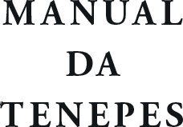{width="1.6573370516185477in" height="1.1593744531933508in"}

Fonte: Manual da Tenepes (Vieira, 2020)

### Verso da Falsa Folha de Rosto

<!-- XXX -->

Associação Internacional EDITARES


### Folha de Rosto

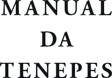

Fonte: Manual da Tenepes (Vieira, 2020)

### Verso da Folha de Rosto (página de créditos)
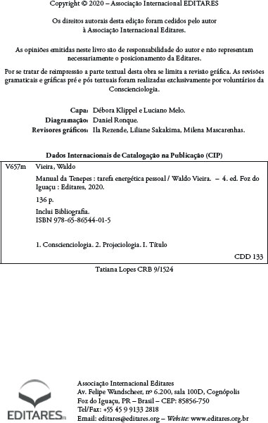{width="3.5301695100612425in" height="5.571770559930009in"}

Fonte: Manual da Tenepes (Vieira, 2020)

### Verso da Folha de Rosto (página de créditos em língua estrangeira)

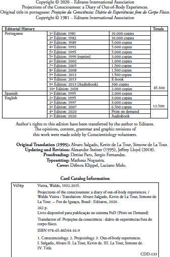

Fonte: *Projections of Counsciousness* (Vieira, 2020)

### Dedicatória
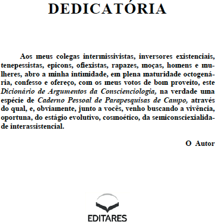{width="3.43215113735783in" height="3.5641666666666665in"}

Fonte: Dicionário de Argumentos da Conscienciologia (Vieira, 2014)

### Agradecimentos
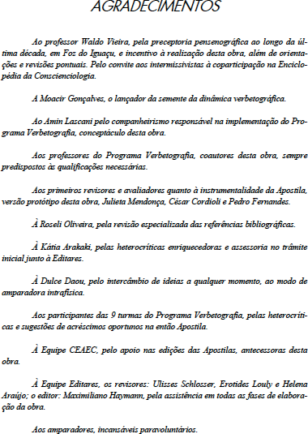{width="3.5225043744531934in" height="4.95989501312336in"}

Fonte: Manual da Verbetografia da Enciclopédia da Conscienciologia (Nader, Org., 2012)

### Sumário
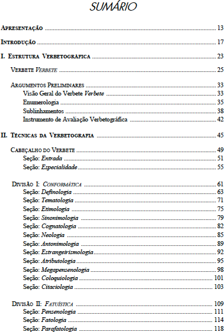{width="3.3969346019247593in" height="5.043541119860017in"}

Fonte: Manual da Verbetografia da Enciclopédia da Conscienciologia (Nader, Org., 2012)

### Prefácio
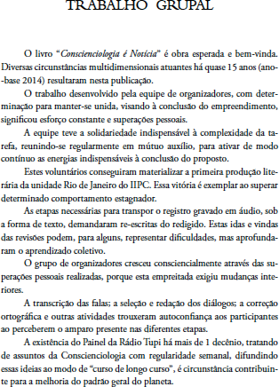{width="3.7267377515310587in" height="5.1775in"}

Fonte: Conscienciologia é Notícia (Nascimento & Wong, 2015)

### Introdução
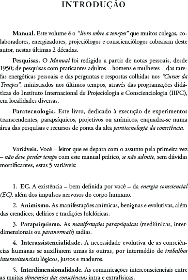{width="3.453183508311461in" height="5.117707786526684in"}

Fonte: Manual da Tenepes (Vieira, 2020)

### Apresentação da Obra
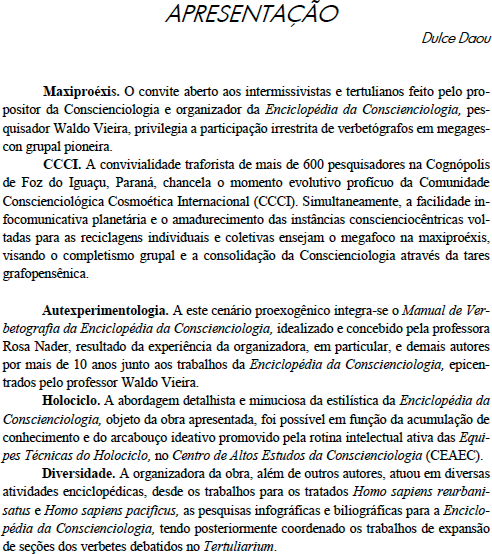{width="3.3328674540682415in" height="3.7510411198600173in"}

Fonte: Manual da Verbetografia da Enciclopédia da Conscienciologia (Nader, Org., 2012)

### Elementos Textuais (corpo do livro)

Referem-se ao conteúdo da obra constituído, por exemplo, dos se-guintes itens:

1.  **Seções** (ou partes)**.**


### Elementos pós-textuais

Referem-se à parte complementar da obra, relacionados a seguir, em ordem lógica:

1.  **Posfácio.**


# Pós-textual

##  Referências Bibliográficas

### Bibliografia Específica

1.  **Assis,** Jaqueline; **Oliveira,** Mércia; & **Salles,** Rosemary; Orgs.; ***Círculo Mentalsomático: Encontros de 11 a 20 -- Período de 16 de Ju-nho a 18 de Agosto de 2012;*** revisores Dayane Rossa; *et al.;* 16 Vols; 374 p.; Vol. II; 1 cronologia; 10 encontros; 21 *E-mails;* 41 enus.; 23 estudos de casos; 21 fotos; 21 microbiografias; 99 perguntas; 1 tab.; 52 relatos; 9 técnicas; 2 anexos; 23 afixos; glos. 655 termos; 7 índices; alf.; geo; ono; 23 x 16 cm; br.; *Epígrafe Editora;* Foz do Iguaçu, PR; 2020; páginas 11 a 14.

2.  **Daou,** Dulce; ***Vontade: Consciência Inteira;*** revisores Equipe de Revisores da EDITARES; 288 p.; 6 seções; 44 caps.; 23 *E-mails;* 226 enus.; 1 foto; 1 minicurrículo; 1 seleção de verbetes da *Enciclopédia da Conscienciologia;* 3 tabs.; 21 *websites;* glos. 140 termos; 1 nota; 133 refs.; 17 webgrafias; 1 apênd.; alf.; ono.; 23 x 16 cm; br.; *Associação Internacio-nal EDITARES;* Foz do Iguaçu, PR; 2014; página 197.


### Webgrafia Específica

1.  **Amadeu,** Maria Simone Utida dos Santos; *et al.; **Manual de Normalização de Documentos Científicos: De Acordo com as Normas da ABNT.** Editora UFPR;* Curitiba, PR; 2017; disponível em: \<https:// acervodigital.ufpr.br/bitstream/handle/1884/45654/Manual_de_norma-lizacao_UFPR.pdf?sequence=1&isAllowed=y\>; acesso em: 20.04.2021.

2.  **Associação Brasileira de Normas Técnicas (ABNT); *NBR 6024/2012;*** 2a Ed.; 2012; disponível em: [\<https://www.bm.edu.br/wp-](https://www.bm.edu.br/wp-)content/uploads/2018/10/ABNT_NBR-6024-2012.pdf\>; acesso em: 20.04.2021.


## Instituições Conscienciocêntricas (ICs)

**ICs.** As *Instituições Conscienciocêntricas* (ICs) são organizações cujos objetivos, metodologias de trabalho e modelos organizacionais estão fun-damentados no Paradigma Consciencial. A atividade principal das ICs é apoiar a evolução das consciências através da tarefa do esclarecimento pautada pelas verdades relativas de ponta, encontradas nas pesquisas no campo da Ciência Conscienciologia e especialidades.

**Voluntariado.** As *Instituições Conscienciocêntricas* são associações independentes, de caráter privado, sem fins de lucro e mantidas predomi-nantemente pelo trabalho voluntário de professores, pesquisadores, admi-nistradores e profissionais de diversas áreas.


##  Lista de Publicações da Editares

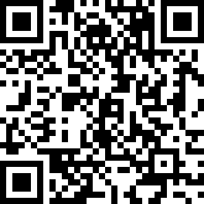{width="2.6606244531933507in" height="2.6606244531933507in"}

editares.org/titulos-pt-br


## Levantamento Estatístico da Obra

+----------------+--------------------------------+
| **Pontoações** | **Itens**                    |
+===============:+================================+


## CoMo ReFeRenCIaR esta oBRa no PaDRÃo Da BIBLIoGRaFIa esPeCÍFICa eXaUstIVa (Bee)

**Galdino,** Lane; Org.; ***Manual de Publicações da EDITARES: O que Você precisa Saber para Publicar o Livro Conscienciológico;*** ed. Mag-da Stapf; int. Oswaldo Vernet; pref. Denise Paro; revisores Carlos Mo-reno; *et al.;* 144 p.; 6 seções; 19 caps.; 1 citação; 1 *E-mail;* 58 enus.; 1 esquema; 7 fichários; 16 fotos; 1 gráfico; 20 ilus.; 16 microbiografias; 1 quadro sinótico; 3 *websites;* 4 notas; 14 refs.; 15 webgrafias; 1 apênd.; alf.; 23,5 x 15,5; br.; 2a Ed.; *Associação Internacional Editares;* Foz do Iguaçu, PR; 2024.

##  Minibiografias dos Autores (1ª edição)

**Carolina Ellwanger**

{width="1.1250087489063867in" height="1.2470406824146982in"}Natural de Porto Alegre, RS; professora universitária; graduada, mestre e doutora em Direito; voluntária da Conscienciologia, coordenadora do *Conselho Inter-nacional de Assistência Jurídica da Conscienciologia* (CIAJUC) da *União das Instituições Conscienciocêntri-cas Internacionais* (UNICIN) e editora na *Associação Internacional Editares;* docente e pesquisadora em Conscienciologia; tenepessista.
